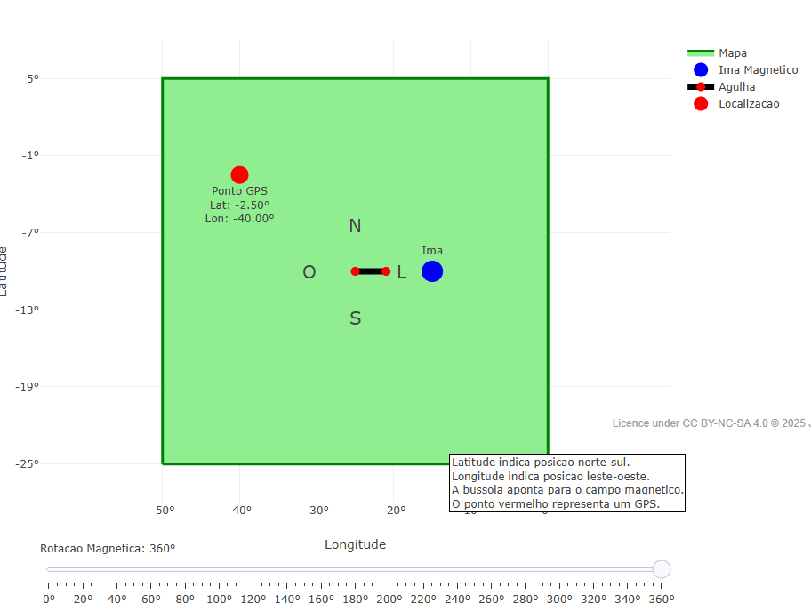

---
title: "Bússola Interativa"
---

 ma orientação especial e importante para a navegação e localizaçao geográfica, como mapas e bússolas. Latitude e longitude ajudam
na identificação de posições e direções na superfície a terra, tendo o magnetismo uma influencia direta no funcionamento
da bússola. No objeto interativo o usuário observa um mapa com coordenadas geográficas, um ponto de localizaçao e uma agulha de uma
bússola no ponto central. 

## Download e Uso:

{target="_blank"}
\

A figura mostra um bússola no centro do mapa e uma imagem azul girando ao seu redor,a agulha da bússola aponta para o ima por causa do ima magnetico.

1. bserve como a agulha da bússola muda de direção quando o ima azul gira ao redor do mapa.
2. Compare a posição do ponto vermelho com as coordenadas de latitude e longitude.
3. Use o slider para controlar a rotação do ima em diferentes ângulos.
4. Identifique as direções norte, sul, leste e oeste usando a bússola.

::: {.callout-warning}

## Sugestão: 

1. Mude os valores de diferentes formas, para ver se a qualidade está comprometida, ou de acordo com o Ideal.
2. Troque a posição do gráfico ondulatório de acordo com os resultados, tentando aproximá-lo da linha azul.

## Lógica de código

1. O mapa usa coordenadas x e y.
2. A bússola fica no centro do mapa.
3. O imã azul gira em 360 graus.
4. A agulha aponta para o ima magnetico.
5. O ponto vermelho mostra uma localização.
6. Os controles permitem interagir com a simulação.

:::

Estudante: Escola Estadual Doutor Emílio Silveira, Alfenas-MG.

<!--- Código 

FIS-OPT-FIS-01
--->
