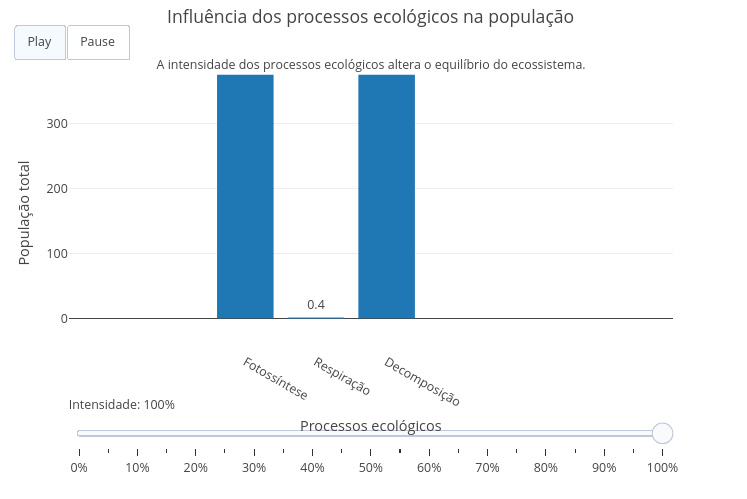

::: {.callout-tip}

Os ecossistemas são formados por organismos que interagem continuamente entre si e com o ambiente. Processos como fotossíntese, respiração e decomposição influenciam diretamente a disponibilidade de energia e matéria, afetando o crescimento das plantas, a sobrevivência dos herbívoros e a manutenção dos carnívoros. Alterações nesses processos podem provocar equilíbrio ecológico, explosão populacional ou colapso das populações.

Este objeto interativo simula a dinâmica de um ecossistema por meio da manipulação das taxas de fotossíntese, respiração e decomposição. O usuário modifica esses processos ecológicos utilizando controles deslizantes e observa, em um gráfico, a evolução das populações de plantas, herbívoros e carnívoros ao longo do tempo. Ao final da simulação, o sistema classifica automaticamente o cenário como equilíbrio ecológico, explosão populacional ou colapso ecológico.

## Equação:

$$
P_{t+1}=P_t+F-C-R+D
$$

$$
H_{t+1}=H_t+G_H-P_R-R_H
$$

$$
C_{t+1}=C_t+G_C-R_C
$$

Onde:

**P** = população de plantas

**H** = população de herbívoros

**C** = população de carnívoros

**F** = taxa de fotossíntese

**R** = perdas por respiração

**D** = contribuição da decomposição para a reciclagem de nutrientes

**Gₕ** = crescimento dos herbívoros

**Pᵣ** = predação pelos carnívoros

**G𝒸** = crescimento dos carnívoros

## Download e Uso:

{target="_blank"}
\

Obs: a imagem deve conter apenas a área gráfica do objeto desenvolvido no JSPlotly.

1. Clique em **"add"** para carregar o objeto interativo.
2. Ajuste as taxas de **fotossíntese**, **respiração** e **decomposição** utilizando os controles deslizantes.
3. Clique em **"Simular Ecossistema"**.
4. Observe a evolução das populações de plantas, herbívoros e carnívoros no gráfico.
5. Analise o resultado final indicado pelo sistema: **equilíbrio ecológico**, **explosão populacional** ou **colapso ecológico**.

:::

::: {.callout-caution}

## Sugestão:

1. Aumente a taxa de fotossíntese e observe o crescimento das populações.
2. Eleve a taxa de respiração e analise a redução das populações ao longo do tempo.
3. Modifique a taxa de decomposição e observe como a reciclagem de nutrientes influencia o ecossistema.
4. Compare diferentes combinações dos parâmetros para identificar quais favorecem o equilíbrio ecológico.
5. Observe em quais condições o sistema entra em explosão populacional ou colapso ecológico.

## Lógica de código

O código implementa um modelo ecológico dinâmico baseado na interação entre plantas, herbívoros e carnívoros. Inicialmente, são definidos valores para as populações e criados controles deslizantes que permitem ao usuário modificar as taxas de fotossíntese, respiração e decomposição, representando processos ecológicos fundamentais.

Durante a simulação, a população de plantas aumenta de acordo com a taxa de fotossíntese e diminui em função do consumo pelos herbívoros e das perdas por respiração. Os herbívoros crescem conforme a disponibilidade de alimento, mas sofrem redução pela respiração e pela ação dos carnívoros. Os carnívoros aumentam em função da disponibilidade de presas e diminuem devido às perdas naturais.

A cada etapa da simulação, as populações são recalculadas e armazenadas para construir um gráfico de linhas que representa sua evolução temporal. Ao final do processo, o sistema analisa automaticamente os valores finais das populações e classifica o ecossistema em uma das três situações possíveis: **equilíbrio ecológico**, **explosão populacional** ou **colapso ecológico**, permitindo ao usuário compreender as consequências das alterações realizadas nos processos ecológicos.

:::

**Estudante:** Curso de Bacharelado em Ciências Biológicas - Universidade Federal de Alfenas (UNIFAL-MG). 

<!---
BIO-ECO-CICL-01
--->