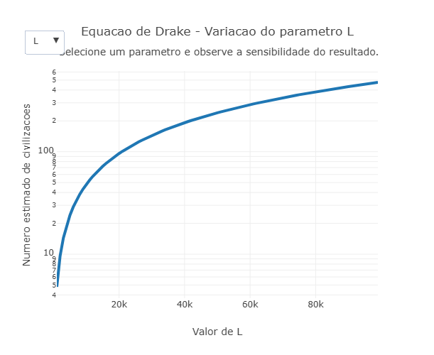

---
title: "Equação de Drake da exobiologia"
---

  A Equação de Drake foi inventada em 1961 por um astrônomo Frank Drake com um objetivo de ter uma estimativa de quantas civilizações extraterrestres poderiam existir. Equação de Drake é uma ferramenta teorica que estima o numero de civilizações extraterrestres avançadas na via Lactia com fatores relacionados a formação de estrelas, planetas habitaveis e desenvolvimento de uma vida inteligente. Ela Reune diferentes fatores que colaboram para o surgimento de civilização capaz de se comunicar pelo espaço. A forma mais conhecida da equação é:
$$
N = R^* \cdot f_p \cdot n_e \cdot f_l \cdot f_i \cdot f_c \cdot L\
$$
que cada variavel representa uma etapa necessária para o surgimento de uma possivel de uma civilização fora da terra. 

  Essa quação não oferece um numero exato, mas ajuda os cientistas e pesquisadores a entenderem quais são os fatores necessarios para a existencia de uma vida fora da terra. E essas pequenas alterações nas variaveis da equçaõ podem aumentar ou reduzir o numero final de vida extraterrestre, mostrando como o tema envolve muitas incertezas cientificas. Alem disso, a equação de Drake estimula pesquisas sobre exoplanetas, evolução biológica e comunicação interestelar, sendo frequentemente utilizada em estudos sobre a busca por vida extraterrestre e em projetos científicos como o SETI.

## Equação: 

$$
N = R^* \cdot f_p \cdot n_e \cdot f_l \cdot f_i \cdot f_c \cdot L\
$$

Onde:

\begin{aligned}
N   & = \text{número de civilizações detectáveis} \\
R^* & = \text{taxa de formação de estrelas} \\
f_p & = \text{fração de estrelas com planetas} \\
n_e & = \text{número de planetas habitáveis por sistema} \\
f_l & = \text{fração dos planetas onde surge vida} \\
f_i & = \text{fração onde surge vida inteligente} \\
f_c & = \text{fração com tecnologia detectável} \\
L   & = \text{tempo de emissão de sinais detectáveis}
\end{aligned}
\

{target="_blank" }

:::: {.callout-note}
## Como usar

1. O grafico gerado, mostra como a alteração dos parâmetros influencia o número final de civilizações detectáveis ((N)).

2. Utilize variáveis da equação, como:

\begin{aligned}
N   & = \text{número de civilizações detectáveis} \\
R^* & = \text{taxa de formação de estrelas} \\
f_p & = \text{fração de estrelas com planetas} \\
n_e & = \text{número de planetas habitáveis por sistema} \\
f_l & = \text{fração dos planetas onde surge vida} \\
f_i & = \text{fração onde surge vida inteligente} \\
f_c & = \text{fração com tecnologia detectável} \\
L   & = \text{tempo de emissão de sinais detectáveis}
\end{aligned}
\

4. Compare os resultados obtidos ao aumentar ou diminuir cada variável individualmente. Assim analisa como que pequenas mudanças nos parametros  podem alterar o valor final da equção.

5. Ao passar o mause no grafico você pode ver o valor exato de cada ponto.

6. Reinicie a simulação sempre que desejar testar um novo conjunto de parâmetros.
:::

::: {.callout-caution}

## Sugestão: 

1. Altere apenas o valor de (fl) (probabilidade de surgir vida) para observar como pequenas mudanças biológicas podem aumentar ou reduzir drasticamente o número final de civilizações.

2. Modifique o parâmetro (L) (tempo de duração de uma civilização tecnológica) e compare os resultados no gráfico, analisando como civilizações mais duradouras impactam a chance de detecção extraterrestre.

:::

## Lógica de código

1. Ao rodar, o sistema exibe um gráfico mostrando o impacto de R no número de civilizações. Se o usuário abrir o menu dropdown e mudar para fl (fração de planetas que desenvolvem vida), a linha anterior desaparece instantaneamente, uma nova linha toma o seu lugar, e os títulos do gráfico se adaptam sozinhos, revelando a sensibilidade do resultado final a essa nova variável.

**Estudante:** Curso de Biotecnologia, Universidade Federal de Alfenas (UNIFAL-MG)

<!--- Código 

BIO-EVO-SINT-01

--->

