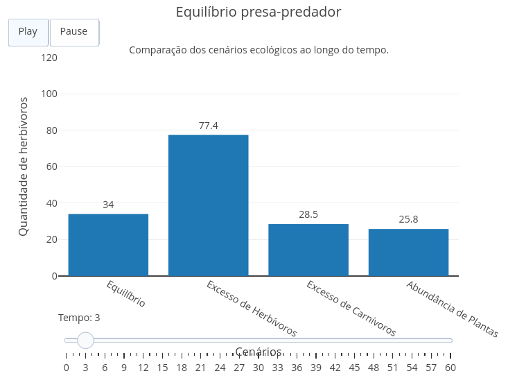

::: {.callout-tip}

As relações entre plantas, herbívoros e carnívoros constituem um dos principais exemplos de interação ecológica entre níveis tróficos. As plantas atuam como produtores, os herbívoros como consumidores primários e os carnívoros como consumidores secundários. Alterações na abundância de qualquer um desses grupos podem modificar o equilíbrio do ecossistema, influenciando diretamente o tamanho das demais populações.

Este objeto interativo simula a dinâmica de um sistema presa-predador com diferentes pré-condições ecológicas. O usuário pode selecionar um cenário inicial e observar, por meio de um gráfico, como as populações de plantas, herbívoros e carnívoros evoluem ao longo do tempo. Ao final da simulação, também são apresentadas as quantidades finais de cada população.

## Equações

O modelo utiliza relações simplificadas de crescimento populacional e interação entre os níveis tróficos.

Crescimento das plantas:

$$
P_{t+1}=P_t+rP_t\left(1-\frac{P_t}{K}\right)-aPH
$$

Crescimento dos herbívoros:

$$
H_{t+1}=H_t+b(aPH)-cHC-dH
$$

Crescimento dos carnívoros:

$$
C_{t+1}=C_t+e(cHC)-fC
$$

Onde:

- **P** = população de plantas;
- **H** = população de herbívoros;
- **C** = população de carnívoros;
- **r** = taxa de crescimento das plantas;
- **K** = capacidade de suporte do ambiente;
- **a** = taxa de consumo das plantas pelos herbívoros;
- **b** = eficiência de conversão em herbívoros;
- **c** = taxa de predação;
- **d** = mortalidade dos herbívoros;
- **e** = eficiência de conversão em carnívoros;
- **f** = mortalidade dos carnívoros.

## Download e Uso

{target="_blank"}

\

Obs: a imagem deve conter apenas a área gráfica do objeto no JSPlotly.

1. Clique em **"Add"** para carregar o objeto interativo.
2. Selecione uma das pré-condições disponíveis.
3. Clique em **"Simular"**.
4. Observe o gráfico da evolução das populações ao longo do tempo.
5. Compare as quantidades finais de plantas, herbívoros e carnívoros apresentadas pelo simulador.

:::

::: {.callout-caution}

## Sugestão

1. Compare os resultados obtidos para cada pré-condição disponível.
2. Observe como o excesso de herbívoros afeta a população de plantas.
3. Analise como o aumento da população de carnívoros influencia a quantidade de herbívoros.
4. Identifique qual cenário apresenta maior estabilidade ecológica ao longo da simulação.

## Lógica de código

O código cria uma interface interativa composta por um seletor de pré-condições ecológicas, um botão para iniciar a simulação e um gráfico dinâmico produzido com a biblioteca Plotly. Cada cenário define valores iniciais diferentes para as populações de plantas, herbívoros e carnívoros, representando diferentes condições do ecossistema.

Após a seleção do cenário e o acionamento do botão **"Simular"**, o algoritmo executa uma simulação temporal na qual as populações são atualizadas iterativamente. Durante cada passo, as plantas crescem segundo um modelo logístico limitado pela capacidade de suporte do ambiente e sofrem redução devido ao consumo pelos herbívoros. A população de herbívoros aumenta em função da disponibilidade de alimento, diminui pela ação dos carnívoros e também pela mortalidade natural. Os carnívoros aumentam conforme a disponibilidade de presas e reduzem sua população devido à mortalidade.

Ao final da simulação, os valores calculados são armazenados em vetores e utilizados para construir um gráfico contendo três curvas, correspondentes às populações de plantas, herbívoros e carnívoros ao longo do tempo. O objeto também apresenta as quantidades finais de cada população, permitindo comparar os efeitos das diferentes pré-condições sobre o equilíbrio ecológico.

:::

**Estudante:** Curso de Bacharelado em Ciências Biológicas - Universidade Federal de Alfenas (UNIFAL-MG). 

<!---
BIO-POP-01
--->