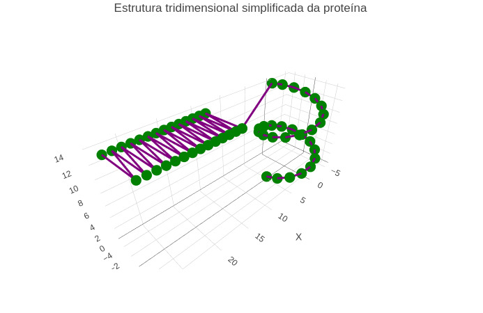

::: {.callout-tip}

As proteínas são macromoléculas formadas por cadeias de aminoácidos ligadas por ligações peptídicas. A sequência dos aminoácidos determina o dobramento da molécula e sua estrutura tridimensional. Entre os principais níveis estruturais das proteínas estão a estrutura primária, correspondente à sequência de aminoácidos, e a estrutura secundária, representada principalmente pelas α-hélices e folhas β.

Este objeto interativo simula a montagem simplificada de uma proteína em três dimensões. O usuário pode selecionar o tipo de estrutura secundária e definir o número de aminoácidos da cadeia polipeptídica. O gráfico tridimensional é atualizado automaticamente, permitindo visualizar como a estrutura da proteína se modifica conforme os parâmetros escolhidos.

## Equação:

$$
N = n_{AA}
$$

Onde:

**N** = tamanho da proteína

**n₍AA₎** = número de aminoácidos da cadeia polipeptídica

## Download e Uso:

{target="_blank"}
\

Obs: a imagem deve conter apenas a área gráfica do objeto desenvolvido no JSPlotly.

1. Clique em **"add"** para carregar o objeto interativo.
2. Selecione a estrutura secundária desejada (α-hélice, folha β ou mista).
3. Ajuste o número de aminoácidos utilizando o controle deslizante.
4. Clique em **"Montar proteína"**.
5. Observe a estrutura tridimensional gerada e compare as diferenças entre os modelos.

:::

::: {.callout-caution}

## Sugestão:

1. Compare a forma das proteínas do tipo α-hélice e folha β.
2. Observe como o aumento do número de aminoácidos altera o tamanho da proteína.
3. Analise a estrutura mista e compare-a com as demais.
4. Relacione as diferentes estruturas secundárias com a organização tridimensional das proteínas.

## Lógica de código

O código cria uma interface interativa composta por um seletor de estruturas secundárias, um controle deslizante para definir o número de aminoácidos e um gráfico tridimensional desenvolvido com a biblioteca Plotly.

Ao executar a simulação, o programa gera as coordenadas espaciais dos aminoácidos de acordo com a estrutura selecionada. Para α-hélices são utilizadas funções trigonométricas que produzem uma espiral tridimensional. Para folhas β, os aminoácidos são distribuídos em um padrão alternado, representando a organização típica dessa estrutura. Na opção mista, parte da cadeia é organizada como α-hélice e a outra parte como folha β.

As coordenadas calculadas são utilizadas para construir uma representação tridimensional simplificada da proteína. Os aminoácidos são exibidos como marcadores e as ligações peptídicas são representadas por linhas, permitindo ao usuário visualizar a organização espacial da cadeia polipeptídica.

:::

**Estudante:** Curso de Bacharelado em Ciências Biológicas - Universidade Federal de Alfenas (UNIFAL-MG). 

<!---
QUI-BIMOOL-ESTRUT-01
--->
