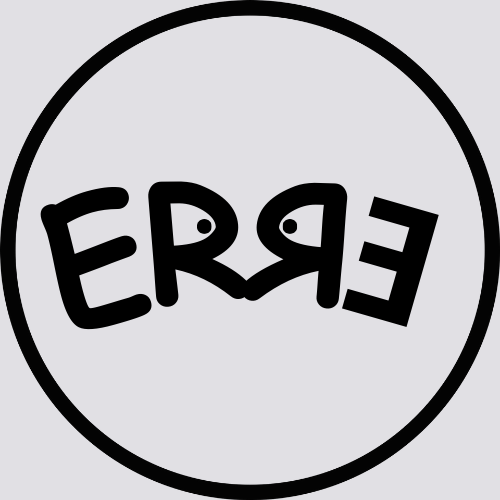

<!-- ::: {layout="[ 30, 110 ]"} -->
<!-- ::: {#first-column} -->
{width="20%" fig-align="left"}
<!-- ::: -->

<!-- ::: {#second-column} -->
| *Reproducible Teaching (RE)* defines an active methodology in teaching and learning that combines programming language with descriptive content.
\

| In one sentence: **codes for content.**
\

| In practice, ER involves applying codes written in text so that a program generates some *product of interest to Teaching*, such as a graph, a table, media, a formatted text (pdf, docx, epub), static or interactive, a simulation, an animation, among others. In this way, it is possible to imagine that a student can repeat the execution of the code in a specific program, change some part of the code to observe a different result, or even create a new code seeking another final result.

\

| *Reproducible Teaching* must be practiced in an open manner, involving freely distributed programs or applications and, preferably, using a simple internet browser, to enable its use by the largest number of people, without restrictions on machine configuration, and allowing access both via desktop computers and notebooks and via mobile devices, such as *tablets* and *smartphones*.
\

## Learning stages in reproducible teaching

| Computer programs, for mobile applications, or for *web applications*, must allow the student to have broad integration with content previously developed by an instructor (or group). In this way, the learner can achieve a progressive appropriation of digital and content competence skills, such as those listed in the table below:
\

```{r, echo = FALSE}
## #| label: tbl-etapas
#| tbl-cap: "Suggested steps for skills aggregated with progressive use of tools to *ER*." library(knitr)
Steps <- c(1,2,3,4) # table construction
Skills <- c("1 - execution of a code snippet by simple action (copy/paste), and even insertion of code directly into *snippet*, for reproduction/editing of the same on a web page (JavaScript): ability to reproduce results (calculations, equations, graphs, tables, diagrams, etc.), as in the static information present in textbooks and scientific articles", "2 - execution with modification of text, parameters, and variables: ability to understand the problem under analysis, and prospect for new tentative results", "3 - modification of the code: basic programming skills, code improvement and algorithm analysis", "4 - creation of code and use of packages: consolidated programming skills and use of advanced resources of the chosen program")
table2 <- data.frame(Steps, Skills)
knitr::kable(table2, "pipe",
align = "l",
)
```

<!-- ::: -->
<!-- ::: -->

## *ERЯƎ* ... {.unnumbered}
\

| The acronym ERЯƎ suggests the initials for *Reproducible Teaching*, with the sources arranged in palindrome, and with the clear intention of suggesting the exercise of *libertarian error*. It also intends a playful arrangement to the analogy of responsible and sustainable development principles of the *3 Rs*. Here, because they are codes for content in *ER*, with the meaning of *reuse (copy), and recycle (alteration) or reinvent (recreation)*.