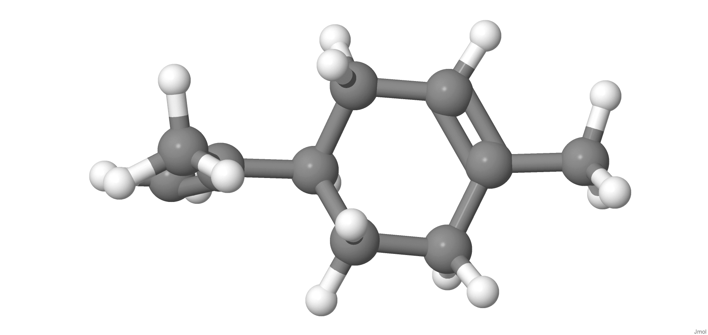
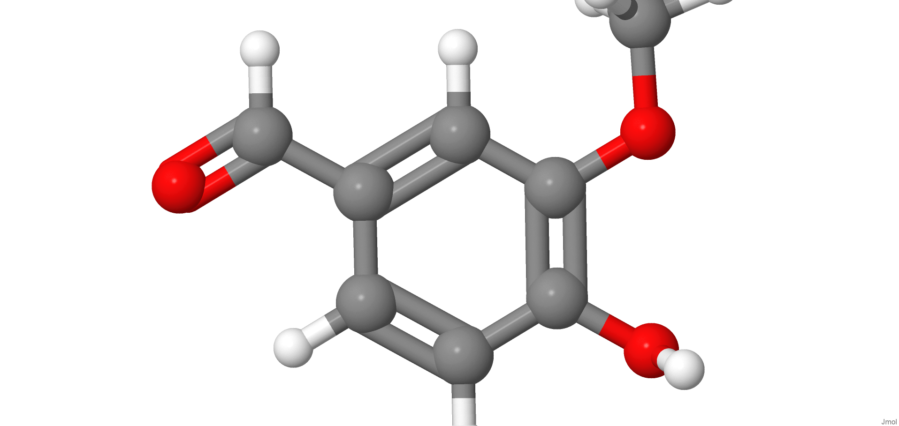
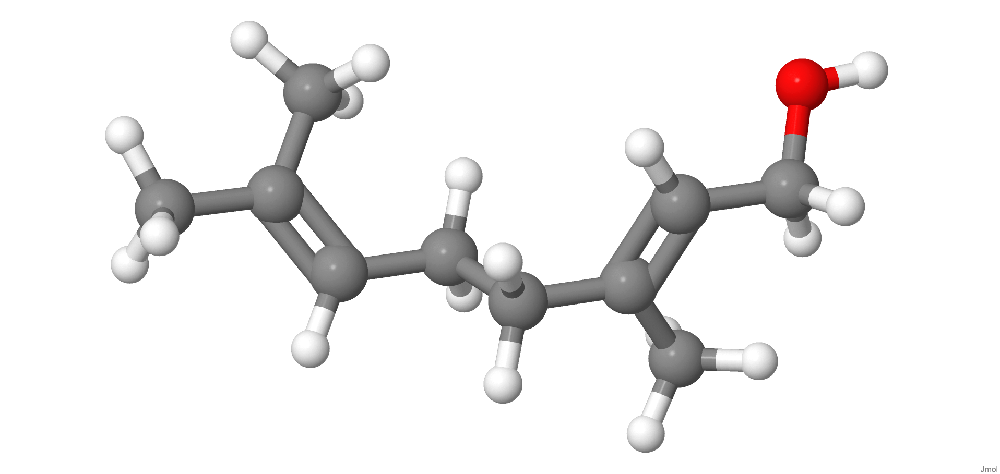
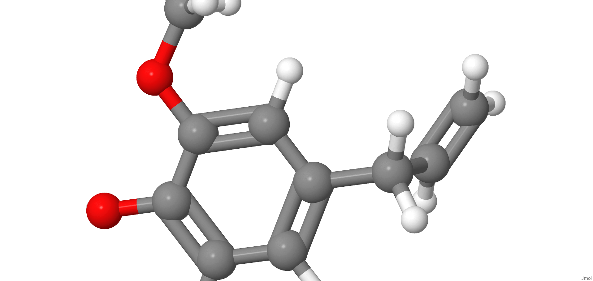

[{width="40%"}](https://chemapps.stolaf.edu/jmol/jmol.php?model=CC1=CCC(CC1)C(=C)C)

[Wikipedia](https://pt.wikipedia.org/wiki/Limonene)

[{width="40%"}](https://chemapps.stolaf.edu/jmol/jmol.php?model=COC1=C(C=CC(=C1)C=O)O)

[Wikipedia](https://pt.wikipedia.org/wiki/Vanilina)

[{width="40%"}](https://chemapps.stolaf.edu/jmol/jmol.php?model=CC(=CCC/C(=C/CO)/C)C)

[Wikipedia](https://pt.wikipedia.org/wiki/Geraniol)

[{width="40%"}](https://chemapps.stolaf.edu/jmol/jmol.php?model=COC1=C(C=CC(=C1)CC=C)O)

[Wikipedia](https://pt.wikipedia.org/wiki/Eugenol)

