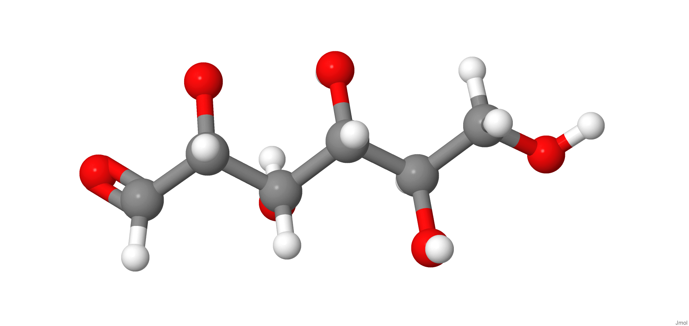
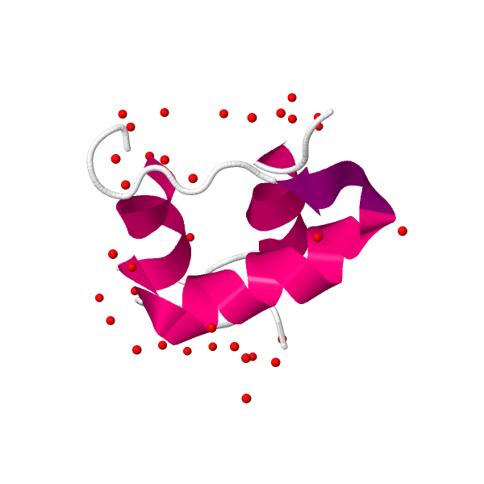

<strong>Tirosina:</strong> aminoácido utilizado na síntese de neurotransmissores como a dopamina e a adrenalina.

<strong>Glicose:</strong> carboidrato fundamental no metabolismo energético. Fornece energia para as células.

<strong>Lecitina:</strong> fosfolipídio com função de emulsificante natural. É usada nas indústrias alimentícia e farmacêutica.

<strong>Insulina:</strong> hormônio regulador da glicose no sangue. Estimula a entrada de glicose nas células.

