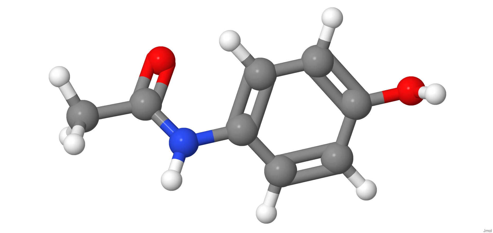
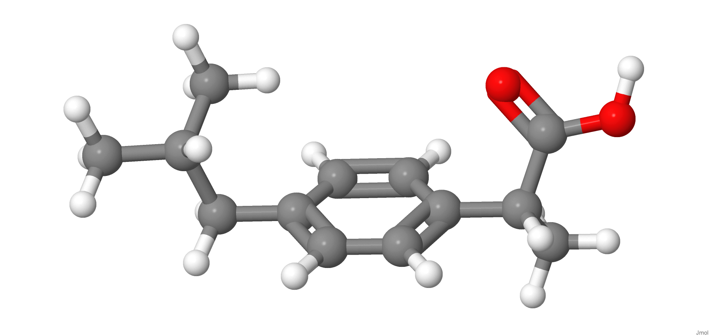
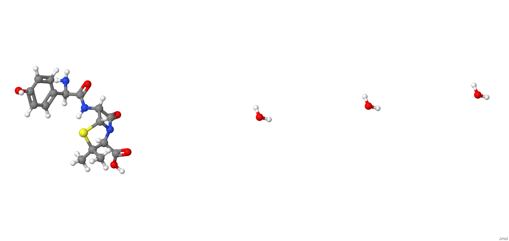
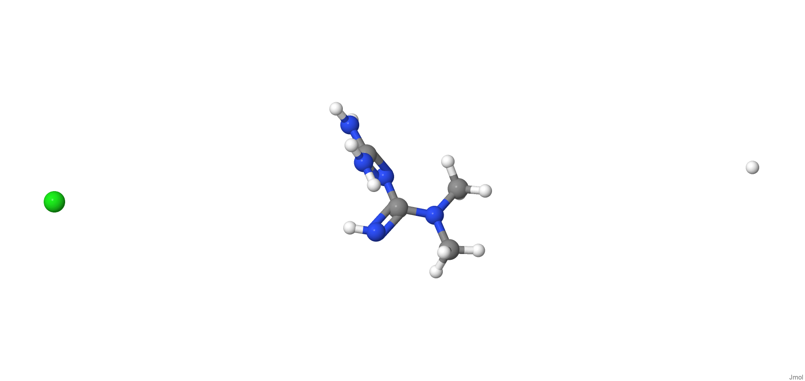

[{width="40%"}](https://chemapps.stolaf.edu/jmol/jmol.php?model=CC(=O)NC1=CC=C(C=C1)O)

[Wikipedia](https://pt.wikipedia.org/wiki/Paracetamol)

[{width="40%"}](https://chemapps.stolaf.edu/jmol/jmol.php?model=CC(C)CC1=CC=C(C=C1)C(C)C(=O)O)

[Wikipedia](https://en.wikipedia.org/wiki/Ibuprofen)

[{width="40%"}](https://chemapps.stolaf.edu/jmol/jmol.php?mode l=CC1(%5BC@@H%5D(N2%5BC@H%5D(S1)%5BC@@H%5D(C2=O)NC(=O)%5BC@@H%5D(C3=CC=C(C=C3)O)N)C(=O)O)C)

[Wikipedia](https://pt.wikipedia.org/wiki/Amoxicillin)

[{width="40%"}](https://chemapps.stolaf.edu/jmol/jmol.php?model=CN(C)C(=N)N=C(N)N)

[Wikipedia](https://pt.wikipedia.org/wiki/Metformina)

