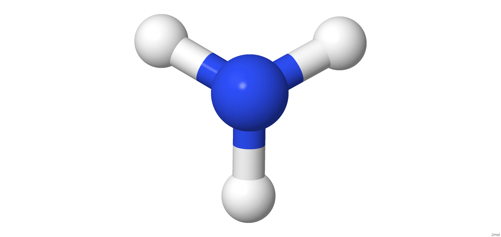
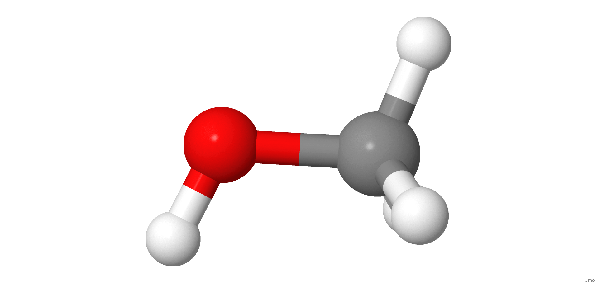
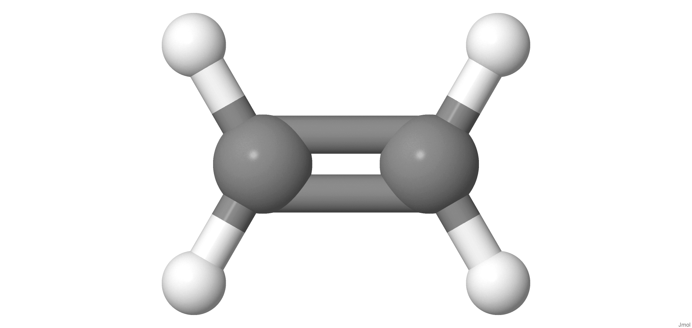

##Molecules of Industrial Interest

[{width="40%"}](https://chemapps.stolaf.edu/jmol/jmol.php?model=N)

[Wikipedia](https://pt.wikipedia.org/wiki/Ammonia)

[{width="40%"}](https://chemapps.stolaf.edu/jmol/jmol.php?model=CO)

[Wikipedia](https://en.wikipedia.org/wiki/Methanol)

[{width="40%"}](https://chemapps.stolaf.edu/jmol/jmol.php?model=%20C=C)

[Wikipedia](https://en.wikipedia.org/wiki/Polyethylene)

[{width="40%"}](https://chemapps.stolaf.edu/jmol/jmol.php?model=C=CCl)

[Wikipedia](https://pt.wikipedia.org/wiki/Cloreto_de_vinila)

