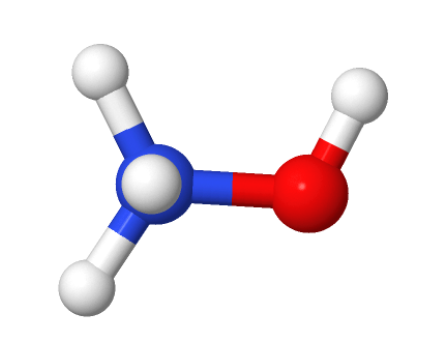

## Acids

<strong>Sulfuric acid:</strong> used in the manufacture of fertilizers, water treatment, batteries, and oil refining.

<strong>Hydrochloric acid:</strong> present in gastric juice and used in chemical industries and analytical laboratories.

## Bases

<strong>Sodium hydroxide:</strong> a strong base used in the manufacture of soaps, paper, fabrics, and industrial cleaning.

<strong>Ammonium hydroxide:</strong> formed when ammonia dissolves in water. Used in cleaning products and fertilizers.

## Salts

<strong>Sodium chloride: </strong> able salt. Essential for life and used in industrial chemical processes.

<strong>Sodium hypochlorite: </strong> a disinfectant used in water purification and household cleaning.

## Oxides

<strong>Carbon dioxide:</strong> a gas produced by respiration and the burning of fuels. Used in fire extinguishers and carbonated beverages.

<strong>Calcium oxide: </strong> known as quicklime. Used in construction and to correct soil pH.

