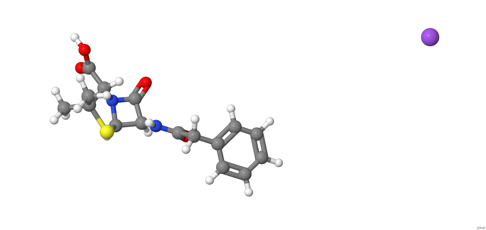
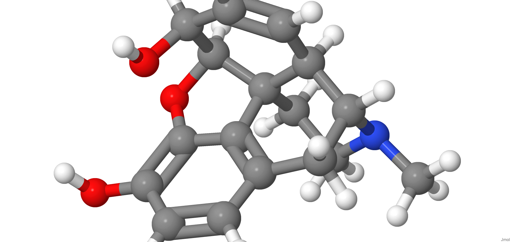
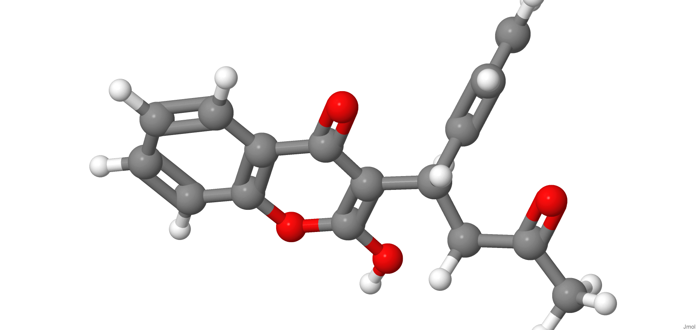
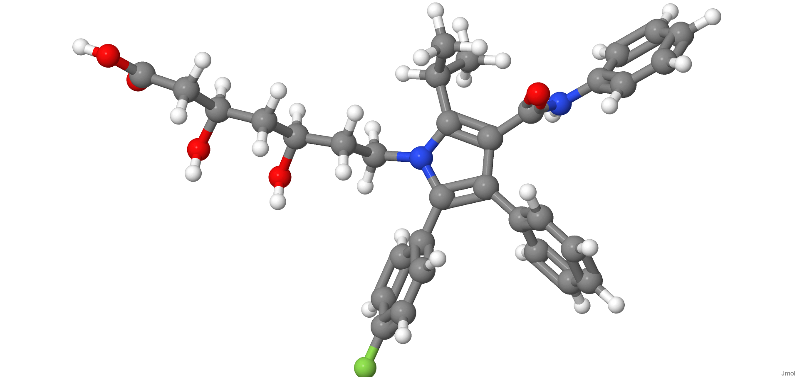

[{width="40%"}](https://chemapps.stolaf.edu/jmol/jmol.php?model=CC1(%5BC@@H%5D(N2%5BC@H%5D(S1)%5BC@@H%5D(C2=O)NC(=O)CC3=CC=CC=C3)C(=O)O)C)

[Wikipedia](https://pt.wikipedia.org/wiki/Penicillin)

[{width="40%"}](https://chemapps.stolaf.edu/jmol/jmol.php?mode l=CN1CC%5BC@%5D23%5BC@@H%5D4%5BC@H%5D1CC5=C2C(=C(C=C5)O)O%5BC@H%5D3%5BC@H%5D(C=C4)O)

[Wikipedia](https://pt.wikipedia.org/wiki/Morfina)

[{width="40%"}](https://chemapps.stolaf.edu/jmol/jmol.php?model=:%20CC(=O)CC(C1=CC=CC=C1)C2=C(C3=CC=CC=C3OC2=O)O)

[Wikipedia](https://pt.wikipedia.org/wiki/Warfarin)

[{width="40%"}](https://chemapps.stolaf.edu/jmol/jmol.php?model=C C(C)C1=C(C(=C(N1CC%5BC@H%5D(C%5BC@H%5D(CC(=O)O)O)O)C2=CC=C(C=C2)F)C3=CC=CC=C3)C(=O)NC4=CC=CC=C4)

[Wikipedia](https://pt.wikipedia.org/wiki/Atorvastatina)

