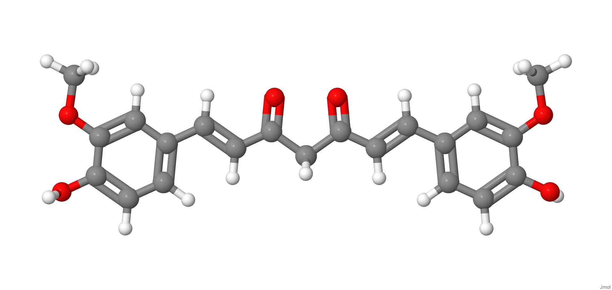
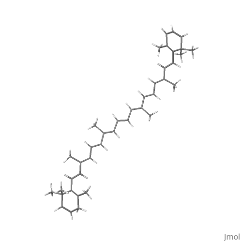
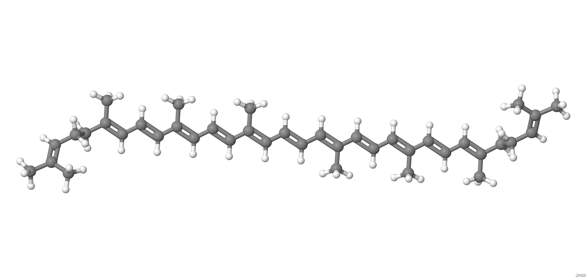
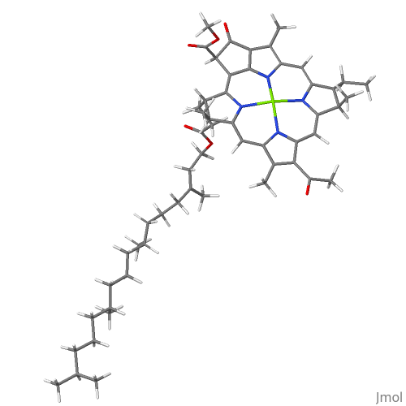

<strong>Curcumin:</strong> yellow pigment found in turmeric. Acts as a natural antioxidant and anti-inflammatory.

<strong>Beta-carotene:</strong> orange pigment found in carrots. It is a precursor to vitamin A and important for vision and immunity.

<strong>Lycopene:</strong> red pigment found in tomatoes. Acts as an antioxidant, helping to protect cells.

<strong>Chlorophyll:</strong> green pigment found in plants, essential for photosynthesis. It also has antioxidant and detoxifying properties.

