# Hydrocarbon

## Alkane

[{width=40%}](https://chemapps.stolaf.edu/jmol/jmol.php?model=C)

<p style="text-align:right;">
[Wikipedia](https://pt.wikipedia.org/wiki/metano)
</p>

```{r, eval=FALSE}
wireframe only; wireframe 0.2
```

[{width=40%}](https://chemapps.stolaf.edu/jmol/jmol.php?model=CC)

```{r, eval=FALSE}
rotate x 10
```

<p style="text-align:right;">
[Wikipedia](https://pt.wikipedia.org/wiki/etano)
</p>

[{width=40%}](https://chemapps.stolaf.edu/jmol/jmol.php?model=CCC)

```{r, eval=FALSE}
spin on

```

<p style="text-align:right;">
[Wikipedia](https://en.wikipedia.org/wiki/Propane)
</p>

[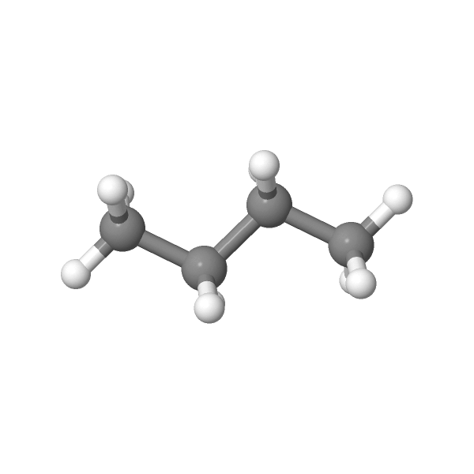{width=40%}](https://chemapps.stolaf.edu/jmol/jmol.php?model=CCCC)

```{r, eval=FALSE}
isosurface vdw

```

<p style="text-align:right;">
[Wikipedia](https://en.wikipedia.org/wiki/Butane)
</p>

[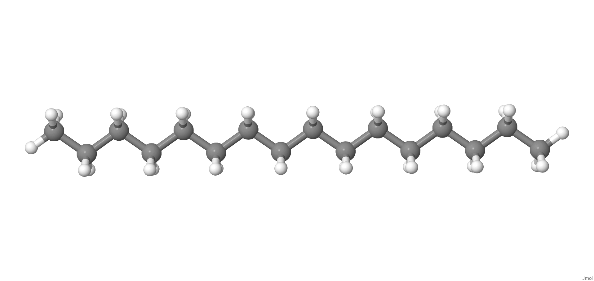{width=40%}](https://chemapps.stolaf.edu/jmol/jmol.php?model=CCCCCCCCCCCCCCC)

```{r, eval=FALSE}
moveto 2.0 {1 1 1 90}

```

<p style="text-align:right;">
[Wikipedia](: https://pt.wikipedia.org/wiki/Alcano)
</p>

## Alkene

[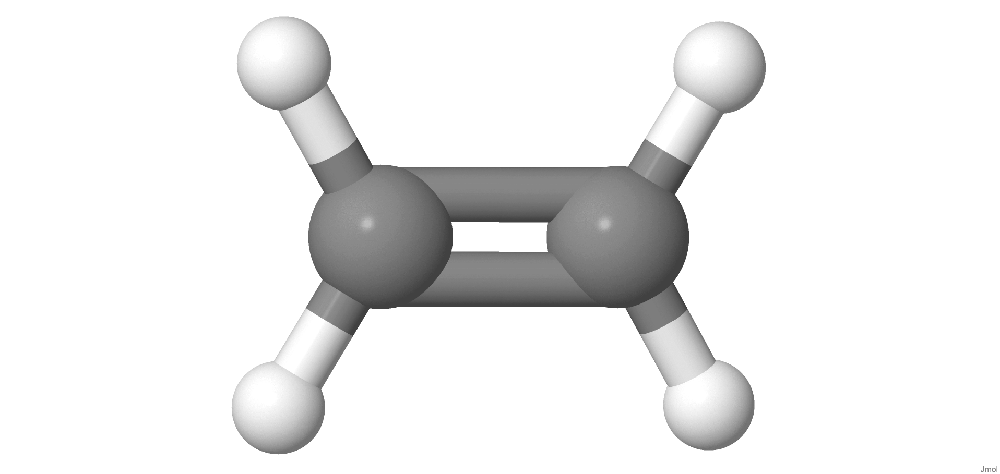{width=40%}](https://chemapps.stolaf.edu/jmol/jmol.php?model=C=C)

```{r, eval=FALSE}
select atomno=1,2
color atoms yellow

```

<p style="text-align:right;">
[Wikipedia](https://pt.wikipedia.org/wiki/Ethylene)
</p>

[{width=40%}](https://chemapps.stolaf.edu/jmol/jmol.php?model=CC=C)

```{r, eval=FALSE}
bondOrder double
```

<p style="text-align:right;">
[Wikipedia](https://pt.wikipedia.org/wiki/Propylene)
</p>

[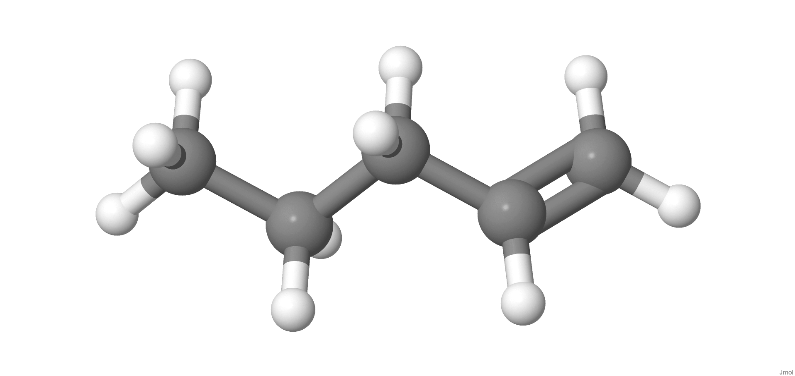{width=40%}](https://chemapps.stolaf.edu/jmol/jmol.php?model=CCCC=C)

```{r, eval=FALSE}
color bonds red

```

<p style="text-align:right;">
[Wikipedia](https://en.wikibooks.org/wiki/Introduction_to_Chemistry/Hydrocarbons)
</p>

[{width=40%}](https://chemapps.stolaf.edu/jmol/jmol.php?model=C1=CC=CC=C1)

```{r, eval=FALSE}
for (var i=0; i<10; i++) {
rotate y 30
color atoms random
delay 0.5
}
```

<p style="text-align:right;">
[Wikipedia](https://pt.wikipedia.org/wiki/benzene)
</p>

[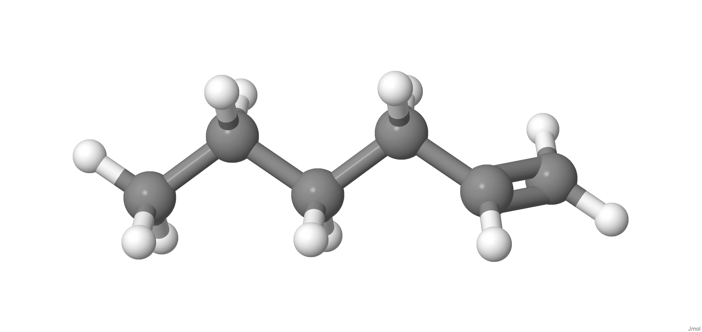{width=40%}](https://chemapps.stolaf.edu/jmol/jmol.php?model=CCCCC=C)

```{r, eval=FALSE}
color bonds blue
```

<p style="text-align:right;">
[Wikipedia](https://pt.wikipedia.org/wiki/hexene)
</p>
| Links:
1. [Alkanes and alkenes](https://www.echalk.co.uk/3Dmolecules/alkanes_alkenes/alkanes.htm)

## Alkyne

[{width=40%}](https://chemapps.stolaf.edu/jmol/jmol.php?model=
acetylene)

```{r, eval=FALSE}
color bonds yellow
```

<p style="text-align:right;">
[Wikipedia](https://pt.wikipedia.org/wiki/Acetylene)
</p>

[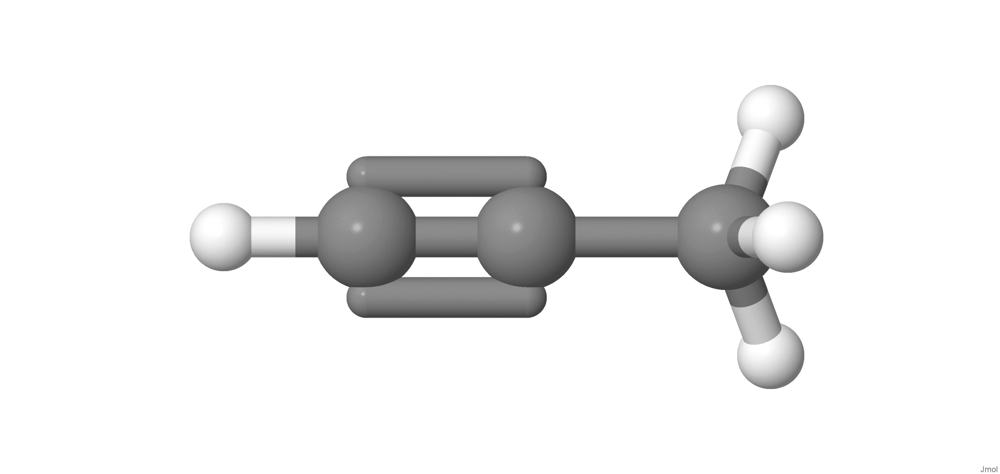{width=40%}](https://chemapps.stolaf.edu/jmol/jmol.php?model=CC#C)

```{r, eval=FALSE}
select bond(triple);C2, C3
```


<p style="text-align:right;">
[Wikipedia](https://pt.wikipedia.org/wiki/propino)
</p>

[{width=40%}](https://chemapps.stolaf.edu/jmol/jmol.php?model=CC#CC)

```{r, eval=FALSE}
load "SMILES:CCCC#C"
```


<p style="text-align:right;">
[Wikipedia](https://en.wikipedia.org/wiki/Ethylacethylene)
</p>

# Arene

# Alcohol

[{width=40%}](https://chemapps.stolaf.edu/jmol/jmol.php?model=CCO)

```{r, eval=FALSE}
cylinder 50

```

<p style="text-align:right;">
[Wikipedia](https://en.wikipedia.org/wiki/Ethanol)
</p>

[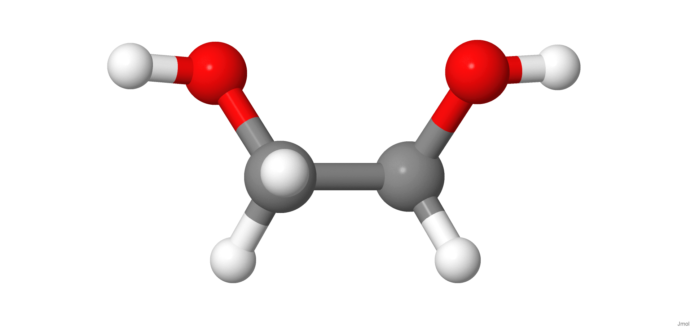{width=40%}](https://chemapps.stolaf.edu/jmol/jmol.php?model=C(CO)O)

```{r, eval=FALSE}
spacefill 20
```

<p style="text-align:right;">
[Wikipedia](https://pt.wikipedia.org/wiki/etilenoglicol)
</p>

# Phenol

[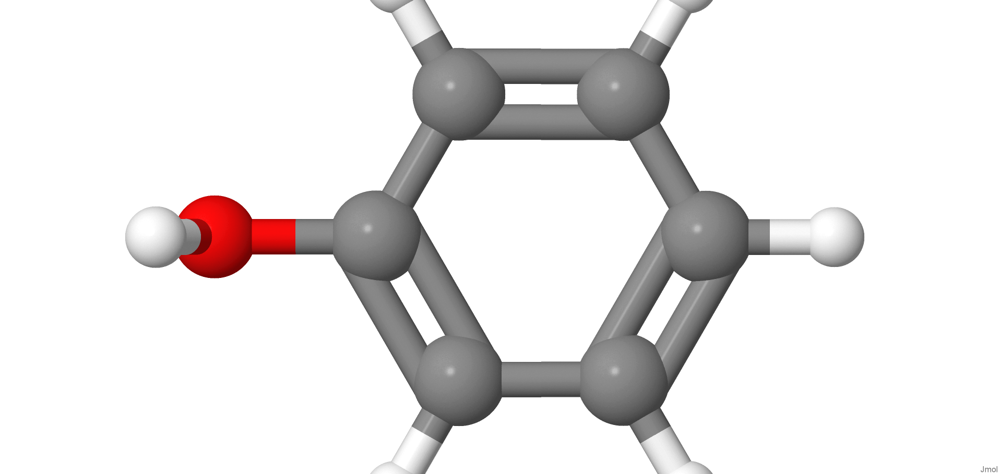{width=40%}](https://chemapps.stolaf.edu/jmol/jmol.php?model=C1=CC=C(C=C1)O)

```{r, eval=FALSE}
select aromatic
color blue
```

<p style="text-align:right;">
[Wikipedia](https://pt.wikipedia.org/wiki/fenol)
</p>

[{width=40%}](https://chemapps.stolaf.edu/jmol/jmol.php?model=C1=CC(=CC=C1/C=C/C2=CC(=CC(=C2)O)O)O)

```{r, eval=FALSE}
select aromatic
wireframe 100
```

<p style="text-align:right;">
[Wikipedia](https://pt.wikipedia.org/wiki/resveratrol)
</p>

# Ether

[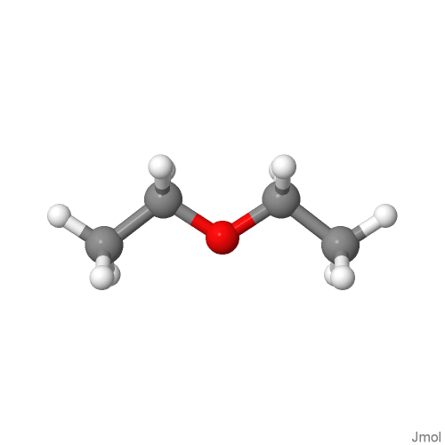{width=40%}](https://chemapps.stolaf.edu/jmol/jmol.php?model=CCOCC)

```{r, eval=FALSE}
select O C
wireframe 100
```

<p style="text-align:right;">
[Wikipedia](https://en.wikipedia.org/wiki/%C3%89ter_et%C3%ADlico)
</p>

# Aldehyde

[{width=40%}](https://chemapps.stolaf.edu/jmol/jmol.php?model=CC=O)

```{r, eval=FALSE}
select C=O
wireframe 100
```

<p style="text-align:right;">
[Wikipedia](https://en.wikipedia.org/wiki/Acetaldehyde)
</p>

[{width=40%}](https://chemapps.stolaf.edu/jmol/jmol.php?model=C=O)

```{r, eval=FALSE}
wireframe 50
```

<p style="text-align:right;">
[Wikipedia](https://pt.wikipedia.org/wiki/Methanal)
</p>

# Ketone

[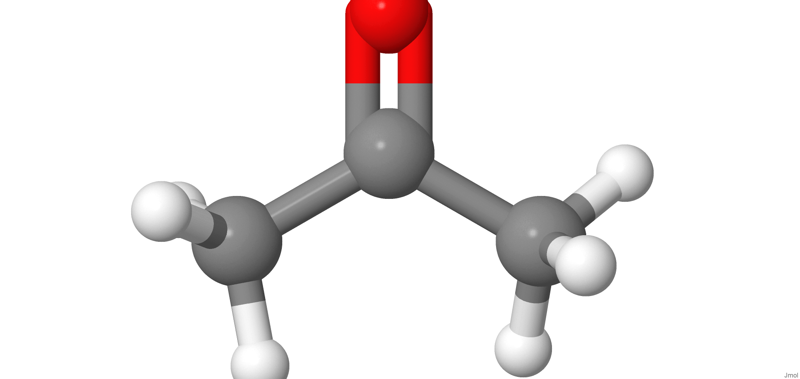{width=40%}](https://chemapps.stolaf.edu/jmol/jmol.php?model=CC(=O)C)
```{r, eval=FALSE}
isosurface solvent; color isosurface red blue
```

<p style="text-align:right;">
[Wikipedia](https://en.wikipedia.org/wiki/Acetone)
</p>

[{width=40%}](https://chemapps.stolaf.edu/jmol/jmol.php?model= C1CCC(=O)C1)

```{r, eval=FALSE}
select carbonyl
color yellow
```

<p style="text-align:right;">
[Wikipedia](https://en.wikipedia.org/wiki/Cyclopentanone)
</p>

# Carboxylic acid

[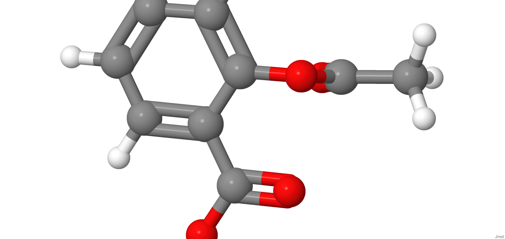{width=40%}](https://chemapps.stolaf.edu/jmol/jmol.php?model= CC(=O)OC1=CC=CC=C1C(=O)O)

```{r, eval=FALSE}
dihedral
```

<p style="text-align:right;">
[Wikipedia](https://pt.wikipedia.org/wiki/%C3%81cido_acetilsalic%C3%ADlico)
</p>

[{width=40%}](https://chemapps.stolaf.edu/jmol/jmol.php?model=C([C@@H]([C@@H]1C(=C(C(=O)O1)O)O)O)O)

```{r, eval=FALSE}
show atoms
show bonds
```


<p style="text-align:right;">
[Wikipedia](https://pt.wikipedia.org/wiki/%C3%81cido_asc%C3%B3rbico)
</p>