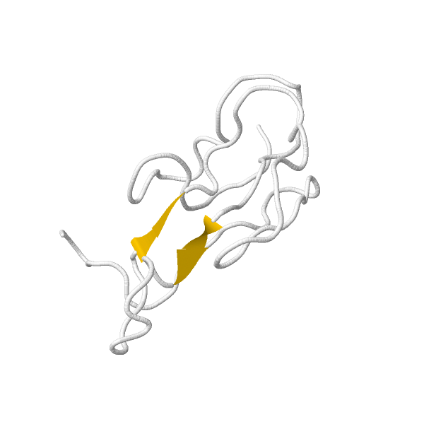
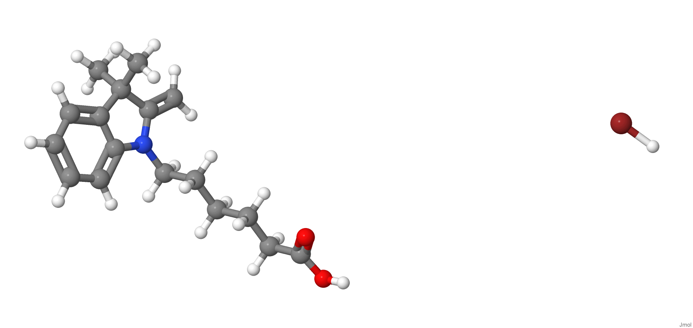
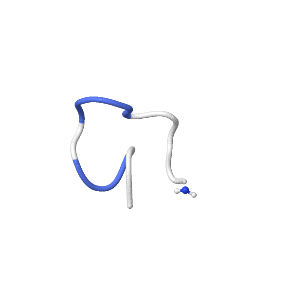

[{width="40%"}](https://chemapps.stolaf.edu/jmol/jmol.php?&pdbid=1IK8)

[Wikipedia](https://gl.wikipedia.org/wiki/Bungarotoxin)

[{width="40%"}](https://chemapps.stolaf.edu/jmol/jmol.php?model=%20CC1(C(=C)N(C2=CC=CC=C21)CCCCCC(=O)O)C.Br)

[Wikipedia](https://pt.wikipedia.org/wiki/Hyaluronidase)

[{width="40%"}](https://chemapps.stolaf.edu/jmol/jmol.php?&pdbid=1CNL)

[Wikipedia](https://pt.wikipedia.org/wiki/Conotoxin)

