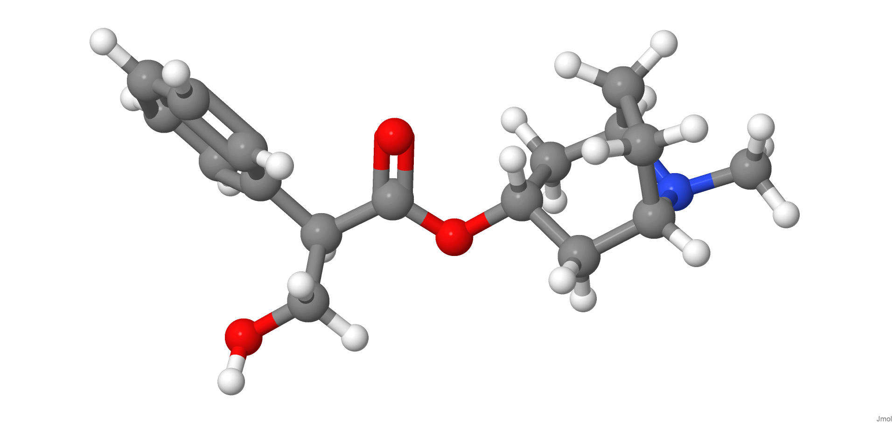
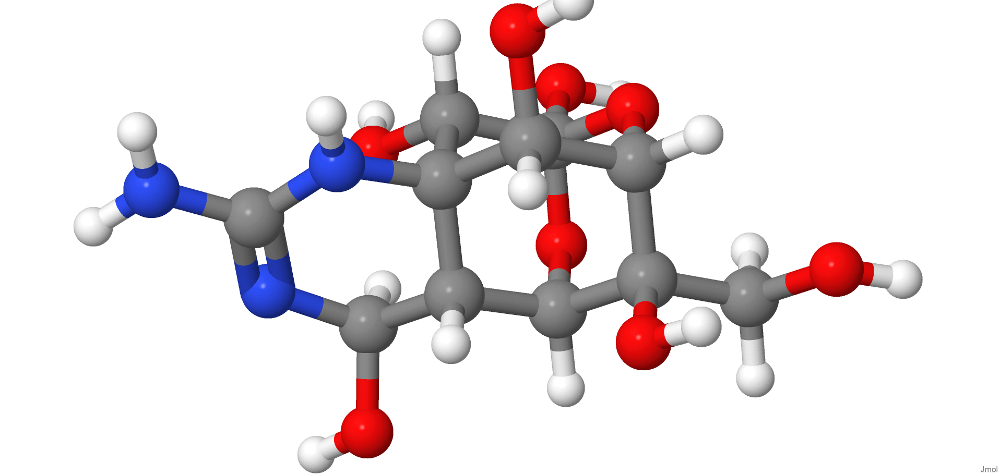
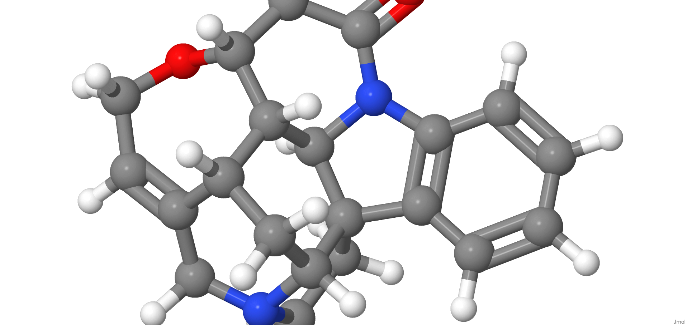
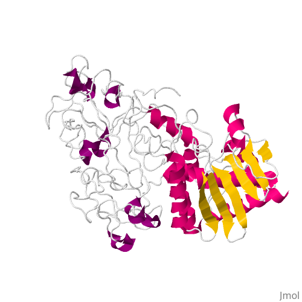

[{width="40%"}](https://chemapps.stolaf.edu/jmol/jmol.php?model=CN1%5BC@@H%5D2CC%5BC@H%5D1CC(C2)OC(=O)C(CO)C3=CC=CC=C3)

[Wikipedia](https://en.wikipedia.org/wiki/Atropine)

[{width="40%"}](https://chemapps.stolaf.edu/jmol/jmol.php?model=%20C([C@@]1([C@H]2[C@@H]3[C@H](N=C(N[C@@]34[C@@H]([C@@H]1O[C@]([C@H]4O)(O2)O)O)N)O)O)O)

[Wikipedia](https://pt.wikipedia.org/wiki/Tetrodoxin)

[{width="40%"}](https://chemapps.stolaf.edu/jmol/jmol.php?model= C1CN2CC3=CCO[C@H]4CC(=O)N5[C@H]6[C@H]4[C@H]3C[C@H]2[C@@]61C7=CC=CC=C75)

[Wikipedia](https://pt.wikipedia.org/wiki/Strychnine)

[{width="40%"}](https://chemapps.stolaf.edu/jmol/jmol.php?&pdbid=2aai)

[Wikipedia](https://pt.wikipedia.org/wiki/Ricina)

