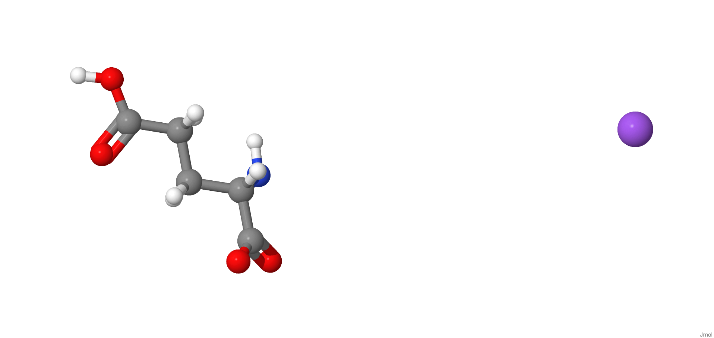
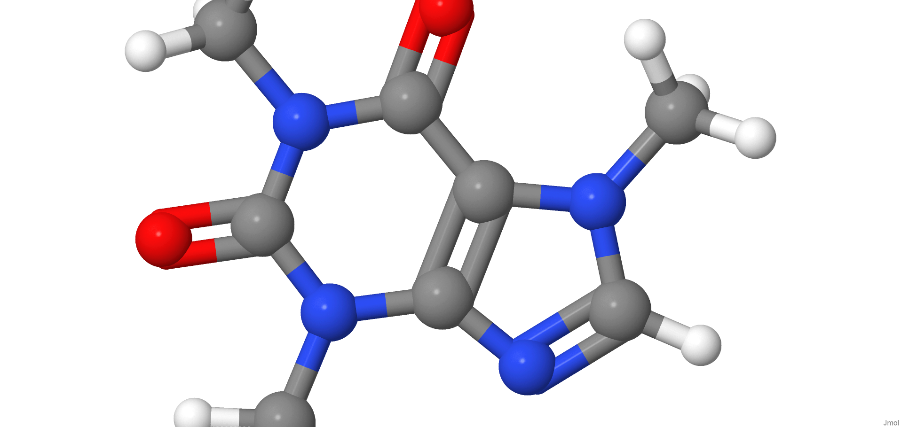
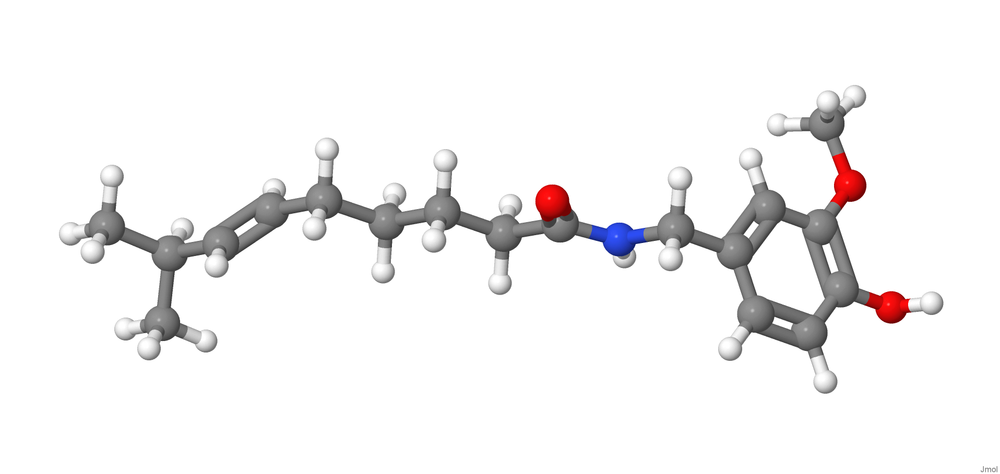
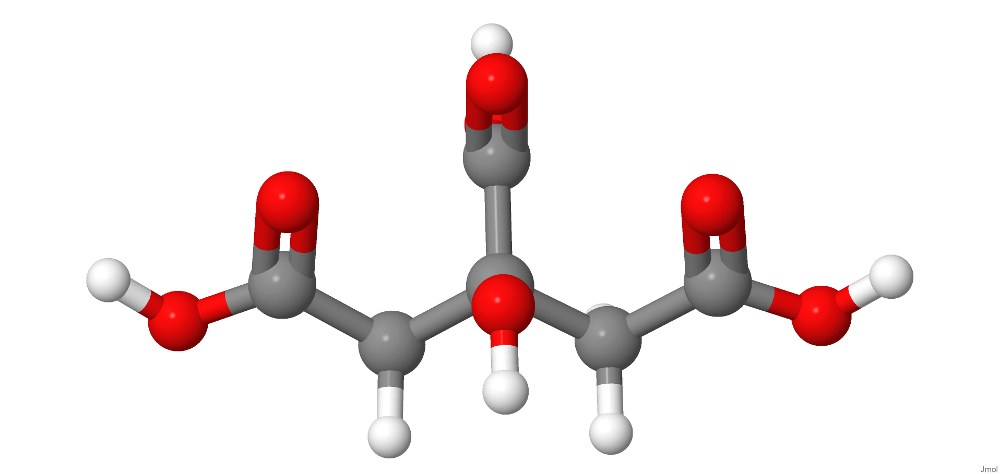

[{width="40%"}](https://chemapps.stolaf.edu/jmol/jmol.php?model=C(CC(=O)O)%5BC@@H%5D(C(=O)%5BO-%5D)N.%5BNa+%5D)

[Wikipedia](https://pt.wikipedia.org/wiki/%C3%81acido_glut%C3%A2mico)

[{width="40%"}](https://chemapps.stolaf.edu/jmol/jmol.php?model=CN1C=NC2=C1C(=O)N(C(=O)N2C)C)

[Wikipedia](https://en.wikipedia.org/wiki/Caffeine)

[{width="40%"}](https://chemapps.stolaf.edu/jmol/jmol.php?model=CC(C)/C=C/CCCCC(=O)NCC1=CC(=C(C=C1)O)OC)

[Wikipedia](https://en.wikipedia.org/wiki/Capsaicin)

[{width="40%"}](https://chemapps.stolaf.edu/jmol/jmol.php?model=C(C(=O)O)C(CC(=O)O)(C(=O)O)O)

[Wikipedia](https://en.wikipedia.org/wiki/Ácido%20citrico)

