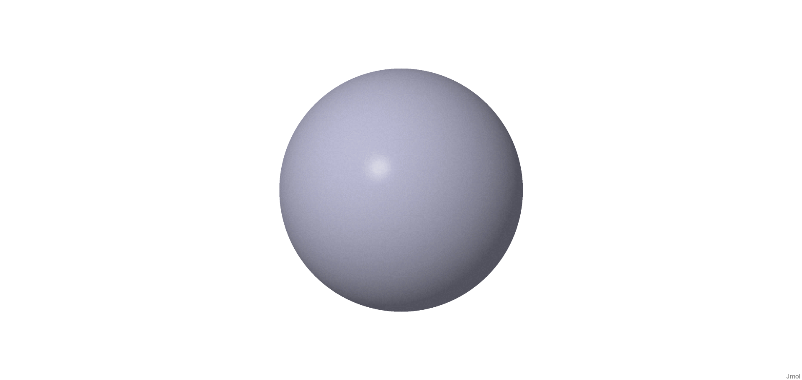
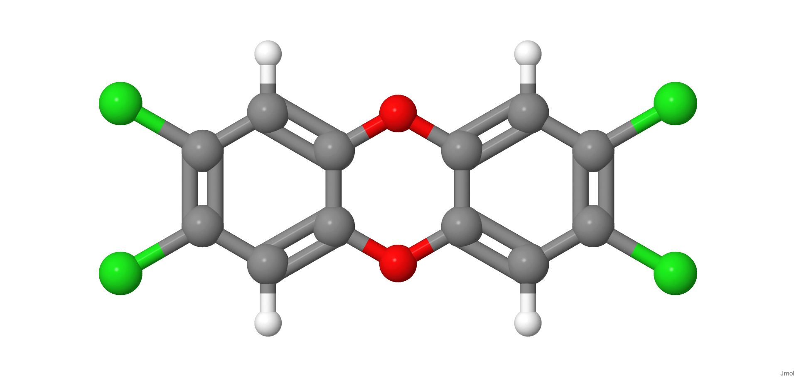

[{width="40%"}](https://chemapps.stolaf.edu/jmol/jmol.php?model=C=O)

[Wikipedia](https://pt.wikipedia.org/wiki/Methanal)

[{width="40%"}](https://chemapps.stolaf.edu/jmol/jmol.php?model=Hg2)

[Wikipedia](https://pt.wikipedia.org/wiki/Merc%C3%BArio)

[{width="40%"}](https://chemapps.stolaf.edu/jmol/jmol.php?model=%5BPb%5D)

[Wikipedia](https://pt.wikipedia.org/wiki/Chumbo)

[{width="40%"}](https://chemapps.stolaf.edu/jmol/jmol.php?model=C1=C2C(=CC(=C1Cl)Cl)OC3=CC(=C(C=C3O2)Cl)Cl)

[Wikipedia](https://pt.wikipedia.org/wiki/Dioxin)

