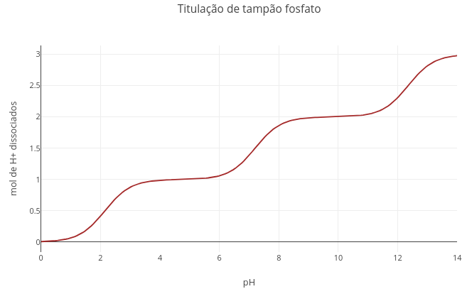
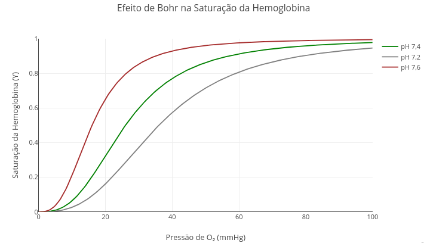
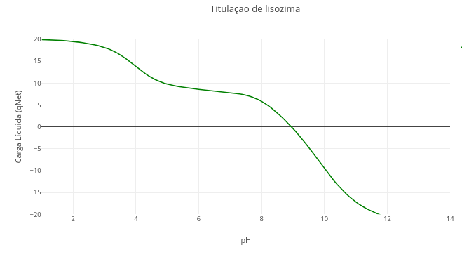
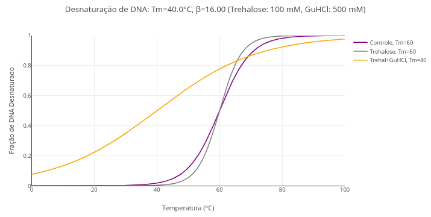
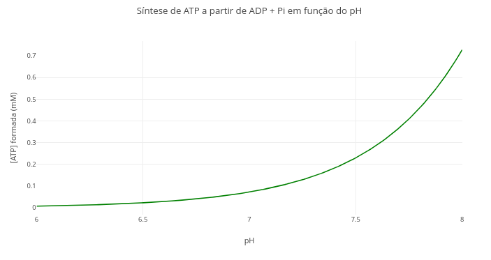
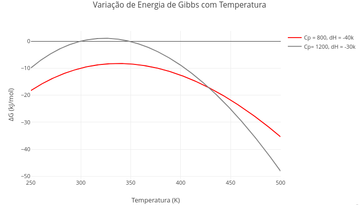

| To illustrate the potential use of *JSPlotly* for biochemistry and related fields, here are some examples of simulations whose graphs are often found in textbooks and related content. To get the most out of each topic, try following the suggestions for *parametric manipulation* in each topic.
\

## Instructions {.unnumbered}


```{r, eval=FALSE}

1. Choose a topic;
2. Click on the corresponding graph;
3. Click on "Add Plot";
4. Use the mouse for interactivity and/or edit the code.

Reminder: the editor uses infinite undo/redo in the code (Ctrl+Z / Shift+Ctrl+Z)!
```


## Acid-base equilibrium and buffer systems

#### Context: {.unnumbered}

| The example illustrates the addition of a base to a system containing a weak acid and its conjugate base. The titration equation refers to a *triprotic acid*, the phosphoric acid of the buffer of the same name, but it would also work for many others, such as those present in the Krebs cycle (citrate, isocitrate). 


#### Equation: {.unnumbered}

$$
fa= \frac{1}{1 + 10^{pKa1 - pH}} + \frac{1}{1 + 10^{pKa2 - pH}} + \frac{1}{1 + 10^{pKa3 - pH}}
$$
*Where
fa = acid fraction (protonatable groups)
\

[](Eq/jsp_acbase.html){target="_blank"}
\
<!---div class="jsplotly_sup-fundo"> --->

### Suggestion: {.unnumbered}

```{r, eval =FALSE}
"A. Converting the phosphate buffer (triprotic) curve to bicarbonate buffer (diprotic)"

1. Change the pKa values for the bicarbonate buffer: pKa1 = 6.1, and pKa2 = 10.3;
2. Set a very large value for pKa3 (e.g., 1e20). 
3. Click "add plot."

Explanation: pKa is a term that represents the logarithm of a dissociation constant (-log[Ka]). With an extreme value, the denominator becomes equally large, canceling out the term that carries pKa3. In JavaScript and other languages, ‘e’ represents the notation for power of 10.

"B. Converting the bicarbonate buffer curve to acetate"

1. Simply repeat the above procedure with pKa1 = 4.75 and eliminate pKa2.

```
\

## Net charge network in peptides

#### Context: {.unnumbered}

| The code refers to the net charge network present in any sequence of amino acid residues. Here we illustrate *angiotensin II*, an important peptide for blood pressure regulation and electrolyte balance, whose converting enzyme is associated with the mechanism of cell invasibility by SARS-CoV-2.


#### Equation: {.unnumbered}

| There is no direct equation for this simulation, as the algorithm needs to decide the charge based on the basic or acidic nature of the residue at a given pH value (see the *script*). Thus:

$$
q =
\begin{cases}
-\dfrac{1}{1 + 10^{pK_a - pH}} & \text{(acid group)} \\\\
\dfrac{1}{1 + 10^{pH - pK_a}} & \text{(basic group)}
\end{cases}
$$
\

*Where

- pKa = value of the antilogarithm of base 10 for the acid dissociation equilibrium constant, Ka (or log[Ka]).


[](Eq/jsp_cargaAA.html){target="_blank"}
\
<!---div class="jsplotly_sup-fundo"> --->

### Suggestion: {.unnumbered}

```{r, eval =FALSE}
1. Select the peptide sequence below and observe the charge distribution:

"Ala,Lys,Arg,Leu,Phe,Glu,Cys,Asp,His"

2. Simulate the pH condition of the stomach ("const pH = 1.5") and check the change in charges in the peptide. 

3. Select a physiological peptide (e.g., oxytocin), observe its charge in blood (pH 7.5), and reflect on its potential for electrostatic interaction with cellular components.

"Cys,Tyr,Ile,Gln,Asn,Cys,Pro,Leu,Gly" - oxytocin
```
\


## Interaction of oxygen with myoglobin and hemoglobin

#### Context: {.unnumbered}

| The oxygen molecule can combine with the *heme* group of myoglobin and hemoglobin in different ways, depending on the cooperativity exhibited in the latter due to its quaternary structure. The following model illustrates this interaction using the *Hill equation*. 


#### Equation: {.unnumbered}


$$
Y= \frac{pO_2^{nH}}{p_{50}^{nH} + pO_2^{nH}}
$$
\

*Where*

Y = degree of oxygen saturation in the protein;


- pO$_{2}$ = oxygen pressure;
- p$_{50}$ = oxygen pressure at 50% saturation;
- nH = Hill coefficient for the interaction;
\


[](Eq/jsp_O2.html){target="_blank"}
\
<!---div class="jsplotly_sup-fundo"> --->

### Suggestion: {.unnumbered}

```{r, eval =FALSE}
1. Run the application ("add plot"). Note that the value of "nH" for the Hill constant is "1," meaning there is no cooperativity effect.

2. Now replace the value of "nH" with the Hill coefficient for hemoglobin, 2.8, and run again!
```
\


## Bohr effect on hemoglobin (pH)


#### Context: {.unnumbered}

| Some physiological or pathological conditions can alter the binding affinity of oxygen to hemoglobin, such as temperature, certain metabolites (2,3-BPG), and the hydrogen ion content of the solution.

#### Equation: {.unnumbered}

$$
Y(pO_2) = \frac{{pO_2^n}}{{P_{50}^n + pO_2^n}}, \quad \text{with } P_{50} = P_{50,\text{ref}} + \alpha (pH_{\text{ref}} - pH)
$$
\
*Where*,

- Y = hemoglobin saturation,
- pO$_{2}$ = partial pressure of oxygen (in mmHg),
- P$_{50}$ = pressure of O$_{2}$ at which hemoglobin is 50% saturated,
- P$_{50,ref}$ = 26 mmHg (standard value),
- $\alpha$ = 50 (Bohr effect intensity),
- pH$_{ref}$ = 7.4,
- n = 2.8 = Hill coefficient for hemoglobin.


[](Eq/jspl_bohr.html)


## Isoelectric Point in Proteins


#### Context: {.unnumbered}

| The *script* for this simulation is based on the distribution of the charge network for a polyelectrolyte, and the identification of the pH value at which this network is zero, i.e., the *isoelectric point (or isoionic point), pI*. The example uses the primary sequence of lysozyme, a hydrolase that acts to break down the microbial wall.

#### Equation: {.unnumbered}


$$
q_{\text{net}}(pH) = \sum_{i=1}^{N} \left[ n_i \cdot q_{B_i} + \frac{n_i}{1 + 10^{pH - pK_{a_i}}} \right]
$$
\
*Where*,

- qnet = total net charge;
- qB$_{i} = charge of the basic form for residue i (e.g., +1 for Lys, 0 for Asp);
- n$_{i}$ = number of groups of residue *i*.

[](Eq/jsp_pI.html)


#### Suggestion: {.unnumbered}

```{r, eval=FALSE}
"Finding the pI for other proteins"

1. You can check the titration of any other protein or peptide sequence by simply replacing the primary sequence contained in the code. An assertive way to perform this replacement involves:
a. Search for the "FASTA" sequence of the protein in NCBI ("https://www.ncbi.nlm.nih.gov/protein/") - e.g., "papain";
b. Click on "FASTA" and copy the sequence 1a. obtained;
c. Paste the sequence into a website for residue quantification (e.g., "https://www.protpi.ch/Calculator/ProteinTool");
4. Replace the sequence in the code. 
```
\


## Catalysis and enzyme inhibition

### Context: {.unnumbered}

| The simulation aims to provide a general equation for enzyme inhibition studies, covering *competitive, non-competitive, and competitive (pure or mixed) models*, also allowing the study of enzyme catalysis in the absence of an inhibitor.
#### Equation: {.unnumbered}


$$
v=\frac{Vm*S}{Km(1+\frac{I}{Kic})+S(1+\frac{I}{Kiu})}
$$
\
*Where*

- S = substrate content for reaction;
- Vm = reaction limit speed (in books, maximum speed);
- Km = Michaelis-Mentem constant;
- Kic = inhibitor dissociation equilibrium constant for competitive model;
- Kiu = inhibitor dissociation equilibrium constant for non-competitive model
\


[](Eq/jsp_kin_inib.html){target="_blank"}
\
<!---div class="jsplotly_sup-fundo"> --->

### Suggestion: {.unnumbered}

```{r, eval =FALSE}
"A. Enzymatic catalysis in the absence of inhibitor."
1. Just run the application with the general equation. Note that the values for Kic and Kiu are high (1e20). Thus, with high "dissociation constants," the interaction of the inhibitor with the enzyme is irrelevant, returning the model to the classic Michaelis-Mentem equation.
2. Try changing the values of Vm and Km, comparing graphs.
3. Use the geographic coordinates feature on the icon bar ("Toggle Spike Lines") to consolidate the mathematical meaning of Km, as well as to observe the effect of different values on the graph.

"B. Competitive inhibition model."
1. To observe or compare the Michaelis model with the competitive inhibition model, simply replace the value of Kic with a consistent number (e.g., Kic= 3).

"C. Incompetitive inhibition model."
1. The same suggestion above applies to the incompetitive model, this time replacing the value for Kiu.

"D. Pure non-competitive inhibition model."
1. In this model, the simulation is performed using equal values for Kic and Kiu.

"E. Mixed non-competitive inhibition model."
1. For this model, simply assign different values to Kic and Kiu.
```
\

## Thermodynamic stability of nucleic acids

### Context: {.unnumbered}

| Several factors contribute to the thermodynamic stability of biopolymers, either stabilizing or destabilizing them. This simulation deals with a thermal denaturation curve for DNA in the presence or absence of some of these compounds: trehalose (stabilizing osmolyte) and guanidine chloride (destabilizing).


### Equation: {.unnumbered}

$$
y(T) = \frac{1}{1 + e^{-\frac{T - T_m}{\beta}}}
$$


*Where*,

- y(T): fraction of denatured DNA at a given temperature T;
- Tm: transition temperature (*melting*, temperature at which 50% of molecules are double-stranded and 50% are single-stranded);
- $\beta$: parameter that adjusts the slope of the curve (affected by trehalose and guanidine).


*Note:*

1. Trehalose as a stabilizer (reduces $\beta$);
2. Guanidine as a denaturant (increases $\beta$);


[](Eq/jsp_denat_DNA_no_osmol.html){target="_blank"}

### Suggestion: {.unnumbered}

```{r, eval=FALSE}
1. Try testing various conditions involved in the simulation, such as:
a) variation of Tm;
b) variation of the $\beta$ parameter;
c) variation of trehalose content;
d) variation of guanidine chloride content.
```


## Van der Waals equation for ideal gases


### Context: {.unnumbered}

| An adaptation that relates the thermodynamic quantities of pressure, volume, and temperature for ideal gases is the *van der Waals equation*. In this equation, coefficients are calculated that estimate the existence of a volume and interparticle interactions. Thus, the van der Waals equation corrects the ideal gas equation by considering a term to compensate for intermolecular forces (a/V$^{2}$) and the available volume, which discounts the volume occupied by the gas molecules themselves.


| The simulation offers additional interactivity through the presence of sliders for temperature and for the finite volume coefficient (*b*) and particle interaction coefficient (*a*).

### Equation: {.unnumbered}


$$
P = \frac{RT}{V - b} - \frac{a}{V^2}
$$

- P = gas pressure (atm);
- V = molar volume (L);
- T = temperature (K);
- R = 0.0821 = ideal gas constant (L·atm/mol·K);
- a = intermolecular attraction constant (L$^{2}$·atm/mol$^{2})
- b = excluded volume constant (L/mol)


[](Eq/jsp_vanderWaals.html){target="_blank"}


### Suggestion: {.unnumbered}

```{r, eval=FALSE}

1. Try varying the parameters of the equation using the slider for temperature, as well as for coefficients "a and b."
2. Discuss which of the coefficients has the greatest effect on the curve profile and the reason for this.

```
\

## Equilibrium of ATP production from reactants, temperature, and pH

### Context: {.unnumbered}

| Intracellular ATP production involves the classic chemical equilibrium relationship between reactants and products as a function of reaction temperature, adjusted to a specific pH value. By varying one or both reactant concentrations or physical-chemical parameters, it is possible to quantify the product using the following thermodynamic reaction:


### Equation: {.unnumbered}

$$
\Delta G = \Delta G^{\circ'} + RT \ln\left(\frac{[\text{ADP}] \cdot [\text{P}_i]}{[\text{ATP}]}\right) + 2{,}303 \cdot RT \cdot n_H \cdot \text{pH}
$$

*Where*,

- $\Delta$G = Gibbs energy of the reaction (positive for spontaneously unfavorable synthesis, kJ/mol);
- $\Delta$G$^{o'}$ = 30.5 kJ/mol standard biological Gibbs energy for ATP synthesis;
- R = 8.314 J/mol/K (universal gas constant);
- T=310 K (physiological temperature);
- nH$^{+}$ = 1 (number of protons involved in the reaction);
- [ADP], [Pi], [ATP] = molar concentrations of reactants and product


[](Eq/jsp_ATP.html){target="_blank"}


### Suggestion: {.unnumbered}

```{r, eval=FALSE}
1. Change the quantities involved in the expression and compare with previous visualizations. For example, temperature, pH, and ADP and Pi levels.
```


## Variation of Gibbs energy with temperature


### Context: {.unnumbered}

| The Gibbs-Helmholtz relation predicts that Gibbs energy varies nonlinearly with temperature in reactions involving a change in the heat capacity of the system ($\Delta$Cp). This expanded form of the Gibbs equation for variable heat capacity is found in various biochemical phenomena, such as in the phase transition of biomembrane structures subjected to a compound challenge, or in the conformational change that accompanies the protein structure under heating. \

### Equation: {.unnumbered}

$$
\Delta G(T) = \Delta H^\circ - T\,\Delta S^\circ + \Delta C_p \left(T - T_0 - T \ln\left(\frac{T}{T_0}\right)\right)
$$

*Where*,

- $\Delta$G(T) = Gibbs energy of the reaction at each temperature value, kJ/mol);
- $\Delta$H$^{o}$ = standard enthalpy of the reaction at T$_{0}$, normally 298 K (J/mol);
- $\Delta$S$^{o}$ = standard entropy of the reaction at T$_{0}$;
- $\Delta$Cp = variation in the heat capacity of the reaction (J/mol·K), assumed to be constant with temperature;
- T = temperature of interest (K);
- T$_{0}$ = reference temperature, usually 298 K.
- R = 8.314 J/mol/K (universal gas constant);


[](Eq/jsp_gibbs.html){target=“_blank”}


### Suggestion: {.unnumbered}

```{r, eval=FALSE}
1. Try varying one or more parameters of the expression;
2. Test the behavior of the Gibbs curve at a high reference temperature (simulation for extremophile organism);
3. Simulate the situation where the variation in heat capacity is zero.
```
