{width=20%}

| **Sisma** is a program designed to generate a dynamic image of transformations occurring between reactants and products of isolated or network reactions, by simply inserting compounds (*object*) interconnected by arrows (*path*). In this sense, the program was designed to facilitate the insertion of reagents and metabolic pathways, **simulating what would be drawn with a pencil and a blank sheet of paper**.
 

The program was written in Java and allows you to dynamically visualize and evaluate the transformation of reactants and products in an isolated reaction, a metabolic flow, or complex maps. The name Sisma refers to the acronym for Autocatalytic Map System. The program performs a visual and quantitative simulation on a reaction map, by perceiving *variations in the hue of the objects* involved in each transformation, either from a *default* equation or one introduced by the user. The program is registered under no. 08869-3 with the National Institute of Industrial Property (INPI).
 

## Features of SISMA

| For the study of the relationships between reactants and products, the program allows the insertion of compounds (*Object*), paths (*Path*), figures and annotations on the map, storage and reading of maps, simulation of variations in the relative contents of each compound by point and line graphs simultaneously with those occurring on the map itself, pause, interruption, backward and forward viewing at any time during the simulation, automatically generating and exporting spreadsheets containing the numerical values of each object transformed at each instant, and instantly printing the map at the point of a desired transformation. In this way, the program makes the visualization of *forces and flows* that are presented statically in diagrams and maps dynamic, both in *Biochemistry* and for any subject involving this type of representation.

| Despite its ease of use with a mouse, without the need to enter text commands, *Sisma* allows the modification of all elements of the map (objects, paths, equations, names, colors, positions) by editing the map file in Notepad, adding value to *Reproducible Teaching* with the tool.

| The program was developed in partnership with Prof. Dr. Luiz Eduardo da Silva, from the Department of Computer Science (DCC/UNIFAL-MG), and undergraduate students.

 

### Example screens

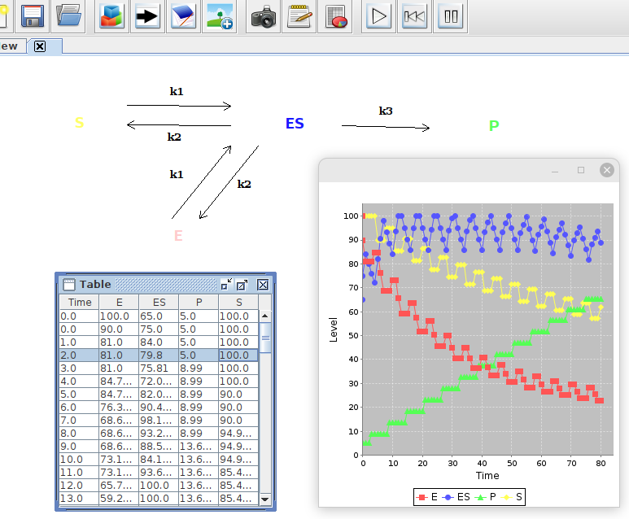{width=40%}
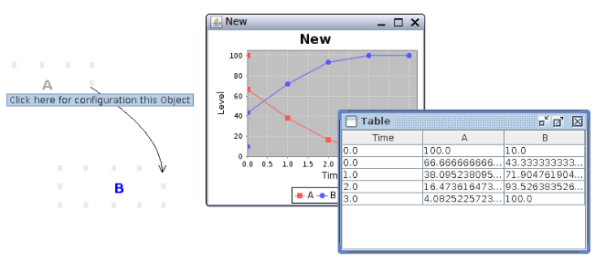{width=40%}
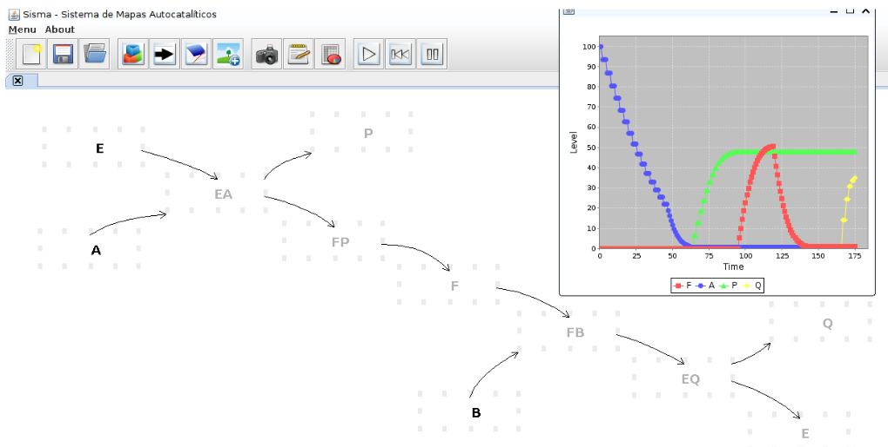{width=40%}
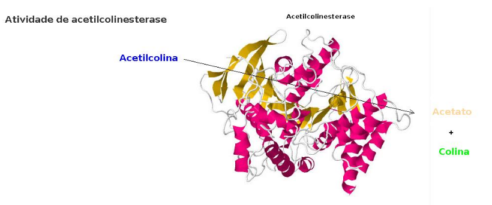{width=30%}

## Download

| The compressed file containing the program can be obtained at this [**LINK**](Sisma.zip)

## Quick tip for use ! 
| To use **Sisma**, download the file from the *link* above and unzip it on your PC. The program does not require installation, only a virtual machine [*JAVA*](https://www.java.com/pt-BR/download/manual.jsp). To run it, go to the *"dist"* folder and click on the Java executable file (*"Sisma_Realese_1.jar"*).

| This [**quick tutorial**](https://www.youtube.com/watch?v=MPr5zWlJqbY){target="\_blank"} in *video* illustrates the use described below.

| Right-click and select *Object* to insert a compound. Repeat the last procedure in another location on the *blank sheet* of the program, but this time reduce the color intensity in the scroll bar. Now connect the two objects by clicking on one of their vertices and dragging the mouse to the vertex of the other. Finally, click *OK* and run the simulation using the *Play* icon to view the conversion of hues from the first to the second object.

## Ebook
 

::: {layout="[ 300, 200 ]"}

::: {#first-column}

| To insert *objects* and *paths* in **Sisma**, as well as to design, simulate, and evaluate enzymatic reactions, chains, or dynamic metabolic networks, download the book [SISMA - Dynamic Visualization in Catalysis & Metabolism](https://www.researchgate.net/publication/388871255_SISMA_-_Visualizacao_Dinamica_em_Catalise_Metabolismo). Here are some examples of files for dynamic transformations with *Sisma*.
\

## Examples of dynamic maps with *Sisma*
\

## Briggs-Haldane condition

[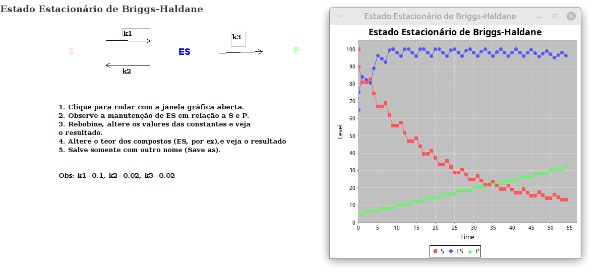](mapas/briggsHald.sis)
\

## Effect of Vm and Km

[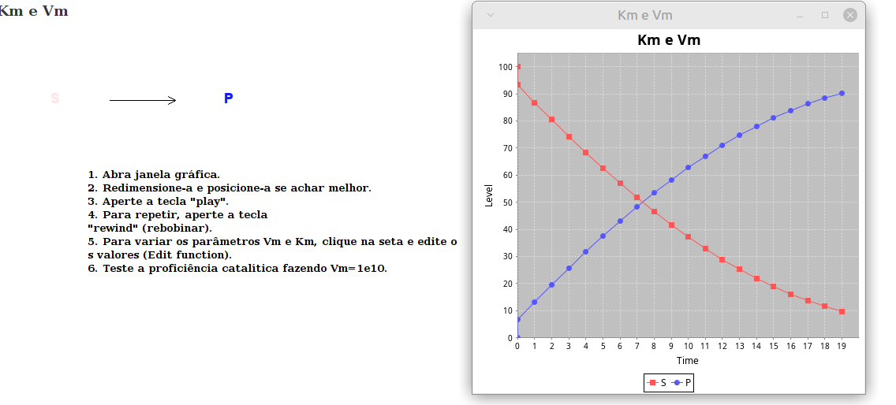](mapas/Vm_Km.sis)
\

## Effector and positive cooperativity

[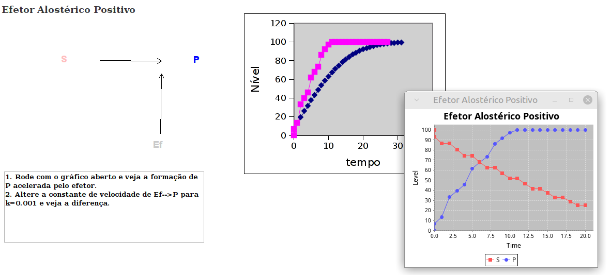](mapas/efetor_pos_exerc.sis)
\

## Negative modulator
[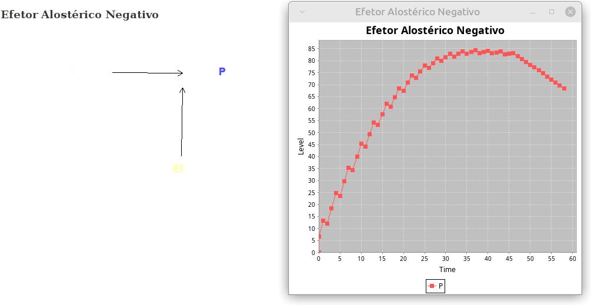](mapas/efetor_neg_exerc.sis)
\

## Induced adjustment

[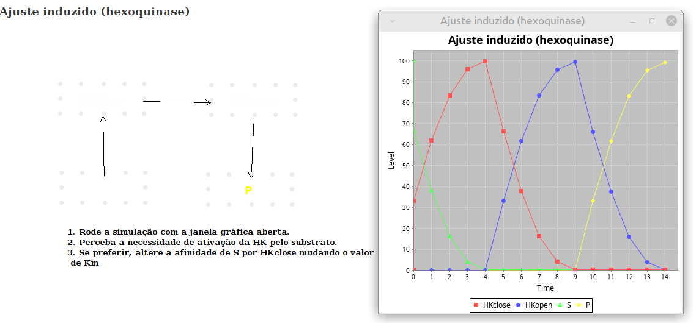](mapas/ajuste_induzido_exerc.sis)
\

## Glycolysis

\

## Carbohydrate metabolism

[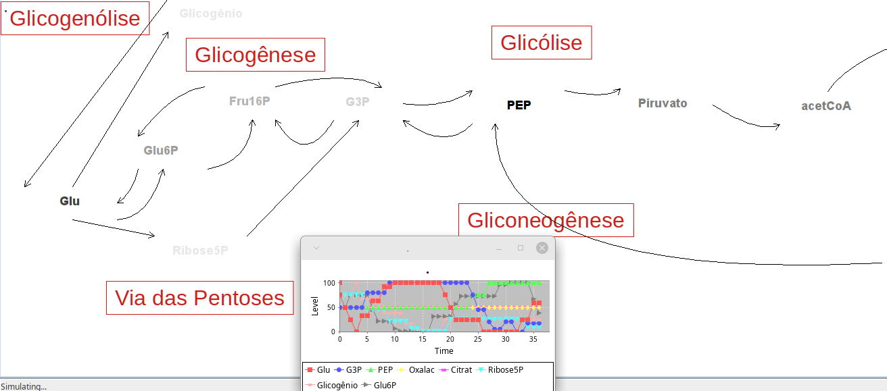](mapas/mapaCHO.sis)
\

## Metabolic map

[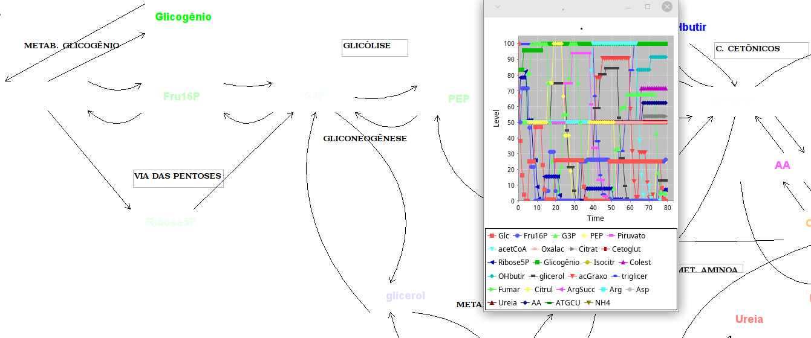](mapas/mapa.sis)
\

<!-- [Briggs-Haldane steady state condition](maps/briggsHald.sis) -->

<!-- [Effect of Vm and Km](maps/Vm_Km.sis) -->

<!-- [Effect of enzyme content](maps/conc_enz.sis) -->

<!-- [Substrate inhibition](maps/inhib_substr.sis) -->

<!-- [T-R equilibrium in enzyme](maps/eqTR.sis) -->

<!-- [Induced fit](maps/ajuste_induzido.sis) -->

<!-- [Negative allosteric effector](maps/efetor_neg.sis) -->

<!-- [Positive allosteric effector](maps/pos_effector.sis) -->

<!-- [Glycolysis](maps/glycolysis.sis) -->

<!-- [Carbohydrate metabolism](maps/carb_map.sis) -->

<!-- [Beta-oxidation of fatty acids](maps/betaoxid.sis) -->

<!-- [Metabolic map](maps/metabmap.sis) -->
:::

::: {#second-column}

[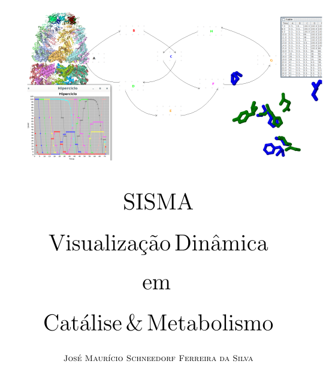{width="30%" fig-align="right"}](https://www.researchgate.net/publication/388871255_SISMA_-_Visualizacao_Dinamica_em_Catalise_Metabolismo?channel=doi&linkId=67ab3dba4c479b26c9dd001c&showFulltext=true)

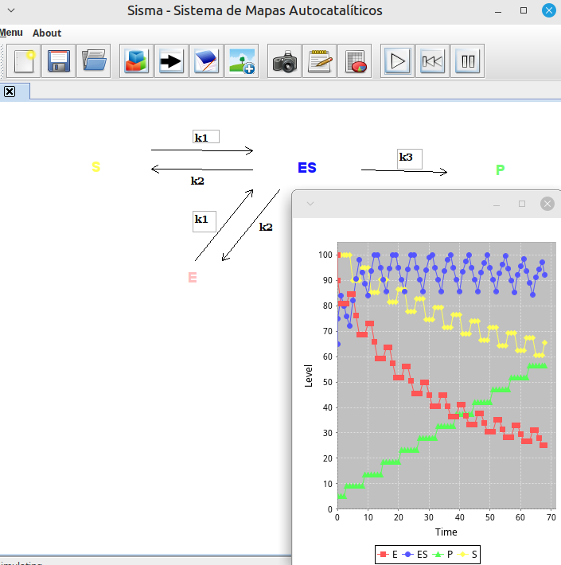

:::

:::

## SISMA online - SismaWeb !!!

| Despite its usability, the SISMA program requires it to be loaded onto a computer, which reduces its potential for use in an era of mobile devices and online access. In this sense, a cloud version is being developed by the team, using *JavaScript* with the *P5.js* library, preserving the existing features of the standalone version of SISMA and adding other capabilities.
 

| A draft for a future prototype can be viewed at [SismaWeb](https://sismaweb.netlify.app/).

