## 1 - Usando o Jmol para observar moléculas em 3D

<div class="reminder-objetivos">

Objetivos:\
  1. Acessar a versão online do Jmol\
  2. Carregar uma molécula no Jmol\

</div>
\

## Onde começar ?

|       Pode-se começar a usar o *Jmol* de vários modos. Se for usar em seu computador ou notebook, ou mesmo a partir de uma mídia removível (*pendrive*), pode acessá-lo baixando, descomprimindo e executando o arquivo `Jmol.jar` presente na pasta principal no [site do Jmol](https://jmol.sourceforge.net/).

|       Agora, se não quiser instalar nada, pode também acessá-lo *online* a partir de diversos sítios. Nesse *Curso* vamos utilizar um bem famoso, adaptado de um dos próprios desenvolvedores do programa. Basta clicar nesse [*link*](https://chemapps.stolaf.edu/jmol/jmol.php?model=water), numa nova aba.


|       Alternativamente, e ao **longo de todo esse Curso, você poderá copiar o código de qualquer exemplo bastando clicar no ícone de *"pastinha"* à direita de cada área sombreada. Pronto ! O código está copiado para a área de transferência. Agora é só colar em algum lugar (bloco de notas, ou Jmol)**. No caso do *Jmol*, copie o *link* abaixo e cole-o numa nova aba de seu navegador, teclando *Enter* em seguida.

<br /> <!-- nova linha; também pra usar somente " \ " -->


```{r, eval=FALSE}
https://chemapps.stolaf.edu/jmol/jmol.php?model=water
```


|       Agora, clique na molécula com o botão esquerdo do *mouse* ou com o *touchpad* (para notebooks), e faça movimentos aleatórios. Ou então gire o botão do meio do mouse, ou realize gestos de afastamento e proximidade com dois dedos no *touchpad*. A @fig-telaInicio que segue ilustra o resultado.

<br />

[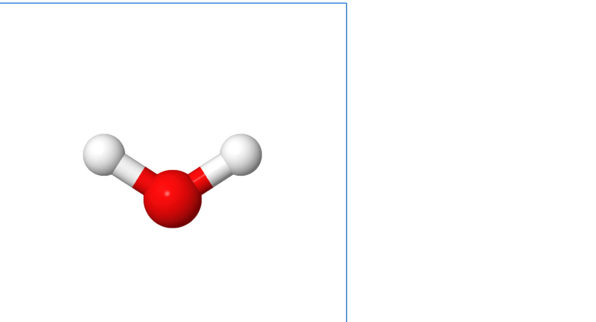{#fig-telaInicio}](https://chemapps.stolaf.edu/jmol/jmol.php?model=water)

|       Essa é a essência principal ao referenciarmos a ideia de **moléculas voadoras** para este *Curso*.


<!-- OBSERVAÇÃO: O applet funciona com os comandos do Jmol mesmo quando se está OFFLINE !! -->

## Como carregar uma molécula *online* ?

|       Pra *brincar* um pouco com outra molécula, experimente mudar o modelo na própria página de internete, ao final da linha. E agora seguindo o *MAPA (Material de apoio pedagógico para aprendizagens)*.


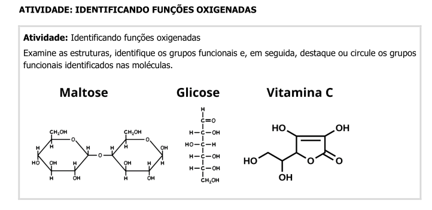
\

|       Vamos ilustrar isso com a estrutura da *vitamina C (ácido ascórbico)*.


```{r, eval=FALSE}
https://chemapps.stolaf.edu/jmol/jmol.php?model=ascorbic acid
```

|       Você pode tentar fazer isso com outras moléculas, digitando seu nome *em inglês*, por tratar-se de um *site* estrangeiro. Mas é claro que o banco de dados dessa busca não é ilimitado, e por vezes o sistema não encontrará a molécula desejada.

|       Mas há alternativas. Uma delas é buscar o nome da molécula em um *site* utlizado como banco de dados, o [PubChem](https://pubchem.ncbi.nlm.nih.gov/). Exemplificando para a *vitamina C (ácido ascórbico)*:
\


<div class="reminder-markdown">

**Agora é com você**:

1. Entre no site do [PubChem](https://pubchem.ncbi.nlm.nih.gov/) ;
2. Procure por `tylenol` ;
3. Se existir, digite esse mesmo termo ao final da linha do *JSmol online*, como segue, e veja se deu certo:
\
    `https://chemapps.stolaf.edu/jmol/jmol.php?model=tylenol`

  </p>
</div>


## Como carregar uma molécula *online*, mas em 2D

|       Por vezes pode ser interessante a visualização estática e bidimensional de um modelo molecular. Para isso, basta acrescentar *"image2d"* à linha de código, como segue:

```{r, eval=FALSE}
https://chemapps.stolaf.edu/jmol/jmol.php?model=tylenol&image2d
```

## 2 - Cliques de mouse *versus* texto de comando

<div class="reminder-objetivos">

Objetivos:\
  1. Observar que há 2 formas de conduzir ações em alguns programas: por *mouse* ou por comandos em texto\
  2. Observar as características do uso de cada\
  3. Conhecer alguns princípios para um "Ensino Reprodutível" e as vantagens do uso de linhas de comando ao invés de movimentos de mouse\
 </div>


## Cliques de mouse

|       Qualquer programa de computador que você já tenha usado, ou mesmo de dispositivos móveis, tem sua *usabilidade* centrada na facilidade do emprego de cliques e arrastes com *mouse*, *touchpad*, e mesmo os dedos (telas capacitivas). Isso facilita muito as ações rápidas pretendidas. Exemplificando para editores de texto, é comum se clicar num ícone de formatação (itálico, negrio, por ex) ou mesmo digitar seu atalho, para concluir o que se deseja no texto.


|       Simples, prático, e rápido. Dessa mesma forma, pode-se utilizar o *Jmol*, tanto na versão baixada no computador, como na versão *online*. Para a versão baixada basta observar a gama de ítens de menus e submenus. Já para versão de navegador, veja que não há menu !


|       Não obstante, a versão *online* permite visualizar a mesma informação, embora com outra formatação, bastando-se clicar *com o botão direito do mouse* em qualquer área do ecrã (nome chique pra tela contendo alguma informação, a molécula, no caso).


## Linhas de comando {#sec-linhasComando}


|       Assim como para cliques de mouse, também é possível acessar um campo de texto para digitar comandos do *Jmol*, tanto na versão baixada (*standalone*), como na versão de navegador (*applet JSmol*). Para a primeira, clique em *File--\>Console*, e surgirá uma janela para inserção de texto. Na versão *online*, clique com o botão direito do *mouse* em qualquer ponto do ecrã e escolha *Console*.


## Cliques de mouse *versus* linhas de comando


|       Ainda que seja possível utilizar o *Jmol* tanto por cliques de mouse como por comandos de texto, *qual é o melhor ?*


|       Para auxiliar na resposta, exemplifiquemos com o uso de uma planilha eletrônica, como o *Excel* do pacote MS-Office, ou o *Calc* do pacote *Libreoffice*, ou o *Planilhas* da suite Google. Suponha que você deseje fazer um gráfico simples, pegando duas colunas, cada qual para uma variável (independente ou *x*, e dependente, ou *y*). O usual seria clicar em um ítem de menu para gráficos, selecionar as colunas desejadas em campos específicos da janela que se abre, selecionar o tipo de gráfico, clicar em *avançar* ou algum termo similar, selecionar outras características (etiquetas ou nomes nos eixos *x* e *y*, por ex), e finalmente clicar em *concluir* (ou *OK*, ou termo de significado similar). Simples, rápido, e prático.


|       Mas (sempre tem um "mas")...e se você precisasse, além de construir o gráfico, realizar ações adicionais, como obter o ajuste linear dos dados, apresentar a reta resultante com determinada cor e estilo, inserir a equação de reta em um ponto específico do gráfico, colocar um título, e alterar o símbolo dos pontos, tanto o tipo, quanto o tamanho e a cor. Ufa !!!

|       Sem problema, também...desde que você tenha um bom tutorial ao lado, claro ! Ou que já esteja familiarizado com o programa da planilha, menus e ações pertinentes aos vários cliques de mouse que serão necessário para se obter um belo gráfico de regressão linear ao final.

|       Agora...mais uma pequena variável a inserir ao exemplo levantado: suponha que não seja você a construir o gráfico, mas um aluno(a)(a) de sua disciplina, e que não fora treinado nem no uso da planilha, e nem nos cálculos pretendidos !

|       Perceba que agora haverá um certo desconforto, posto que:


1.  O aluno(a) não possui conhecimento prévio no uso da planilha;
2.  O aluno(a) não possui conhecimento prévio nos cálculos pretendidos;
3.  Você terá que treinar o aluno(a), ou oferecer-lhe um *guia* de treinamento correlato;
4.  Caso já tenha ocorrido o treinamento, mas não se tenha o *guia* em mãos, tanto você como aluno(a) dependerão da *capacidade de retenção de memória* para efetivar com sucesso a empreita.

|       Agora, e se as orientações para a execução do produto final estivessem, não num *guia* para a repetição de clique de *mouse*, mas sim num pequeno texto contendo tanto os comandos em sequência como os comentários explicativos de cada ação individual, e que quando inserido no programa gerasse o gráfico já todo formatado, colorido, e com o ajuste linear e os parâmetros do resultado ?

## Vantagens do uso de linhas de comando sobre o uso de cliques de *mouse*

|       Pelo exemplo hipotético acima, perceba que um pequeno texto contendo as linhas de comando em sequência e os comentários referentes a esses permitem:

* que o produto final seja **reproduzível** e não contenha  erros;
que o produto final seja elaborado sem prévio conhecimento do aluno(a); basta executar o código no programa;
* que o produto final seja elaborado independentemente da memória dos envolvidos (sequência de cliques, por ex);
* uma quantidade virtualmente infinita de ações sequenciais, sem necessidade de se decorar a ordem dos cliques de *mouse*;
* o aprendizado de cada comando utilizado em linguagem humana, posto que existem comentários do autor para cada linha;
* que o produto possa ser modificado para gerar um objeto diferente ao final (alteração de cor, etiquetas de eixos, outro título, por ex)
* que se **reproduza** o mesmo gráfico, só que com outro conjunto de dados (*x* e *y*);
* que o aprendiz experimente outros comandos para agregar formatações e/ou cálculos distintos ao produto;
* que você ou o aluno(a) consigam **reproduzir** o produto sem recorrer à memória e até por séculos depois, se as previsões de extinção em massa não vingarem;
* que qualquer pessoa consiga *reproduzir* o objeto, independentemente de seu grau de instrução técnica ou de operabilidade do programa;
* enfim, que se consiga ensinar determinado conteúdo de modo reprodutível...ou...**Ensino Reprodutível**.

|       Dessa forma, pretende-se nesse curso utilizar somente *linhas de comando*, para que se permita materializar-se as vantagens descritas acima, tangentes a uma metodologia ativa voltada, ainda que incipiente, ao *Ensino Reprodutível*, e tanto para a ferramenta *Jmol*, como para a ferramenta *R & RStudio*.

|       Em relação ao *Jmol*, portanto, as ações sequenciais para visualização tridimensional de modelos moleculares será realizada pelo *Console* acessável conforme ítem @sec-linhasComando acima.

## *Scripts*

|       Colocado da forma acima, quando se tem um conjunto qualquer de linhas de comando sequenciais, permitindo atuar sobre um objeto tal como um modelo molecular, e para uma infinidade de coisas, tem-se então um *script*. Tecnicamente falando, um *script* constitui um bloco de instruções sequenciais em texto para compilação em um programa.

|       *Scripts* podem ser elaborados no *Jmol* em *browser* por duas maneiras:

```{r, eval=FALSE}
1. Separando os comandos por ";" - ex: "cpk only; color blue"
2. Separando os comandos por linhas - ex:
                                   "cpk only
                                    color blue"
```


|       Se você deseja que o modelo realize uns poucos comandos, a melhor opção é separá-los por ponto e vírgula (";"). Mas se desejar algo mais "sofisticado", sugere-se separá-los por linhas. E mais...linhas comentadas e escritas em um bloco de notas ou em qualquer editor de texto !


### Vantagens do uso de bloco de notas ou editor de texto para comandos em série

|       Imaginando-se uma tranformação mais significativa à molécula original carregada, como efeitos de ampliação, coloração, e representação e movimento, é fácil perceber que um conjunto de linhas comentadas dispostas em sequência facilita tanto a observação do que se pretende com o modelo, como a identificação de erros e ajustes.

|       Isto também é herdado dos conceitos de *Ensino Reprodutível*, uma vez que facilita a visualização do código (*human readable format*) e sua depuração (*code debug*). Veja o exemplo que segue, reflita sobre sua interpretação, copie para um *bloco de notas*, e teste-o no *Console* do *Jmol*.

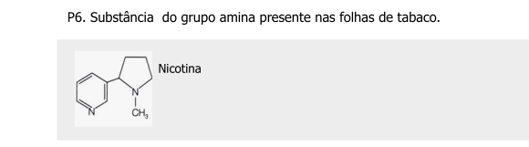

```{r, eval = FALSE}
load $nicotine
background black # cor preta do plano de fundo
spin 80 # gira a molécula
delay 3 # aguarda 1 segundo
spin off # interrompe a rotação
cpk # renderiza como modelo de preenchimento
```


<div class="reminder-markdown">

**Agora é com você**:

1. Copie o trecho de código acima para um bloco de notas.
1. Altere as linhas de código de forma aleatória, copie e execute novamente no Console. 
1. Sugestões para alteração (uma ou outra...ou todas!): 
\
spin 300
\
delay 1
\
background magenta
</div>


## 3 - Alguns comandos pra se aventurar nas moléculas voadoras

<div class="reminder-objetivos">

Objetivos:\
  1. Carregar uma molécula no Jmol de forma alternativa\
  2. Utilizar o Console para alguns comandos\

</div>

## Como carregar uma molécula no JSmol

|       O *JSmol* nada mais é do que o próprio *Jmol*, só que desenvolvido para ser utilizado em navegador de internet, e que usa entre suas linguagens o *JavaScript* (daí o *S* do *JSmol*).       

|       Supondo que você já tenha aberto em seu navegador a janela para o *applet* do *JSmol* mas que, contrariamente ao que foi feito antes (nome da molécula ao final do *site* [PubChem](https://pubchem.ncbi.nlm.nih.gov/), você queira:

*   carregar uma molécula a partir de outro banco de dados;
*   carregar uma molécula cujo arquivo já esteja em seu computador

|       Bom, nesse caso você pode usar o *mouse* ou uma *linha de comando*, como preferir.

### Carregando a molécula com o *mouse*

|       Para isto basta clicar com o botão direito do *mouse* no ecrã, como anteriormente, e selecionar *File--\>Load*. As opções que se apresentam são:


```{r, eval=FALSE}
* Open local file # abre janela para buscar o arquivo do modelo no computador;
* Open URL # abre janela para buscar o endereço de internete que possui o arquivo
* Get PDB file # abre janela para inserir um código de macromolécula do site homônimo (proteínas, ácidos nucleicos, principalmente)
* Get MOL file # abre janela para buscar um arquivo *.mol
* Open script # abre janela para buscar um trecho de código no computador
```


|       A primeira opção é autoexplicativa (`Open local file`), a segunda opção (`Open URL`) depende do endereço correto para um determinado modelo molecular, a terceira (`Get PDB file`) refere-se ao banco de dados [Protein Data Brookhaven](https://www.rcsb.org) para biopolímeros, a quarta (`Get MOL file`) envolve a busca *online* em banco de dados específico para pequenas moléculas, e a última (`Open script`), a busca de um arquivo que contenha linhas de código do *Jmol* para um conjunto de ações.

|       Como os livros didáticos permeiam estruturas moleculares pequenas, normalmente associadas aos grupos funcionais da *Química Inorgânica e Orgânica*, bem como exemplos específicos em áreas como *Saúde, Biotecnologia e Indústria*, incluindo também *alguns modelos de macromoléculas*, pode-se concluir que é mais provável que você utilize a busca remota de pequenas moléculas (*Get MOL file*), moléculas contidas em seu computador (*Open local file*), e/ou biomacromoléculas (*Get PDB file*).

|       O carregamento de pequenas moléculas é *idêntico* ao que foi experimentado adicionando-se o nome do modelo ao final do endereço do [JSmol](https://chemapps.stolaf.edu/jmol/jmol.php?model=water). O carregamento remoto para modelos de proteínas, enzimas e ácidos nucleicos envolve o conhecimento do *código PDB* desses, ou busca de palavras-chave no sítio [Protein Data Brookhaven](https://www.rcsb.org).

|       Já o carregamento de moléculas guardadas no PC envolve algumas poucas etapas, a saber:

1.  Obtém-se o modelo da molécula pela internete, ou o constroi;
2.  Baixa-se o arquivo correspondente ao modelo (geralmente com um atributo \*.mol, \*.cif, \*.cml, \*.sdf, entre mais de 60 formatos);
3.  Carrega-se na página do [JSmol](https://chemapps.stolaf.edu/jmol/jmol.php?model=water) por dois meios alternativos:

```{r, eval=FALSE}
1. Por clique de mouse: File --> Load --> Open local file ;
2. Por arraste do arquivo da pasta onde se encontre para a aba do JSmol no navegador.
```

<!---colocar alguns links pra baixar moléculas...tem vários--->

|     Exemplificando, digamos que você queira visualizar a estrutura da *aspirina* baixada em seu computador.

<div class="reminder-markdown">

**Agora é com voce:**

1. Acesse o site do Pubchem: https://pubchem.ncbi.nlm.nih.gov/
1. Digite no campo `aspirin` e clique na imagem 3D que aparece;
1. Baixe o modelo clicando em `Download Coordinates`, e seguindo-se com a opção `SDF`;
3. Clique no 1o. link pra abrir as informações da aspirina
Baixe o modelo estrutural da aspirina no PubChem ;
1. Abra o Console do JSmol no navegador (clique no ecrã com o botão direito do mouse e selecione "Console");
1. Alternativamente:
  a. Localize o arquivo no PC por "File-->Load-->Open local file", clicando depois em "Load" para o carregamento;
  b. Clique no arquivo baixado ("aspirin.sdf", por ex) e arraste-o diretamente para a janela do JSmol. 

</div>
\

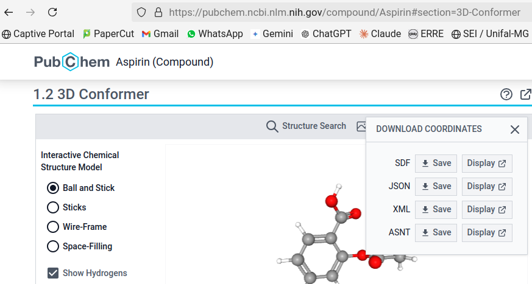
\
### Carregando a molécula por linha de comando

|       O carregamento de um modelo em particular por linha de comando restringe-se à sua busca pela internet, em banco de dados ou páginas da *web*. Para isso, abre-se o *Console* como já explicado. A parte de cima serve para apresentação dos resultados dos comandos, e a parte de baixo, para sua digitação. Nesse caso, clique no quadro inferior do *Console* e digite o comando de carregamento, aqui exemplificado para um *alcano*:

```{r, eval=FALSE}
load $alkane
```

|       O *Console* do *Jmol*, ainda que constitua uma linguagem própria de programação de comandos, possui uma vantagem interessante sobre demais linguagens de programação: *é possível efetuar o comando pelo Console tanto com letras maiúsculas como minúculas, e tanto no singular como no plural.*

|       Você pode tentar com outras moléculas, como *aspirin*, *cholesterol*, *phenol* etc (nomes em inglês, por conta do banco de dados). Para recuperar uma linha de comando que foi escrita antes, basta *navegar entre os comandos que foram utilizados com as setas para cima e para baixo do teclado (histórico de comandos)*.

Os modelos moleculares são carregados a partir do banco de dados [Cactus - CADD Group Chemoinformatics Tools and User Services](https://cactus.nci.nih.gov/chemical/structure).


### Carregando biopolímeros (proteínas, enzimas, ácidos nucleicos) por linha de comando

|       Como mecionado acima, o carregamento de macromoléculas biológicas dá-se por identificação de um código alfanumérico da mesma frente ao banco de dados [PDB-Protein Data Bank](https://www.rcsb.org/). Após obter esse código, você poderá carregar o biopolímero pelo  *link online* ou pelo *Console*. Mas saiba que são instruções diferentes (e não me pergunte por quê?!):


```{r, eval=FALSE}
Pelo Console:
  load=XXXX # onde XXXX é o código da macromolécula
# Obs: Perceba que o sinal de "$" é trocado por "=" para o PDB

Pelo link online:
  pdbid=XXXX
# Obs: Como para o link é mais "truquento", segue um exemplo completo para a bungarotoxina, um veneno proteico de serpentes:
#      https://chemapps.stolaf.edu/jmol/jmol.php?&pdbid=1ik8
```


|       Isso pode ser ilustrado por carregamento remoto da proteína espícula (*spike*) do vírus Sars-Cov-2, tal como segue:


```{r, eval=FALSE}
1. Entre no site do PDB-Protein Data Bank - https://www.rcsb.org/ ; 
2. No campo de busca, digite "spike sars-cov-2" ;
3. Selecione a 1a opção (o site vai direcionar para várias estruturas da proteína espícula) ;
4. Memorize o código da 1a. opção (embora qualquer uma também sirva), ou seja, "7FCD" ;
5. Digite a linha para carregar a proteína: "load=7FCD" (tanto faz se maiúsculas ou minúsculas)
```


|       A representação padrão para proteínas no *Jmol* é a de arame ("*wireframe*"). Para visualizar a proteína do vírus de modo mais "amigável" e semelhante ao que aparece em textos ou na internet, digite os comandos abaixo, sua **primeira sequência em linguagem de programação**.

```{r, eval=FALSE}
cartoon only  # representação exclusiva de desenho da estrutura de biopolímeros
color chain #  coloração por "cadeias" da proteína
```


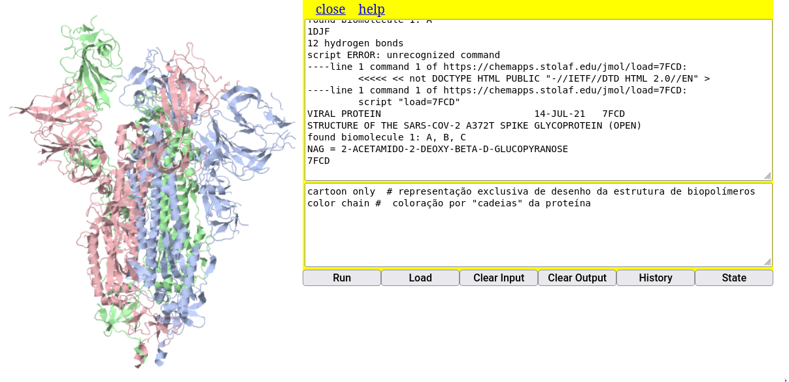


|       Proteínas, enzimas, ácidos nucleicos, e associações macromoleculares são mais pertinentes ao estudo da *Bioquímica* estrutural. Nesse sentido lhe convido a visitar uma parte do *website* autoral que possui descrições e representações detalhadas de estruturas bioquímicas com auxílio do *Jmol*, o site [Bioquanti](https://bioquanti.netlify.app/)


[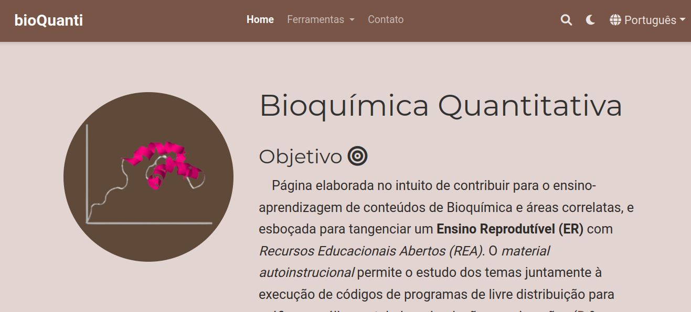](https://bioquanti.netlify.app/)

## Agora que a molécula está na página do navegador, o que posso fazer com ela ?

|       Muuuuuiiita coisa !!!

|       O *Jmol* possui um *menu* com diversas operações, e centenas de comandos, e talvez outra centena de tutoriais pela internete. Para observações estruturais mais diretas e imediatas, contudo, pode-se resumir as operações em:

-   Movimentos com mouse (rotação, translação, *zoom*)
-   Representações do modelo (bola e varetas, espaço preenchido, arame)
-   Cores (modelo e plano de fundo)
-   Medidas (distâncias e ângulos)
-   Características moleculares (ligações de H, nuvem de van der Waals, carga parcial e efetiva)
-   Superfícies (molecular, eletrostática)
-   Seleção de átomos e visualização (água, hidrogênio)
-   Animações (zoom, rotação automática), cortes


## Salvamento do modelo no computador ou dispositivo móvel

|       Todas as ações realizadas com a molécula produzem um novo modelo que pode ser baixado para o computador. E isso é bem legal porque a molécula modificada (com alteração de cores, representações, animações, por ex) pode ser carregada no *Jmol* ou na *JSmol* (internet) como já mencionado. Para tanto, pode-se usar cliques de mouse ou linhas de comando, como segue:

```{r, eval=FALSE}
1. Botão direito no ecrã -> File -> Save -> Save as PNG/JMOL # por mouse
ou...
2. write nome_da_molecula.pngj # por linha de comando no Console
```


|       **Uma das características impressionantes com o Jmol é que salvando a molécula como PNG/JMOL, você poderá abrir o arquivo como uma imagem estática com um duplo clique, para apenas mostrar a molécula, ou arrastar o arquivo até a janela do Jmol mesmo no navegador, no que será carregada a estrutura tridimensional e interativa do modelo !!! **
\

<div class="reminder-markdown">

**Agora é com voce:**

1. Carregue um modelo para "fenol" digitando no Console: `load $phenol`
1. Salve o modelo digitando no Console: `write fenol.pngj
2. Mude a orientação do modelo aleatoriamente com o mouse (só dar uma mexidinha);
3. Localize o arquivo `fenol.pngj` em seu computador;
4. Abra-o como uma figura normal, só pra testar;
5. Agora arraste o arquivo para a a janela do Jmol online, e veja se o modelo substitui o anterior (basta conferir a orientação)

</div>

\


### Alguns movimentos no Jmol

|       Para exemplificar algumas ações, usaremos inicialmente o modelo da *vitamina C*, carregando-o com o comando abaixo no *Console*.

```{r, eval=FALSE}
load $ascorbate
```


## Movimentos com mouse

|       Para *rotação e translação do modelo, bem como ampliação*:

```{r, eval=FALSE}
zoom - botão do meio do mouse; se não houver o botão, Shift+botão esquerdo; 

rotação - botão esquerdo do mouse

translação - Ctrl+botão direito

rotação no eixo - Shift+botão direito
```


## Representações do modelo

|       As representações referem-se ao aspecto visual do modelo (renderização), ou seu *estilo*, Assim, o *Jmol* pode renderizar o modelo como *vareta, arame, espaço preenchido, bola e vareta, traço, e desenho* (tudo em inglês, claro - *cpk, wireframe, trace, cartoon*). 


|       Experimente esses estilos, incluindo a opção `only`. Essa opção permite que a ação não seja sobreposta às anteriores (no caso, a sobreposição das representações). Para isso, copie, cole, e execute **em cada linha separada** o trecho de código que segue no *Console* do *Jmol*, e cuja renderização ilustra a molécula de fluoxetina.
\


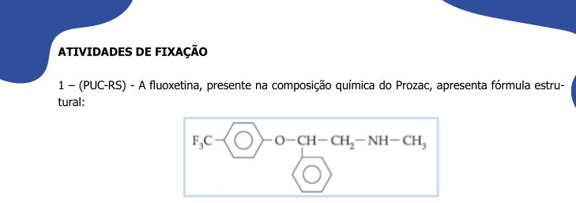
\


```{r, eval = FALSE}

load $fluoxetine  # carrega a molécula
wireframe only # estilo em arame
cpk only # espaço preenchido
cpk 20 only, bond 1 # bolas e varetas
cartoon only # representação de cartoon, mas que não ocorre com moléculas pequenas, apenas com biomacromoléculas (proteínas, ácidos nucleicos, por ex)

```


|       Observe também que a representação em `cartoon` não resulta numa renderização para o modelo da fluoxetina. Isso decorre porque *a representação em `cartoon` é restrita para biopolímeros somente, ou seja, proteínas e ácidos nucleicos, e algumas associações supramoleculares.*

|       Contudo, se quiser experimentar o `cartoon`, será necessário conhecer o código alfanumérico de uma proteína ou ácido nucleico. Exemplificando para a mioglobina, proteína transportadora de oxigênio em mamíferos (código: *1mcy*)

```{r, eval=FALSE}
load=1mcy # carregando a mioglobina

# Obs: veja que a linha de comando pra biopolímeros é ligeiramente diferente da usada pra moléculas pequenas
```

|       Observe que a renderização padrão para grandes moléculas é a de *bolas e varetas*, pouco didática para o aprendiz. Nesse caso, pode-se representá-la como desenho exclusivo, digitando-se:

```{r, eval=FALSE}
cartoon only # renderizando em desenho
```

|       Para se conseguir esse e outros códigos de proteínas e ácidos nucleicos, deve-se entrar no banco de dados do [PDB - Protein Data Bank, RCSB](https://www.rcsb.org/), e digitar o nome no campo de busca (no caso, `myoglobin`). O sistema retorna diversos modelos estruturais e seus códigos, bastando transcrever um desses códigos ao *Console* do *JSmol*.

|       Se desejar observar um pouco mais sobre biomoléculas e o uso do *Jmol*, deixo-lhe um convite para visitar nosso portal de [Bioquímica Quantitativa](https://bioquanti.netlify.app/). Lá você encontrará também outras aplicações para o *Jmol*, *R e RStudio*, bem como um programa que simula transformações de elementos presentes em esquemas (diagramas, fluxogramas, heredogramas, redes e teias) por diferenças de luminância entre o elemento e seu predecessor/sucessor ([SISMA - Sistema de Mapas Autocatalíticos](https://bioquanti.netlify.app/uploads/sismabook/)).


## Cores

|       Existe grande flexibilidade de [cores](https://jmol.sourceforge.net/jscolors/) para o *Jmol* (e, por consequência, para o *JSmol*), tanto para os modelos inteiros, partes do modelo (átomos específicos ou um conjunto), e plano de fundo. A visualização padrão de cores segue a convenção [CPK (Corey–Pauling–Koltun)](https://en.wikipedia.org/wiki/CPK_coloring). Exemplificando para o modelo anterior de vitamina C (`load $ascorbate`), experimente a variação que segue, separadamente:

```{r, eval=FALSE}
color pink
color blue
color ligthgreen
background yellow # cor do plano de fundo
```

|       O último comando da lista acima permite variar a coloração do plano de fundo.

|       Adicionalmente, também é possível a coloração de ligações entre os átomos, como segue:

```{r, eval=FALSE}
color bonds LightSeaGreen
```


|       Para um grande espectro de cores, você pode consultar a referência do [Jmol Colors](https://jmol.sourceforge.net/jscolors/), ou um *link* mais "mastigado", de nossa autoria junto ao aprendizado do programa no ensino superior, o portal [Bioquanti](https://bioquanti.netlify.app/) e, mais especificamente, o [tópico de cores para o Jmol](https://bioquanti.netlify.app/uploads/jmolbook/jmolquarto/comandos#cores-espec%C3%ADficas).


## Medidas

|       O *Jmol* permite calcular distâncias e ângulos em um modelo molecular. Para exemplificar isso, talvez seja interessante o carregamento de um *modelo de água* (`load $water`), e cujas distâncias e ângulos estão presentes em alguns livros de Química.


### Para distâncias

|       No exemplo da molécula de água, para se determinar a distância de uma ligação O-H, por exemplo execute:

```{r, eval=FALSE}
1. Duplo-clique do mouse no 1o. átomo;
2. Arraste do mouse ao 2o. átomo;
3. Clique do mouse no 2o. átomo
```


|       Experimentando para a distância da ligação O-H, o programa retorna o valor de 0,097 nm, ou 0,97 Angstroms, o valor convencial para esse tipo de ligação covalente.

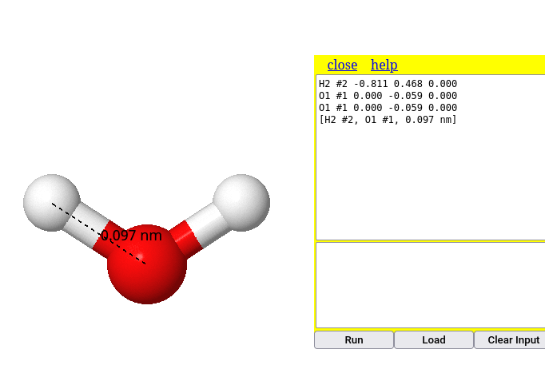


### Para ângulos

|       Para a mesma molécula de água, experimente determinar o ângulo de ligação:

```{r, eval = FALSE}

1. Duplo clique no 1o. átomo (ex: H);
2. Arrasta ao 2o. átomo (ex: O);
3. Clique no 2o. átomo;
4. Arraste ao 3o. átomo (ex: o outro H);
5. Clique no 3o. átomo
```

|       Perceba que o sistema retorna o valor de 114$^{o}$, um valor próximo do previsto para a molécula (109.5$^{o}$), ou medido (104.5$^{o}$). Essa aproximação é decorrente da construção do modelo de água.

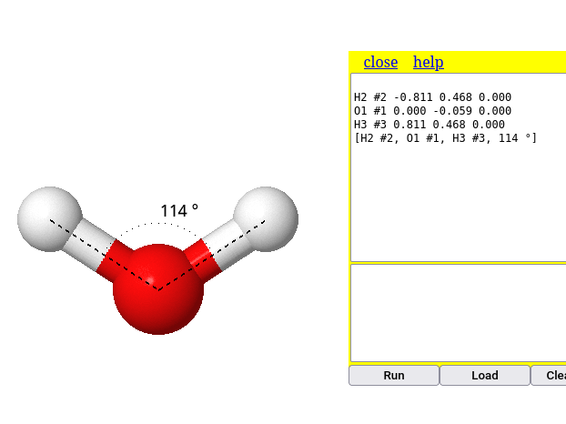

|       Para limpar as medidas, use o comando:

```{r, eval=FALSE}
measure off
```


## Características moleculares

|       São diveras as informações tangíveis a um modelo molecular no *Jmol*. Exemplificando as mais básicas para a molécula de um componente do molho *shoyo*, o glutamato:


### Cargas

|       Por vezes pode ser interessante apresentar a polaridade das moléculas em função de sua distribuição de cargas. No *Jmol* há dois tipos de cargas, *carga efetiva (`formaCharge`) e carga parcial (`partialcharge`)*. Podemos ilustrar a distribuição de cargas em uma molécula de tensoativo, como o hexadecanoato.

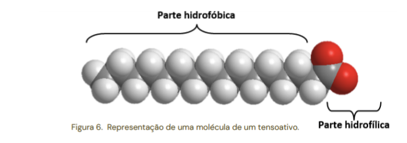


|       Para isso, digite no *Console* os comandos abaixo:

```{r, eval=FALSE}
load $hexadecanoate
calculate partialCharge # cálculo de cargas parciais do modelo
label %P # apresentação das cargas (etiquetagem)
```


|       Uma característica do *Jmol* que o torna mais eficiente a execução de suas ações é a disposição sequencial de comandos. Dessa forma, não é necessário clicar em *Enter* para cada comando, bastando separar os comando por ponto e vírgula (*;*) como ilustrado abaixo, para o cálculo de cargas parciais da molécula de glutamato:

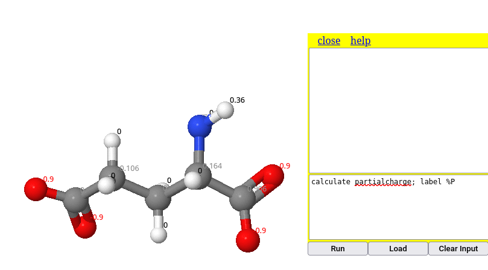


|       Da mesma forma pode-se ilutrar a obtenção de *cargas formais* no modelo. Nessa, adicionou-se a coloração transparente, para melhor visualização da carga unitária negativa do ácido carboxílico:

```{r, eval=FALSE}
calculate formalcharges # cálculo de cargas parciais do modelo
label %C # apresentação das cargas (etiquetagem)
```

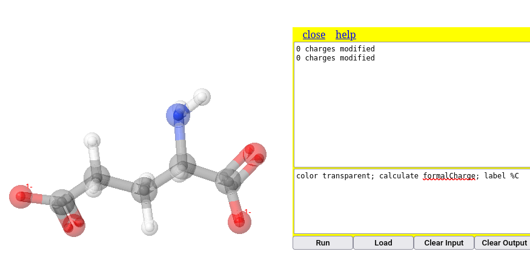

|       Perceba que os comando da figura mistura maiúscula e minúsculas, de modo diferente da linha de comando que a antecede. Essa é uma **característica bem legal do *Jmol*, que não se importa com a capitalização ou não da fonte**. Ou seja, tanto faz se minúsculo, maiúsculo ou uma combinação de ambos; o *Jmol* executa a ação do mesmo modo.


#### Scripts & Ensino Reprodutível

|       O exemplo acima apresenta uma maneira simples de concatenar comandos, facilitando a execução automática e sequencial de um conjunto desses. No entanto, a visualização da linha de comando fica um pouco prejudicada com a separação por *";"*, o que pode acarretar uma poluição visual quando houver vários comandos.

|       A situação de contorno envolve a disposição dos comandos no formato de um *script*. Esse nada mais é do que um trecho de código contendo um comando por linha, o que melhora a visualização do código como um todo. Além disso, o *script* possui a vantagem adicional de se inserir comentários entre as linhas de comando, permitindo também uma melhor apropriação do código e de seu aprendizado.

|       Essas características de um *comando por linha com comentários explicativos* conferem ao *Jmol* seu aspecto para *programação* de ações sequenciais, e enraiza por consequência uma das premissas básicas para um *Ensino Reprodutível*: a redação de trechos de códigos em comandos unitários por linha, escritos como num bloco de notas, e com comentários sobre as ações do programa em cada linha. 


Exemplificando para um *script* envolvendo as ações para o glutamato acima, apenas copie o trecho abaixo e cole-o no *Console* do *JSmol*, executando-o.

```{r, eval=FALSE}
load $glu # carregamento de micromolécula 
wireframe only # renderização exclusiva de varetas
calculate partialCharge # carga parcial
label %P 
```

|       Outro aspecto inerente à iniciativa de *Ensino Reprodutível* reside na *possibilidade de se avaliar o código com alguma alteração*, objetivando um produto final ligeiramente modificado. Tente repetir o trecho acima, mas para cargas efetivas, ou seja:

```{r, eval=FALSE}
load $glu # carregamento de micromolécula 
cpk only # renderização exclusiva por espaço preenchido
calculate formalCharge # carga efetiva 
label %C 
```


|       Complementarmente, pode-se atuar alterando mais comandos do código, de modo a criar um resultado completamente diferente do original. Isso define outra característica do *Ensino Reprodutível*, qual seja, a de *criação de trecho de código*. Ilustrando, segue um trecho baseado no anterior, mas para minimização de energia e reestruturação dos orbitais da molécula.

```{r, eval=FALSE}
load $glu # carregamento de micromolécula 
cpk only # renderização exclusiva por espaço preenchido
minimize # comando para minimização de energia da estrutura 
```


## Características moleculares


|       Por vezes também é interessante apresentar à turma o conceito de *forças fracas* que permeia as interações moleculares, tal como ilustrado abaixo.


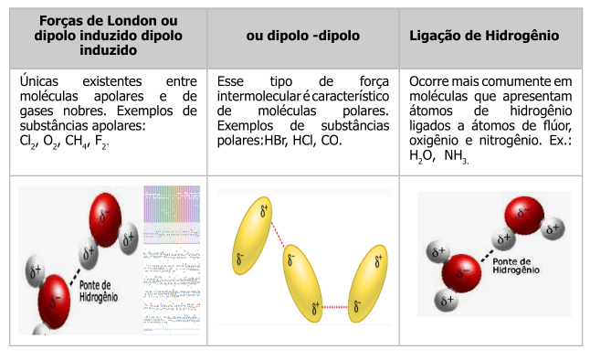


|       Além de previsão estrutural para *carga parcial e carga formal*, o *Jmol* também permite evidenciar *forças fracas* no modelo, tais como *nuvem de van der Waals* e *ligações de hidrogênio*, como segue.


### Nuvem de van der Waals

```{r, eval=FALSE}
dots on # nuvem de van der Waals nos átomos do modelo (retira-se com "dots off")
calculate hbonds # identifica ligações de hidrogênio no modelo
```

|       Ilustrando, copie e cole o trecho que segue no *Console*:

```{r, eval=FALSE}
load $water
dots on # nuvem de van der Waals na estrutura da água
dots ionic # nuvem iônica sobre o modelo
```

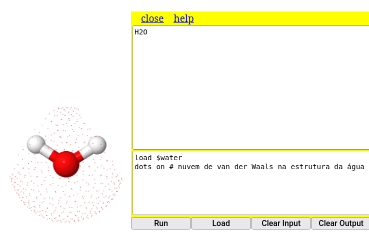

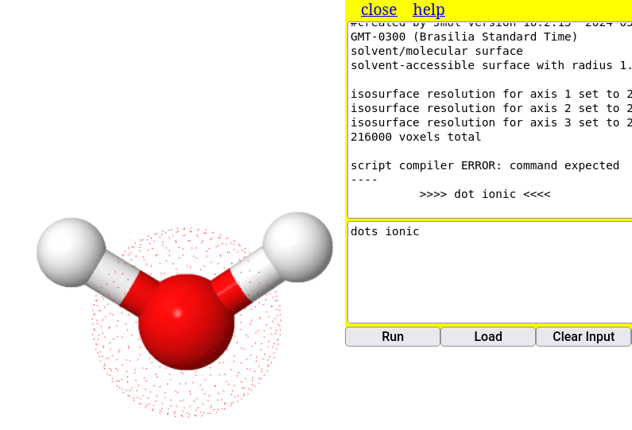 
\

### Ligações de hidrogênio
\

```{r, eval=FALSE}
load=1djf # carrega um modelo de peptídio
calculate hbonds # apresenta as ligações de H presentes na estrutura
```

\

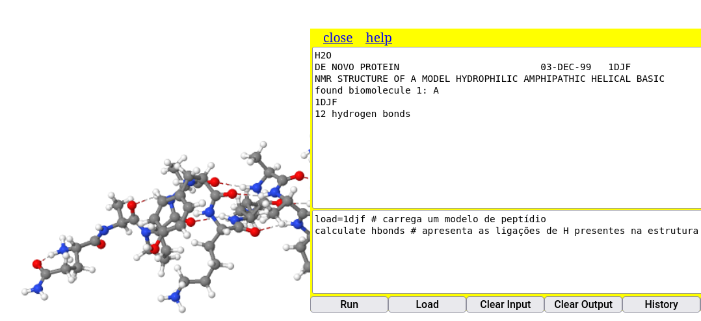

## Superfícies

|       Além da superfície de van der Walls (*dots on*) vista acima, o *Jmol* é capaz de representar algumas superfícies para modelos moleculares. Quanto maior a molécula, maior o cálculo interno para gerar a superfície, o que pode dificultar sua visualização. Assim, ilustrando um comando simples para superfície da molécula de água:


```{r, eval=FALSE}
isosurface molecular # superfície molecular que inclui o solvente
```

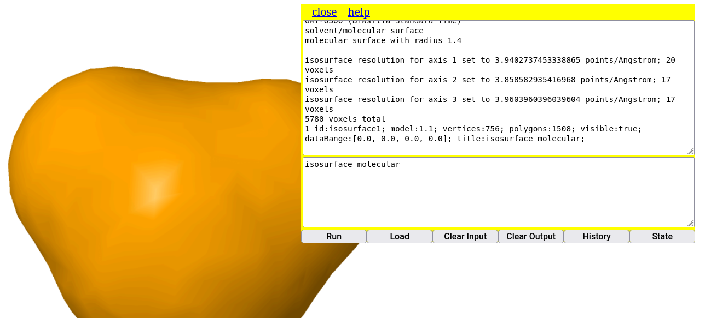

## 4 - Algumas animações com Jmol

<div class="reminder-objetivos">

Objetivos:\
  1. Compreender uma animação de molécula como um script\
  2. Utilizar o Console animação de moléculas\

</div>


## Animar as moléculas.


|       E chegamos a esta última parte do *Curso* com o *Jmol*, para apresentar um efeito didático-pedagógico bem interessante do programa: *animação de moléculas*.

|       Pode ser que você queira mostrar uma molécula com estilos distinto durante um determinado período, ou fazer uma transição lenta entre cores em átomos específicos, ou ainda efeitos de ampliação, redução, ou rotação controlados. E outros tantos que a imaginação e o rigor técnico permitirem ao estudo.

|       Nesses casos é interessante conhecer e aplicar alguns poucos comandos para animação explicados a seguir. Os exemplos foram selecionados de modo a simplificar cada comando. Mas não se iluda sobre a capacidade do *Jmol*, porque para cada comando sempre há várias opções complementares. E se você quiser saber algo sobre qualquer comando do *Jmol*, faça uma visita ao [*site* de referência](https://chemapps.stolaf.edu/jmol/docs/).


### Spin

|       Comando simples de rotação da molécula.

```{r, eval = FALSE}
load $glucose; spin 30 # o valor refere-se à velocidade de rotação
```


### ZoomTo (redimensionamento do tamanho)

|       Esse comando impressiona, pois permite uma ampliação ou redução controlada no tempo. Sua sintaxe é:

```{r, eval=FALSE}
*zoomTo* : tempo (expressão opcional) tamanho
```

Exemplos:

```{r, eval = FALSE}         
Aumentar em 3x, meio segundo por vez: zoomto 0.5 *3 

Aumentar em 4x, meio segundo por vez: zoomto 0.5 400 

Focar num ligante de biopolímero com ampliação de 2x: zoomto 2(ligand) 0

Focar num ligante de biopolímero com ampliação de 4x, a meio segundo por vez: zoomto 0.5(ligand)* 4
```


### Delay

|       Esse é um **comando-chave** para qualquer animação, pois permite que a imagem da molécula no *Jmol* realize uma pausa (em segundos), antes da próxima ação. É utilizado normalmente na sequência de comandos pelo *Console*, ao longo de um *script*.

```{r, eval=FALSE}
delay 3 # aguarda 3 segundos antes da próxima ação
```


|       Podemos experimentar uma animação com os comandos acima junto ao modelo do ciclohexanol.


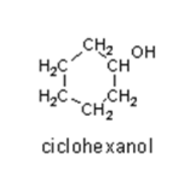

|       Segue um trecho de código para você experimentar animações com o *Jmol*. Basta copiar e colar no *Console* e executá-lo. Se preferir alguma modificação, é melhor copiar para um bloco de notas, modificar e testar o *script* no *Console*.


<div class="reminder-markdown">

**Agora é com você:**

load $cyclohexanol
\
delay 2
\
spin Y 70
\
delay 2
\
spin off
\
zoomTo 2 \*2
\
cpk 
\
delay 2
\
color transparent 
\
zoomTo 2 \*0.5
\
spin 50 


</div>

