## 1 - Como usar o R & Rstudio  - instalação e nuvem

<div class = "reminder-objetivos">

Objetivos:\
  1. Conhecer o R e o RStudio\
  2. Compreender os passos para instalação em computador\
  2. Acessar o RStudio pelas nuvens\

</div>


|       Existem dois ambientes alternativos para se utilizar o *R* (programa) e o *Rstudio* (interface do usário): instalando no computador, ou pelas nuvens. Há poucas diferenças entre ambas as maneiras de se trabalhar, mas a fundamental é que a *instalação* permite a utilização dos programas  *offline*, sem necessidade de internet, enquanto que pelas nuvens, bom, já sabe. Por outro lado, na versão de nuvem não é necessário instalar nem o *R* e nem o *RStudio*, enquanto que na versão instalada existem alguns passos pra isso, descritos abaixo. 
\

|       Contudo, <span style="color:orange;">você poderá utilizar a versão em nuvem durante todo o *Curso*, não sendo necessário preocupar-se com as instalações do `R` ou do *RStudio*.</span>


\

## Instalando o R e RStudio no computador

|       Você precisa seguir uns poucos passos para instalar o *R & RStudio* no computador. Na prática, baixa-se ambos os programas e os instala como se faria com qualquer outro programa, tanto faz se para *Windows*, *Linux*, ou *Mac*. Seguem os passos:

1.  Acesse o site do [Rstudio](https://posit.co/download/rstudio-desktop/) e faça o *download* do programa `R`. 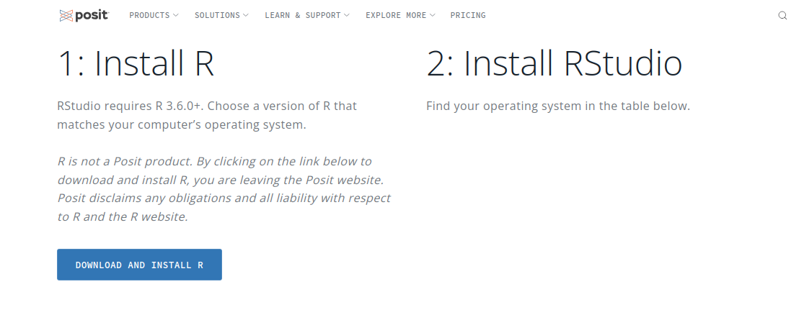

2.  Instale o programa com as opções padrão.

3.  No mesmo site do ´[RStudio](https://posit.co/download/rstudio-desktop/) procure um pouco mais abaixo pelo instalador mais apropriado a seu sistema operacional.


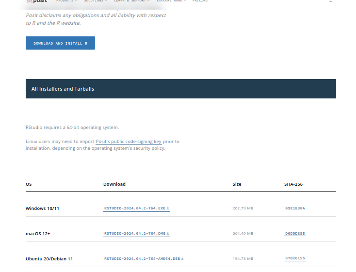
\

3.  Baixe o arquivo e instale-o como qualquer outro programa.

4.  Abra o programa *RStudio*, e cuja interface será parecida com a que segue.

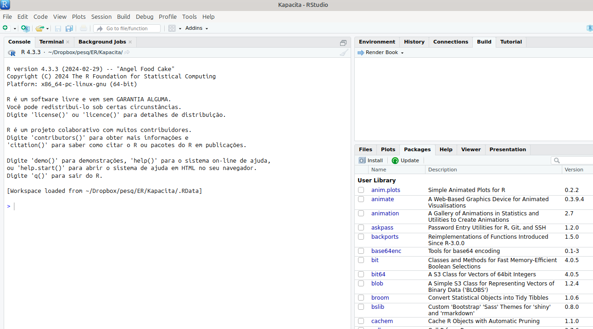{#fig-rstudioJanela}
\

## Acessando o `R & Rstudio` pelas nuvens

|       Essa é uma opção simples e que não requer qualquer instalação. A interface acessada é praticamente igual à da instalação em computador. Entre algumas vantagens destaca-se a velocidade normalmente superior pra rodar e instalar pacotes, posto que o servidor já se encontra em nuvem. Mas por ser acesso *online*, requer uma inscrição inicial, com *login e senha*. Seguem os passos:
\

1.  Acesse o site do [RStudio Cloud](https://login.posit.cloud/login?redirect=%2Foauth%2Fauthorize%3Fredirect_uri%3Dhttps%253A%252F%252Fposit.cloud%252Flogin%26client_id%3Dposit-cloud%26response_type%3Dcode%26show_auth%3D0).

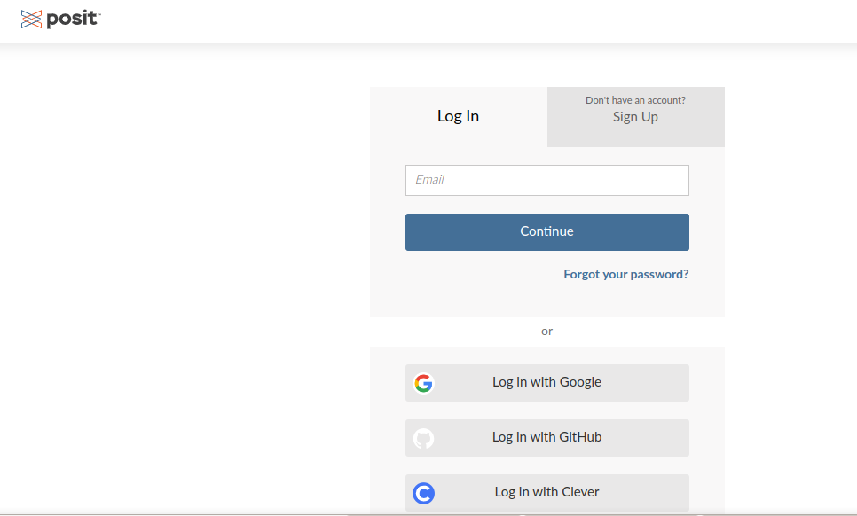


2.  Realize a inscrição (*sign up*) ou acesse pelo *Google* (mais simples).

3.  A janela deverá parecer-se com a que segue, embora sem os projetos listados.

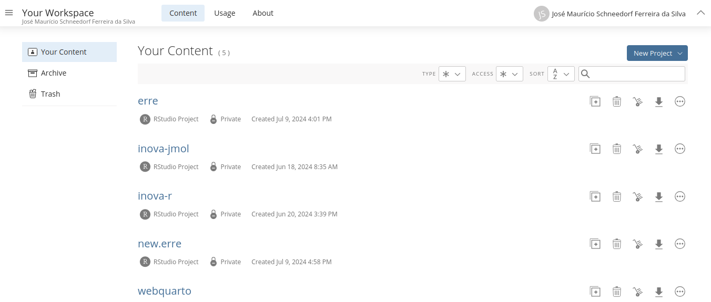


4.  Agora a parte interessante. Clique em *New Project* e selecione *New Rstudio Project*.

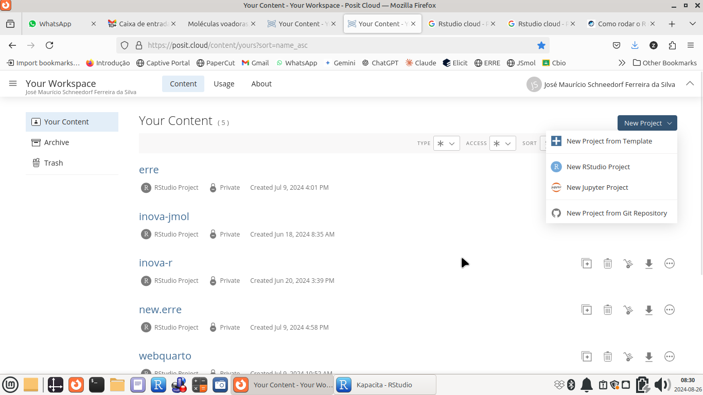


5.  A imagem final será bem parecida com a apresentada pela versão instalada, veja:

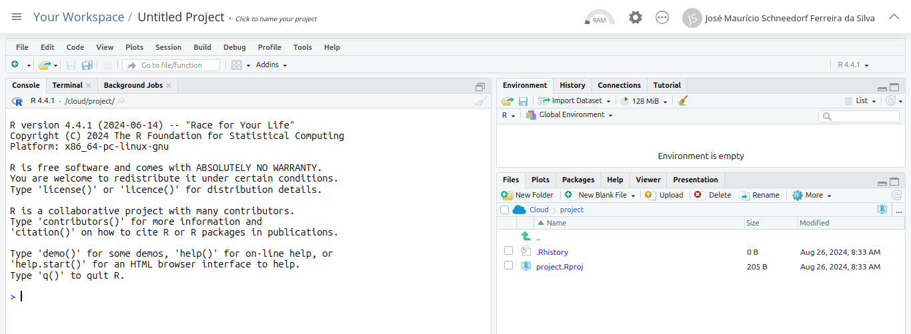
\

|       Pronto ! Você pode utilizar uma ou outra forma para acessar as atividades propostas. A seguir serão fornecidas algumas ações e comandos rápidos para se trabalhar com a interface do `Rstudio` e com o `R`. Mas apenas para que se consiga criar, executar, e modificar alguns *scripts* criados para *interatividade por animação, simulação, e visualização cartográfica*. 
\


|       Mãos à obras, agora !!

## Comandos básicos & Scripts no R

<div class = "reminder-objetivos">
Objetivos:\
  1. Entender para que servem as janelas e abas do RStudio\
  2. Compreender a lógica de comandos e atributos do R\
  3. Utilizar comandos por script
  
</div>


|       O `R` é um programa que opera por linha de comando. Isso é um pouco chato, como já visto, porque qualquer erro na digitação de um comando resulta na interrupção da leitura do código. Mas, por outro lado, e também como já visto, *linhas de comando encadeadas e comentadas permitem a reprodução e modificação de trechos de códigos convergentes a um produto* qualquer, no caso, objetos didáticos ao ensino médio, e *sem a necessidade de se memorizar cliques de mouse e operações técnicas*.

|       Diferente do *Jmol*, contudo, o `R` é bem chatinho na sintaxe, não sendo possível mesclar fonte maiúsculas ou minúsculas, bem como singular ou plural. Para que o código funcione, é necessário sua correta digitação. Mas *pode-se tranquilamente aumentar ou reduzir o espaço entre comandos*, o que não faz diferença pro compilador do `R`.

|       Algumas operações são realizadas alternativamente por *mouse*, *linha de comando*, ou ambos, dependendo da ação. A seguir serão apresentadas algumas funcionalidades básicas para a reprodução de códigos para objetos didáticos, sem descrições detalhadas da operação própria do *R & RStudio*, para simplificar e tornar mais objetivo este trabalho. 

|       Se você desejar saber mais a respeito de ambos os programas, versão instalada ou em nuvem, sugerimos os inúmeros sites e tutoriais disponíveis na internet, bem como centenas de livros já escritos no assunto, e cursos *on-line* em várias plataformas de ensino.

\

## Uma visão da interface *RStudio* 

\
    | O *Rstudio* nada mais faz do que permitir uma *interace gráfica para o usuário* do `R` (ou *GUI*, do inglês, *Graphic User Interface*), esse um programa executado por linguagem própria de códigos, assim como o *Jmol*.  Diversas operações também são realizadas alternativamente sem comandos ou códigos, como abrir e salvar um arquivo, ou visualizar e salvar um gráfico, por exemplo. Vejamos a divisão da janela principal do *Rstudio*.

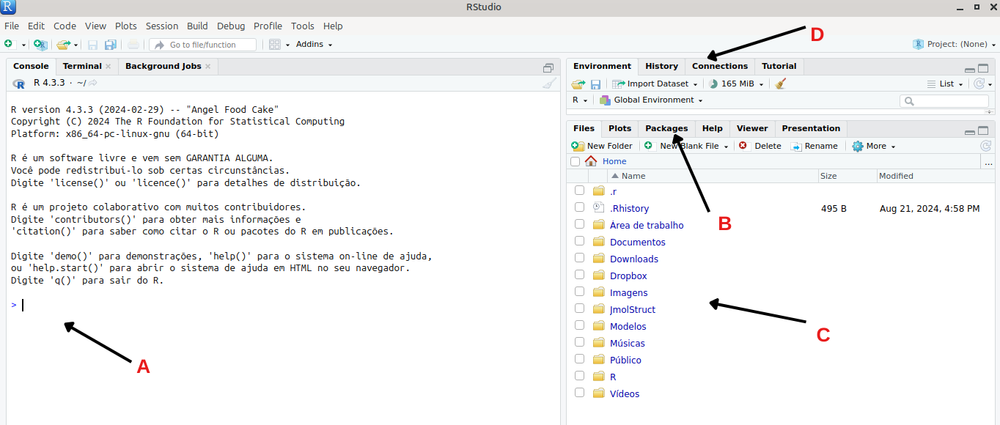

|       Para nosso trabalho, contudo, será interessante uma área adicional, a *área de scripts*, a qual se acessa como segue:


```{r, eval=FALSE}
File --> New File --> RScript

... ou por atalho:Ctrl + Shift + N

```

\

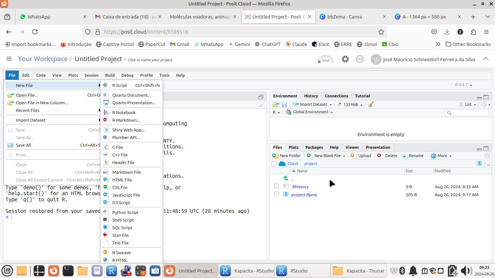
\

|       Veja que agora a janela principal se dividiu em mais uma parte, a que incluiu a aba nova para *scripts*.
\

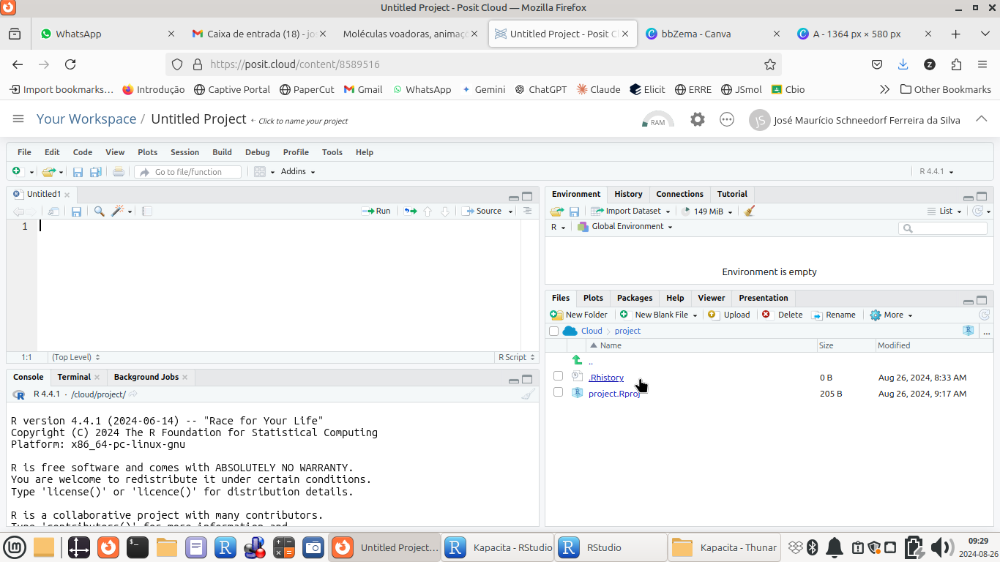
\


## Como funcionam os comando no `R`

|       Todos os comandos do `R` são compostos por um *nome* seguido de *argumentos*, esses entre parênteses. Seguem exemplos

```{r, eval=FALSE}
comando(argumento 1, argumento 2, argumento 3, ...)

Exemplos:
  plot(x,y)
  mean(z)
  read.csv(file = "meus.dados.csv")
```
\


## Elaborando um *script* no `R`

|       Para se produzir um *script* no `R`, a melhor forma é redigir as linhas de comando de modo similar ao que foi realizado com o visualizador molecular 3D *Jmol* em seu *Console*, separando-os por linhas individuais. Veja um exemplo de cálculo simples:

```{r}
x = 5
x^2 +7
```
\

|      E para executar o *script* acima, basta copiá-lo e colá-lo na área de *script* aberta. E aí vai uma **dica de ouro**. Veja que no canto superior direito do *script* existe um *ícone de colagem* do texto do *script*. Basta clicar nesse ícone que o texto estará copiado.

|       Agora é só colar na aba do *script* aberto (em nuvem, por exemplo) e executá-lo como segue.

\

## Executando um *script* no `R`

|       Existem algumas formas de se executar um *script*, como no exemplo acima, no `R`. Seguem as mais comuns:

```{r, eval=FALSE}
1. Se deseja executar algumas linhas de um *script*, pode-se selecionar as linhas e clicar Ctrl + Enter ;

2. Se desejar executar todo o *script*, seleciona-se todo o texto (Ctrl + A) seguido da ação acima, Ctrl + Enter ;
   Opcionalmente, pode-se clicar no ícone "-->Source" ;
   
3. Se desejar executar apenas uma linha, basta clicar na linha seguido de Ctrl + Enter ;
   Opcionalmente, pode-se clicar no ícone "-->Run" ;

```

\

<div class="reminder-markdown">

**Agora é com você:**

  A partir do script rodado, e transcrito abaixo:\
x = 5 \
x^2 +7 \

Modifique a segunda linha de comando para o cálculo em "x" utilizando outras operações. Sugetões: \
  sqrt(x)  ; raiz quadrada \
  log10(x) ; logaritmo de base 10 \
  sin(x)   ; seno 

</div>


## Algumas recomendações sobre a digitação num *script* do `R`:

|       Existem algumas premissas básicas pra que um *script* do `R` seja lido de forma clara por seu elaborador, bem como compilado corretamente pelo programa:

1.  *Digitação*: sempre que houver um erro no *script* no *Rstudio*, surgirá uma cruz vermelha ao lado esquerdo da linha de comando; contornado o erro, o sinal desaparece;
2.  *Comentários*: para que o *script* seja lido também por *"um ser humano"*, é aconselhável tecer comentários nas linhas de comando (iniciados por *\#* ) - umas das bases do *Ensino Reprodutível*;
3.  *Identação*: permita "identação" quando a linha estiver um pouco longa, clicando na tecla *Enter* após uma separação de argumentos por *"vírgula"*. Dessa forma, a linha continua logo abaixo, mas com um pequeno deslocamento à direita. Isso facilita a legibilidade do código.
4.  *Nomes*: os comandos do `R` são em língua inglesa. Dessa forma, deve-se evitar o uso de variáveis e nomes de arquivos com acentuação ou sinais gráficos em Português (ex: *ç*, *~*). Além disso, o `R`é um compilador de códigos. Se você definir um nome composto para um arquivo ou variável, ou seja, com espaço entre os termos (como é normal no cotidiano. ex: meu arquivo), o `R` tentará executar os termos separadamente (ex: "meu", e depois, "arquivo"), o que incorrerá na interrupção de leitura e numa mensagem de erro. Assim, para nomes de variáveis e arquivos, dê preferência a um dos 3 tipos de **convenções comuns usadas em programação**, a saber:

* separação por *underline, " \_ "* ou hífen; ex: minha_variável, minha-variável
* separação por maiúscula; ex: minhaVariável
* separação por pontos; ex: minha.variável


## 4 - Instalando pacotes no `RStudio`

<div class = "reminder-objetivos">
Objetivos:\
  1. Entender o que são e para que servem os pacotes do R\
  2. Saber instalar e carregar um pacote do R, exemplificado para `plotly`
</div>


## Pra quê instalar pacotes (bibliotecas) ?

|       Numa resposta simples, porque cada um dos mais de 21 mil pacotes do `R` possui uma extensão de recursos que o próprio `R` não possui em sua instalação original. Ou seja, amplia-se a ferramenta para algum propósito específico. *Neste *Curso*, nosso objetivo com o `R` é o de reproduzir e mesmo modificar trechos de códigos que resultem em objetos didáticos interativos para o ensino médio*. 

|       E para isso, vamos utilizar dois pacotes, apenas, `plotly`, e `leaflet`. Dessa forma, os pacotes de interatividade precisam de instalação prévia à execução dos códigos. Mas fique tranquilo. Essa é umas das partes mais tranquilas quando se lida com o `R`.


## Instalando o pacote `plotly` no `R` 


1.  Acesse a aba *Packages* do *RStudio*.

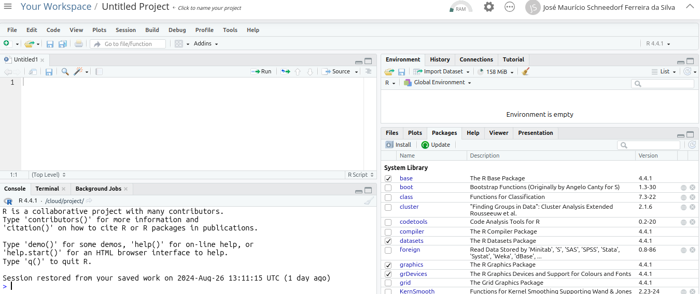


2.  Digite o nome do pacote no campo (`plotly`), e clique em *Install*.

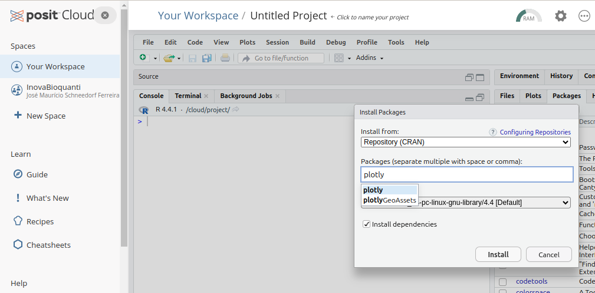

|       Pronto ! O pacote será instalado a partir do servidor de nuvem do *RStudio* (tanto faz se no seu computador ou em nuvem), com algumas mensagens intermediárias em vermelho, como abaixo.

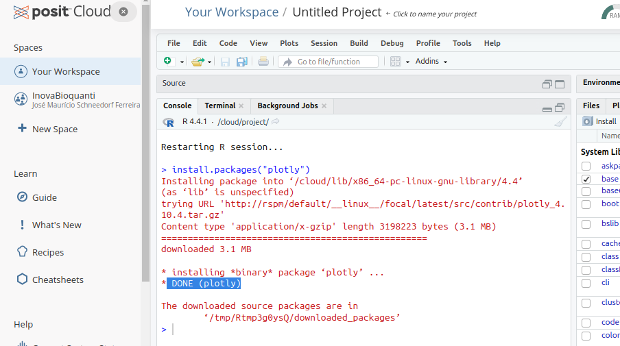

## Carregando o pacote instalado

|       O `R` permite que instale um número gigantesco de pacotes. Mas é claro que você não os utilizará simultaneamente. Dessa forma, o `R` precisa *"saber"* qual o pacote que se deseja no momento, o que é realizado pelo comando `library`, e ilustrado abaixo para o pacote `plot_ly`, como segue:

```{r, eval=FALSE}
library(plotly)
```

|       Pronto !! Pacote instalado e carregado !! 
|       Agora é executar alguns trechos de códigos para objetos didáticos.


## Construindo gráficos interativos com `plotly`

<div class = "reminder-objetivos">
Objetivos:\
  1. Compreender para que serve o "plotly" e seu potencial interativo para ensino e aprendizagem\
  2. Utilizar o "plotly" por scripts para a construção de gráficos interativos\
  3. Verificar a interatividade dos gráficos criados\
</div>


|       A biblioteca `plotly` é uma das mais ricas do `R` para gráficos interativos. Permite, entre outros, efeitos de *zoom* no gráfico, bem como de *mouse over*, em que a simples passagem do mouse sobre um elemento do gráfico abre as informações daquele ponto. Além disso, permite animações controladas pelo usário, a inseração de seletores, de controles deslizantes, menus e botões.
\

|       Complementarmente, por possibilitar uma integração a uma linguagem desses tempos chamada *JavaScript*, a biblioteca também é utilizada em alguns paineis de dados, como no [Power Bi](https://www.microsoft.com/pt-br/power-platform/products/power-bi) da *Microsoft*, uma coleção de aplicativos conectados para a visualização de dados. De fato, é a própria biblioteca `plotlyjs` escrita em *JavaScript*, externa ao `R` e *RStudio*, que é incorporada ao `R`.


|       A elaboração de gráficos pelo `plotly` requer alguns comandos simples. E a boa notícia é que o gráfico produzido já *"sai"* apresentando interatividade, como ampliação/redução, deslocamento dos dados em eixos, e efeitos de informação por passagem do *mouse*, salvamento como imagem *PNG*, entre outros. Para construir um gráfico qualquer precisa-se de *dados*. Basicamente há 3 formas para se obter os dados:

```{r, eval=FALSE}
* Criando-se os dados ;
* Criando-se uma equação que vai gerar os dados ;
* Importando-se os dados (de uma planilha, por ex)
```

\


## Criando um gráfico interativo

|       Vamos começar criando os dados a partir de uma equação aplicada a um *vetor.* Para isso, precisamos...do vetor !  Visualize um vetor como se fosse uma coluna (ou linha) do Excel. No `R` os vetores são criados por *concatenação* de valores separados por *vírgula*, tal como segue:

```{r}
x = c(1,2,3,4,5) # um vetor; o "c" indica "concatenação"
 # atribui valores de 1 a 5 à variável "x"

# Alternativamente,

x = 1:5 # também atribui valores de 1 a 5 à variável "x"
```

|       Para elaborar o gráfico interativo, ilustremos a equação de *lançamento vertical* abaixo.


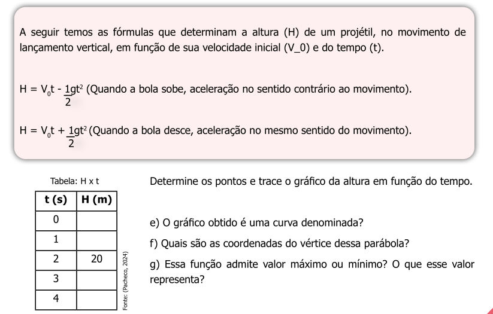
\


|        Agora faremos um gráfico interativo a partir desses dados. Mas antes, claro, é necessário instalar o pacote `plotly` no  `R`. Você pode instalá-lo pela aba *Packages* do *RStudio*, se já não fez, e como explicado na seção anterior sobre *Pacotes*.
\


|       Etapa final... construir um *gráfico de dispersão de pontos* da função de ascensão vertical. 


|       Para fazer isso, basta copiar o trecho abaixo e colá-lo num novo *script* `R`. E executá-lo de qualquer das formas mencionadas em seção anterior.
\

```{r}
# Dados:
t = 1:20 # define o vetor de tempo
Vo = 100 # velocidade inicial, 100 m/s
g = 9.8 # aceleração da gravidade, m/s^2

# Equação (ascensão vertical):

H = Vo*t-1/2*g*t^2

# Gráfico interativo:
library(plotly)
plot_ly(x = ~t, y = ~H)

# Observação:
# Sintaxe do plotly: ~variável, para atribuir uma variável (x ou y)
#                    type: para atribuir um tipo de gráfico
```


|       O `R` costuma apresentar algumas mensagens (*Warnings*) após rodar os comandos. Não são erros, mas informações adicionais, tais como na reprodução do gráfico anterior. Nesse caso, a informação é que está faltando caracterizar o tipo de gráfico, um espalhamento de pontos (*scatter*) :


```{r, eval=FALSE}
plot_ly(x = t, y = H, type = 'scatter')
```


|       Agora observe quanta interatividade surgiu com o simples comando acima, passando o *mouse* pelos pontos do gráfico, ou clicando-se nos ícones que apareceram acima do gráfico. Teste essa interatividade:

*   Passando o *mouse* sobre os pontos do gráfico (*hover*) você obterá as coordenadas de cada ponto;    
*   Usando o botão de rolagem do *mouse* você amplia ou reduz o gráfico
*   Clicando com o botão esquerdo do *mouse* em qualquer parte do gráfico e desenhando um retângulo você obterá uma ampliação da área;
*   Se der dois cliques após a ampliação você retornará ao gráfico original;
*   Posicionando o ponteiro do *mouse* entre os valores de um eixo, e arrastando o *mouse*, você verá um deslocamento do eixo selecionado;
*   Selecionando um ícone no canto superior direito do gráfico, você poderá, na sequência a partir da esquerda, baixar o *plot* como imagem, realizar uma ampliação, deslocar os eixos, selecionar os pontos dentro de uma caixa, ou dentro de um laço, ampliar, reduzir, escalonar ao tamanho original, realinhar os eixos aos do plot original, observar as coordenadas (x e y), observar somente a coordenada *y*, e retornar ao início.


## Salvando o gráfico

|       Agora uma <span style="color:orange;">**característica bem interessante do `plotly`: você pode salvar o gráfico mantendo toda a sua interatividade num arquivo** *HTML*. Dessa forma qualquer pessoa será capaz de abrir seu gráfico em um *browser* de internet (*Firefox, Chrome, Edge*, por ex), o que lhe permitirá observar os detalhes e a ação interativa em qualquer computador, notebook, *tablet* ou *smartphone* !!!</span>


|       E pra salvar **seu 1o. gráfico interativo** é muito simples: 

```{r, eval=FALSE}

1. Após feito o gráfico, clique em "Export", logo acima do gráfico na aba `Plots`;
2. Clique em "Save As Web Page"
3. Escolher um nome pro gráfico e salvá-lo
```


|       Agora basta localizar o arquivo em seu computador, abrir o arquivo automaticamente em um *browser*, e verificar que sua interatividade foi mantida. **E para compartilhá-lo, se desejar, basta enviar o arquivo do gráfico interativo para alguém ou exibi-lo num projetor multimídia**. 


## Trabalhando com relações matemáticas nas variáveis

|       Às vezes é interessante na construção de um gráfico que se permita executar um cálculo em uma variável, sem que com isso tenha que se elaborar um novo vetor. Vamos exemplificar isso para uma *transformação isotérmica do estudo de gases (lei de Boyle-Mariotte)*, como segue:


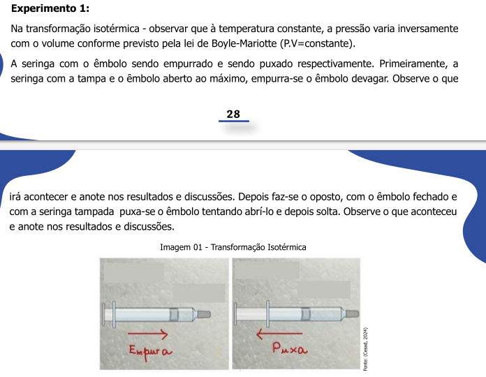


|       Exemplificando, se você está trabalhando num planilha eletrônica (ex: *Excel*) e deseja construir um gráfico da relação acima, digamos *V* *versus* *p*, terá que montar uma coluna com essa operação. No `plotly`, assim como no `R` como um todo, não precisa, já que *p* pode ser considerado como *1/V constante*. De fato, essa *constante* é representada pela *constante geral dos gases ideais, R*, de valor conhecido.


|       Resolvendo para a situação acima:

```{r}
# Dados:
R = 8.314 # J/(mol*K), constante geral dos gases ideias
V = seq(0,22.4, length.out=50)  # vetor de "Volume" (em litros), com 50 pontos
T = 298 # K, temperatura absoluta


# Equação
# pV = RT; p = RT/V
p = R*T/V

# Gráfico:
library(plotly)
plot_ly(x = V, y = ~R*T/V, type = 'scatter', mode='lines')
```


|       Agora, se quiser nomear as *etiquetas dos eixos* e fornecer um *título* ao gráfico para apresentar melhor o significado físico das quantidades envolvidas, basta acrescentar o comando `layout`, como segue:

```{r, eval=TRUE}
library(plotly)
library(magrittr) # biblioteca para o operador pipe "%>%"
plot_ly(x = V, y = ~R*T/V, type = 'scatter', mode='lines') %>%
layout(
    title = "Transformação Isotérmica de um Gás",
    xaxis = list(title = "Volume V, L"),
    yaxis = list(title = "Pressão p, bar")
)
```


<div class="reminder-markdown">

**Agora é com voce:**

Abra um novo script e construa um gráfico que apresente uma relação qualquer entre variáveis, tal como sugerido abaixo:

1. Crie os valores da variável independente (ex: x = 1:10); \
2. Carregue a biblioteca `plotly` - `library(plotly)` ; \
3. Digite uma linha geral de comando pro gráfico: \
   `plot_ly(x = ~x, y = ~sqrt(x), type = "scatter") ` \
4. Selecione essas linhas, dê um Ctrl+Enter, e observe a saída (ou seja, o gráfico, na aba `plots` ; \
5. Modifique a variável "y", substituindo o valor de "x" por alguma outra relação, tal como: `~exp(x)` - exponencial, `~sin(10*x)` - seno, ~sqrt(x)` - raiz quadrada; \

</div>
\


## Outros tipos de gráficos

|       Também é possível elaborar outros gráficos, como de *linhas, barras, histograma, ou box-plot* ("caixa de bigodes"). Algumas dessas possibilidades são ilustradas abaixo.


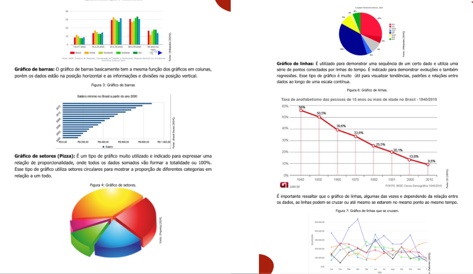


|       No `plotly` há uma gama de gráficos possíveis. Experimente alguns tipos:

```{r} 
# Linhas
library(plotly)
plot_ly(x = ~x, y = ~x, type = 'scatter', mode = 'lines')
```
 
```{r}
# Barras
library(plotly)

classes <- c("A", "B", "C", "D") # dados para o gráfico de barras
percentuais <- c(25, 35, 20, 20)

plot_ly(x = ~classes, y = ~percentuais, type = 'bar')
```


```{r}
library(plotly)
classes <- c("A", "B", "C", "D") # dados para o gráfico de barras
percentuais <- c(25, 35, 20, 20)

# Gráfico de torta
plot_ly(labels = classes, values = percentuais, type = 'pie')
```


```{r}
# Histograma
library(plotly)

x <- rnorm(1000) # comando pra gerar dados aleatórios no `R`
plot_ly(x = ~x, type = "histogram")
```


```{r}
# Boxplot

library(plotly)
x <- rnorm(50) # gera dados aleatórios
y <- rnorm(50, mean = 1) # gera a variação estatística nos dados


plot_ly(y = ~x, type = "box", name = 'Grupo 1') %>%  # adiciona os dois box para os dados
  add_trace(y = ~y, type = "box", name = 'Grupo 2')
```

|       Também é possível combinar alguns tipos, como um gráfico de *pontos e linhas*:

```{r}
# Pontos e linhas
library(plotly)
x <- 1:10
plot_ly(x = ~x, y = ~x^2, type = 'scatter', mode = 'markers, lines') # também dá se 'markers+lines'
```
\

## Gráficos 3D

|       Para encerrar essa parte, *gráficos tridimensionais* ! A versão básica de um gráfico 3D é bem simples de se executar no `plotly`, e seu efeito visual e de interatividade são bem expressivos !

|       Um exemplo de gráfico 3D pode ser obtido das relações de *raio, área superficial, e volume* de uma esfera, tal como segue.


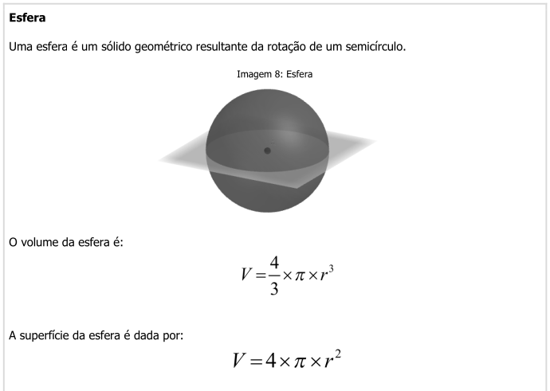

|       Agora vamos elaborar o gráfico 3D interativo no `plotly`. O mais simples seria com as etiquetas com os nomes padrão, *x, y e z*. Mas é melhor acrescentar o comando *layout* para dar significado físico e melhorar a interpretação do gráfico.

```{r}
library(plotly)

# Dados:
r = seq(0,100, length.out = 50)
AreaSup = 4*pi*r^2 # cálculo de área superficial da esfera
Volume = 4/3*pi*r^3 # cálculo do volume da esfera

# Gráfico:
library(plotly)
plot_ly(x = r, y = AreaSup, z = Volume, 
        mode= 'markers+lines')%>%
  layout(scene = list(
         xaxis=list(title="raio"),
         yaxis=list(title="área superficial"),
         zaxis=list(title="volume")))

```
\

|       Observe que o gráfico é interativo também sobre outros aspectos, como sua *rotação em qualquer dos 3 eixos*. Sob o ponto de vista de conteúdo, esse gráfico ilustra como que os valores de área superficial, e mais ainda de volume, são enormemente variados em função do raio de uma esfera. Isso também justifica em parte o grande sucesso do uso de *nanopartículas* em Ciência e Tecnologia nos dias atuais (alta área de superfície em tamanho reduzido).

|       Outro gráfico tridimensional interessante é o de *superfície 3D*. Como o de cima, poucas linhas são necessárias para defini-lo. A diferença é que você pode trabalhar com uma *equação*,para a superfície, veja:

```{r}
x <- seq(-5, 5, length.out = 50)
y <- seq(-5, 5, length.out = 50)
z <- outer(x, y, function(x, y) x^2 - y^2) # equação x^2+y^2

plot_ly(x = ~x, y = ~y, z = ~z, type = 'surface') %>%
  layout(title = "Gráfico de Superfície")
```


|       Existem outros tipos de gráficos para o `plotly`, pelo que vale uma visitinha ao [website](https://plotly.com/r/) para mais informações.

## `Plotly` por comandos de mouse !!

|       Ainda que esse treinamento insista nas vantagens de se utilizar linhas de comando ao invés de cliques de *mouse*, não podemos nos furtar de apresentar uma solução desse tipo para quem prefere o uso do recurso. Entre alguns aplicativos online, destacamos o [Plotly Chart Studio](https://chart-studio.plotly.com/create/) abaixo, que permite a construção de gráficos interativos variados com o pacote.

[](https://chart-studio.plotly.com/create/)

## Referência do pacote:

*   [Geral](https://cran.r-project.org/web/packages/plotly/index.html)
*   [Manual](https://cran.r-project.org/web/packages/plotly/plotly.pdf)
*   [Tutorial](https://plotly.com/r/)

## 5 - Mais interatividade aos gráficos

<div class = "reminder-objetivos">
Objetivos:\
  1. Observar a capacidade extensiva de interação com o pacote "plotly"\
  2. Elaborar um gráfico com controle deslizante\
  3. Elaborar um gráfico com menu suspenso 
</div>


|       Até o momento só *"arranhamos"* o potencial de interatividade gráfica do pacote `plotly`. Como já mencionado, essa biblioteca permite um grande conjunto de ações de usuário, como deslizadores (*sliders*), menu de escolha, e botões, entre muitos.
\

# Adicionando um controle deslizante por intervalo

|       Um *slider* dessa natureza permite que se escolha uma janela de dados para um estudo mais detalhista naquela região. Nesse caso é possível agregar a um gráfico simples um *controle deslizante de intervalo* (*rangeslider*).


|       Podemos ilustrar seu emprego pela observação de gases de efeito estufa, e em especial, da *emissão de dióxido de carbono no Brasil* a partir de uma base de dados da internet. Para isso, você aprenderá a *obter um arquivo a partir  de base de dados da internet, filtrar para um subconjunto desejado, e elaborar o gráfico resultante, com um controle deslizante adicional*.


## Emissão de CO$_{2}$ e o efeito estufa


|       As emissões de CO$_{2}$ e outros gases pela queima de combustíveis fósseis tem grande responsabilidade sobre o efeito de estufa, incidindo diretamente sobre as alterações climáticas. Para reduzir essas emissões é necessário transformar a matriz energética atual, indústria e sistemas alimentares.  
\

|       Para compreender a emissão de CO$_{2}$ observada no Brasil no período de 1890 a 2022, execute o trecho de código que segue em um *script* do `R (ou seja, copie, cole, e execute), a partir da fonte [Our World in Data](https://github.com/owid). 
\

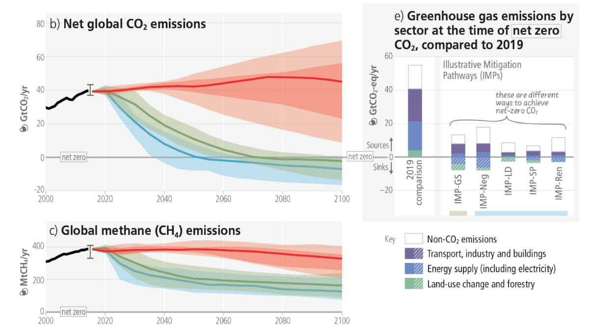
\

```{r}
library(readr) # biblioteca de importação de dados
library(dplyr) # biblioteca para uso do operador pipe "%>%"
library(plotly)

# Carregamento dos dados da internet
url <- "https://raw.githubusercontent.com/owid/co2-data/master/owid-co2-data.csv"
co2_data <- read.csv(url)

# Filtragem dos dados para o Brasil usando subset()
co2_brasil <- subset(co2_data, country == "Brazil")

# Criação do gráfico interativo com plot_ly
co2_plot <- plot_ly(data = co2_brasil, x = ~year, y = ~co2, type = 'scatter', mode = 'lines+markers') %>%
  layout(title = "Emissões de CO2 no Brasil ao longo dos anos",
         xaxis = list(title = "Ano"),
         yaxis = list(title = "Emissão de CO2 (milhões de toneladas)"))

```


|       Agora, a cereja do bolo. A inserção de um controle deslizante, para a seleção de faixas para um estudo mais focado. 

```{r}
co2_plot %>%
  rangeslider()
```
\

|       Você pode copiar e colar os *scripts* na sequência para sua execução, ou apenas adicionar o comando `rangeslider()` com o operador *pipe* %>% ao final.

|       Experimente agora posicionar o *mouse* num dos dois marcadores laterais do gráfico inferior, arrastando-o em seguida, e observe o resultado. O controle deslizante pode ser útil quando se deseja focar em determinada região do gráfico. Por exemplo, ajustar a emissão de CO$_{2}$ para os últimos anos.


### Adicionando um menu suspenso

|       Menus suspensos (*dropdown menu*) permitem observar um gráfico diferente a cada opção selecionada. Para exemplificar esse recurso interativos, vamos primeiramente elaborar um conjunto de dados (*dataframe*) que possua a resposta linear, quadrática, e cúbica a uma variável independente, tal como segue:

```{r}
x = 1:10 # vetor da variável independente "x"
yLin = x
yQuad = x^2 # criação da variável dependente quadrática 
yCub = x^3 # criação da variável dependente cúbica 

datLQC <-data.frame(x,yLin,yQuad,yCub) # criação da planilha de dados
```


|       Agora podemos inserir o *menu suspenso* para opção das tendências matemáticas:

```{r}
plot_ly(datLQC, x = ~x, y = ~yLin, type = "scatter", mode = "line", name = "Linear") %>%
  add_trace(x = ~x, y = ~yQuad, mode = "line", name = "Quadrático") %>%
  add_trace(x = ~x, y = ~yCub, mode = "line", name = "Cúbico") %>%
  layout(
    title = "Gráficos de potência",
    xaxis = list(title = "x"),
    yaxis = list(title = "x^n"),
    updatemenus = list(
      list(
        buttons = list(
          list(label = "yLin", method = "update", args = list(list(visible = c(TRUE, FALSE, FALSE)))),
          list(label = "yQuad", method = "update", args = list(list(visible = c(FALSE, TRUE, FALSE)))),
          list(label = "yCub", method = "update", args = list(list(visible = c(FALSE, FALSE, TRUE))))
        )
      )
    )
  )

```


|       Ainda que você possa achar meio complicado o trecho de código acima, apenas copie-o, cole-o num *script*, e execute-o. Isso exemplifica a *essência inerente ao Ensino Reprodutível, desde a simples reprodução do código, até sua alteração e mesmo a criação de novos*. Sentindo curiosidade, você pode alterar alguns termos do código acima, como as etiquetas (*label*, substitua um nome, por ex) que surgem no menu suspenso, o tipo de gráfico pretendido (substitua *scatter* por *bar*, por exemplo), ou o título do gráfico (*title*).
\

|       Em relação à interatividade produzida, adiciona-se às que já estavam presentes pelo comando `plot_ly`, a seleção do tipo de potência a representar pelo menu suspenso.
\


|       Assim como para vários pacotes do `R`, existe um número significativo de comandos e *widgets interativos* com o `plotly`, e que, nesse caso específico, daria "pano pra manga" pra uma obra literária isolada. Mas você pode consultar inúmeros *sites* sobre o `plotly` para um aprendizado mais abrangente, os *links* abaixo, e mesmo um [livro online](https://plotly-r.com/) gratuito, com códigos e gráficos correlatos. Para observar a imensa riqueza de gráficos interativos, dê uma olhada no [website do `plotly`](https://plotly.com/r/) para o `R`.
\

*   [Geral](https://cran.r-project.org/web/packages/plotly/index.html)
*   [Manual](https://cran.r-project.org/web/packages/plotly/plotly.pdf)
*   [Tutorial](https://plotly.com/r/)

## 6 - Animação em gráficos interativos

<div class = "reminder-objetivos">
Objetivos:\
  1. Conhecer o potencial do "plotly" para criar animações interativas\
  2. Elaborar gráficos animados por importação de banco de dados
</div>


|       Além do aspecto puramente interativo de gráficos elaborados com o `plotly`, o que já perfaz um grande diferencial ao preparo de materiais ilustrativos de conteúdos didáticos, a biblioteca ainda é capaz de rodar animações com os gráficos!
\

|       A animação se dá por meio de transições de uma imagem a outra de um gráfico quando se deseja observar o que ocorre com esse quando se altera uma variável (numérica ou categórica). O comando chave pra isso é `frame` (quadro). A animação no `plotly` também serve para os 3 tipos de entrada de dados, ou seja: *equações, vetores, datasets importados*. 
\

## Elevação da temperatura média da Terra


|       Desnecessário mencionar os impactos recentes das mudanças climáticas no planeta em função da ação humana, incluindo uma elevação média da temperatura superficial do globo terrestre em decorrência de  fatores como o efeito estufa. 
\

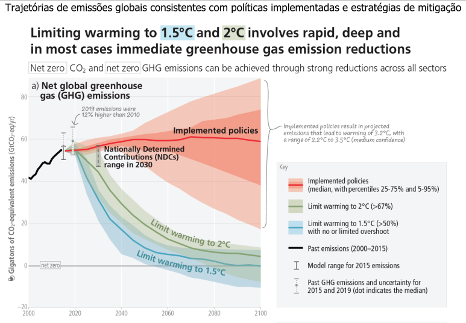
\

```{r}

library(plotly)
library(magrittr)  # bibliotecas necessárias

# 1) Obtendo os dados da internet

url <- "https://raw.githubusercontent.com/datasets/global-temp/refs/heads/main/data/annual.csv" # define o link para os dados
dados <- read.csv(url)  # lê o arquivo dos dados

# 2) Construindo o gráfico com animação 

plot_ly(dados, x = ~Year, y = ~Mean,
        type = "bar", 
        marker = list(line = list(width = 10)),
        frame = ~Year) %>%
  animation_opts(
    frame = 150,           # Velocidade da animação
    transition = 0,
    redraw = TRUE
  ) %>%
  layout(
    title = "Flutuação da temperatura global",
    xaxis = list(title = "Anos"),
    yaxis = list(title = "Diferença de temperatura, C"))
```
\

|       Para observar melhor o gráfico, clique em *Zoom* que será aberta uma janela maior. Agora a parte "*chique*": clique em *PLAY* e veja o que acontece. Você pode também selecionar qualquer período para a emissão, bastando usar a barra de rolagem do gráfico.
\

## Expectativa de vida & Produto Interno Bruto


|       Um emprego bem interessante para o uso do `plot_ly` em animação gráfica dá-se quando necessitamos apresentar vários dados sobre determinado tema. A isso dá-se no nome de *dados multivariados*. Ilustrando esse situação, digamos que se deseje oferecer informações variadas em um gráfico que envolva a relação entre o produto interno bruto de um país e a expectativa de vida de seus habitantes ao longo do tempo. 
\


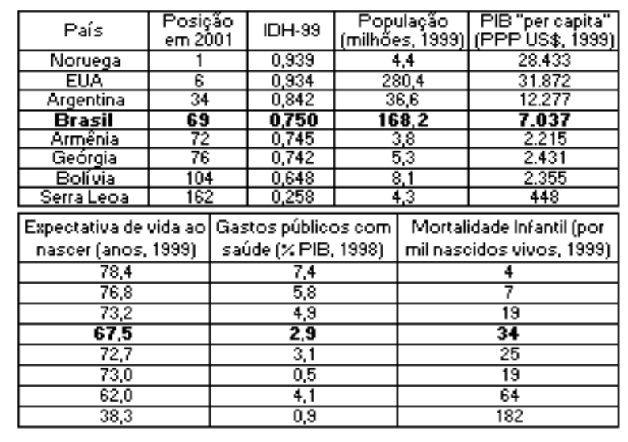

|       Para ilustrar a riqueza interativa que se pode obter pelo `plotly` sobre a influência do *produto interno bruto - PIB* sobre a expectativa de vida, podemos importar um conjunto de dados da internet e criar um gráfico sobre essa relação, veja:
\

```{r}
library(plotly)

# Obtendo os dados na internet
url <- read.csv("https://raw.githubusercontent.com/kirenz/datasets/refs/heads/master/gapminder.csv")

dadosExpVida <- url  # atribuindo os dados a um objeto do `R`

# Criando o gráfico interativo
plot_ly(
  dadosExpVida, # dados convertidos da internet
  x = ~gdpPercap, # nome da coluna de renda per capita nos dados
  y = ~lifeExp, # nome da coluna de expectativa de vida nos dados
  type = 'scatter', # tipo de gráfico (espalhamento)
  mode = 'markers' # tipo de espalhamento (pontos)
)
```
\

|       Pronto ! Código simples, direto, e interativo. Se você passar o *mouse* pelos pontos verá as coordenadas de *PIB* e expectativa de vida. Só que não é possível saber por esse gráfico *quem é quem*, ou seja, qual país possui qual PIB, bem como outras informações que constam da planilha original baixada da internet. Pra se ter uma ideia, *essa planilha possui, além dos valores de PIB e de expectativa de vida, o país e sua população, o continente a que pertence, bem como o ano foram medidos os dados*. 
\

|       Dessa forma, estamos diante de um quadro de *dados multivariados*, muito comum em bases de dados diversas, como [IBGE](https://www.ibge.gov.br/) ou [DATASUS](https://datasus.saude.gov.br). 
\

|       Que tal se pudessemos apresentar tudo de uma só vez, ou seja, PIB, expectativa de vida, o país, o tamanho da população, país, o continente, e o ano de medida disso tudo, ou seja, **seis** variáveis, entre *numéricas* e *categóricas* (classes) ?! 
\

|       Impossível ?! Não parao `R`!! Segue um trecho de código para isso, e com o resultado proposto. Não se preocupe com o tamanho ou os detalhes. Se quiser **reproduzir** esse código, já sabe... apenas copie, cole, e execute o código num *script* do `R`.
\


```{r}
library(plotly)

# Obtendo os dados na internet
url <- read.csv("https://raw.githubusercontent.com/kirenz/datasets/refs/heads/master/gapminder.csv")

dadosExpVida <- url  # atribuindo os dados a um objeto do `R`

# Criando o gráfico interativo com animação
plot_ly(
  dadosExpVida, # dados convertidos da internet
  x = ~gdpPercap, # renda per capita
  y = ~lifeExp, # expectativa de vida
  size = ~pop, # tamanho dos pontos em função da população
  color = ~country, # cor dos pontos em função do país
  frame = ~year,    # Frame para a animação por ano de coleta dos dados
  text = ~continent,  # País como informação ao passar o mouse
  hoverinfo = "text",
  type = 'scatter', # tipo de gráfico
  mode = 'markers',
  marker = list(sizemode = 'diameter', opacity = 0.7)
) %>%
  layout(  # atribuição de título e etiquetas dos eixos
    title = "Produto interno bruto X Expectativa de vida",
    xaxis = list(title = "PIB (log), US$", type = "log"),
    yaxis = list(title = "Expectativa de Vida, anos"),
    showlegend = TRUE # possibilidade ou não de aparecer a legenda
  ) %>%
  animation_opts(
    frame = 1000,           # Velocidade da animação
    transition = 0,
    redraw = TRUE
  )
```
\

|       Para ir ao "*playground*" agora, tecle em *PLAY* e observe a transição temporal de expectativa de vida em função do PIB dos países. E veja que todos os demais dados estão lá, separados por tamanho dos pontos (população), cor (país), continente (*hover*, passagem do *mouse*), e ano (quadro de animação ou *frame*) ! 
\

|       Mais um detalhe ! Se você observar a legenda, veja que ela também é *deslizante*, identificando cada país por uma cor. Quer saber onde encontra-se o Brasil nessa relação de PIB e expectativa de vida do gráfico doidão ? Fácil. Ache o Brasil na legenda, dê dois cliques, e observe que agora somente esse ponto é destacado.

## 7 - Mapas interativos com `plotly`

<div class = "reminder-objetivos">
Objetivos:\
  1. Conhecer o potencial do "plotly" para criação de mapas interativos\
  2. Elaborar um mapa interativo com dados inseridos\
  3. Elaborar um mapa interativo com dados importados \
</div>


|       Por fim, deixamos esta última parte de nosso curso para lhe apresentar outro potencial *"pra lá de bacana"* do `plotly` para ensino e aprendizagem: a construção de mapas interativos. 

|       Mapas interativos permitem que se observe informações por *mouse hover* (passagem do *mouse* sobre os dados) ou por clique de *mouse* sobre um mapa contendo esses dados. Por se tratar de um mapa, as informações são obtidas em coordenadas geográficas específicas. Essa característica torna indispensável, portanto, as *coordenadas de longitude e de latitude* relacionadas aos pontos geográficos que se deseja apresentar.

|       Segue um exemplo simples, localizando os três municípios do Sul de Minas Gerais onde ficam os campi da Universidade Federal de Alfenas (UNIFAL-MG).

```{r}
library(plotly)

# Criar dados de exemplo com coordenadas de algumas cidades
cities <- data.frame(
  name = c("Alfenas", "Varginha", "Poços de Caldas"),
  lat = c(-21.42943530, -21.539957, -21.783731),  # Latitude
  lon = c(-45.95948212, -45.433960, -46.564178)   # Longitude
)

# Criar o mapa interativo
plot_ly(
  data = cities,
  lat = ~lat,
  lon = ~lon,
  type = 'scattergeo',
  mode = 'markers+text',
  text = ~name,
  marker = list(size = 10, color = 'blue', opacity = 0.7),
  textposition = "top center"
) %>%
  layout(
    title = "Municípios dos campi da UNIFAL-MG",
    geo = list(
      scope = 'south america',
      showland = TRUE
    )
  )
```


|       Para observar os municípios, vá ampliando a imagem com o *mouse*. Veja que o mapa inicia na América do Sul, uma condição inserida no código para facilitar a busca das cidades. Experimente colocar um comentário (*#*) à esquerda do trecho "*scope = ..."*, e a informação partirá do mapa *mundi.* Observe agora que ao passar o *mouse* sobre os municípios é identificada as coordenadas geográficas propostas.
\

<div class="reminder-markdown">

**Agora é com voce:**

1. Localize as coordenadas geográficas (longitude e latitude) de sua cidade Natal, ou da de um ente querido. Pra isso, dê uma busca na internet; 
2. Copie o código acima, e cole-o num novo script;  
3. Substitua os atributos *"name"*, *"lat"*, e *"lon"* no `data.frame` do código  pelos que você buscou.
4. Rode o script e observe no mapa interativo o município escolhido. 
Dica: se você selecionou uma cidade fora da América do Sul, colocar um *"#"* antes da linha de "*scope = ..."*.

</div>


## Produção mundial de óleos


|       Agora imagine que você possa, ao invés de colocar os dados um a um, *importar os dados de algum repositório da internet* para a construção do mapa, como fora conduzido na etapa anterior. Para ilustrar isso vamos importar uma planilha referente à produção de óleo no planeta. Essa categoria inclui petróleo bruto, óleo de xisto, areias betuminosas, condensados, e líquidos de gás natural (etano, GLP e nafta separados da produção de gás natural).

|       Ao mesmo tempo, vamos filtrar os dados importados para o ano de 2014, tal como encontrado no banco de dados do [Our World In Data](https://github.com/owid/owid-datasets/tree/master/datasets). 


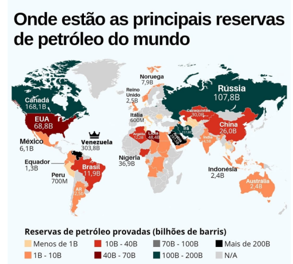


```{r}
library(plotly)

# Exemplo de dataframe com valores fictícios
df <- read.csv("https://raw.githubusercontent.com/owid/owid-datasets/refs/heads/master/datasets/Oil%20production%20-%20Etemad%20%26%20Luciana/Oil%20production%20-%20Etemad%20%26%20Luciana.csv")

# Renomeando as colunas para facilitar interpretação e plotagem

names(df) <- c("País", "Ano", "Produção.TeraWatt")

# Filtrando os dados para o último ano (2014)
df <- subset(df, Ano == "2014")

head(df)


# Criando o mapa choropleth com a escala de cores ajustada
library(plotly)
plot_ly(
  data = df,
  locations = ~País,
  locationmode = "country names",
  z = ~Produção.TeraWatt, # Variável que determina as cores
  type = "choropleth",
  colorscale = "RdBu") # outras escalas: # outras escalas: Viridis, Inferno, Blues, Cividis, Greens, ...
```


|       Seguindo a mesma lógica do mapa anterior, se você passar o *mouse* sobre os países verá o consumo identificado em cada um. Observe que há uma barrinha lateral apresentando a legenda sobre o quantitativo de produção, em  Observe também que o "*type"* do gráfico agora é `choroplet` (e não `scattergeo`). Na sua versão mais simples, ele só precisa dos nomes padronizados dos países. Mas também pode ser realizado com um banco de dados que possua apenas as coordenadas geográficas de latitude e longitude.

|       Para auxiliar nessa direção, seguem dois *links* práticos para arquivos de coordenadas geográficas, e acessíveis pelo `R`:

* [Coordenadas de municípios brasileiros](https://raw.githubusercontent.com/kelvins/municipios-brasileiros/refs/heads/main/csv/municipios.csv)
* [Coordenadas de capitais mundiais](https://raw.githubusercontent.com/bahar/WorldCityLocations/refs/heads/master/World_Cities_Location_table.csv)

|       E nesse caso, qualquer banco de dados nesse quesito será bem-vindo. O que significa na prática poder exemplificar qualquer informação de conteúdo didático de forma interativa em um mapa (ex: produção/exportação de insumos, observações clínicas, marcos históricos, etc).

