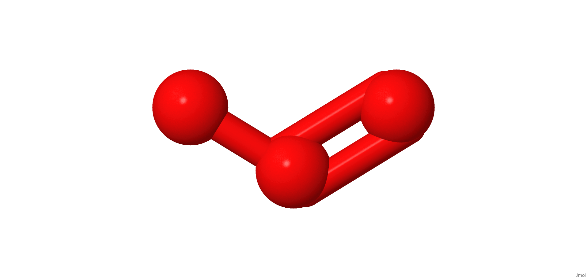

[{width="40%"}](https://chemapps.stolaf.edu/jmol/jmol.php?model=C(=O)=O)

[Wikipedia](https://pt.wikipedia.org/wiki/Di%C3%B3xido_de_carbono)

[{width="40%"}](https://chemapps.stolaf.edu/jmol/jmol.php?model=O=S=O)

[Wikipedia](https://pt.wikipedia.org/wiki/Di%C3%B3xido_de_enxofre)

[{width="40%"}](https://chemapps.stolaf.edu/jmol/jmol.php?model=%5BN+%5D(=O)(%5BO-%5D)%5BO-%5D%5D)

[Wikipedia](https://pt.wikipedia.org/wiki/Nitrato)

[{width="40%"}](https://chemapps.stolaf.edu/jmol/jmol.php?model=%5BO-%5D%5BO+%5D=O)

[Wikipedia](https://pt.wikipedia.org/wiki/Oz%C3%B4nio)

