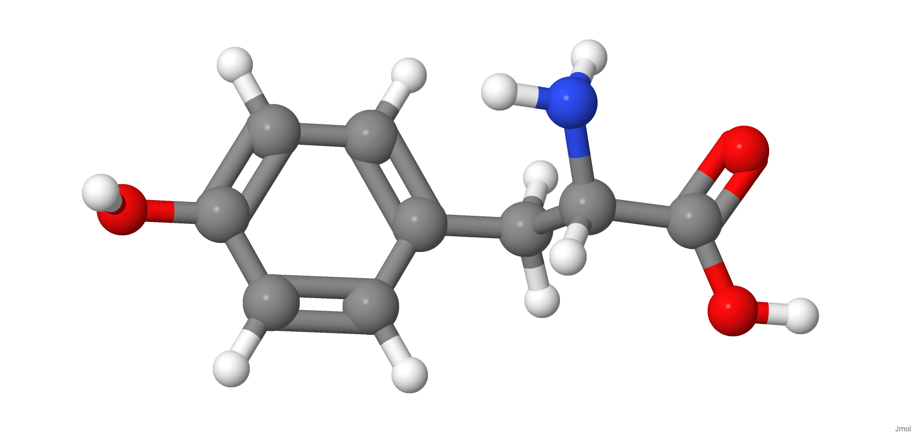
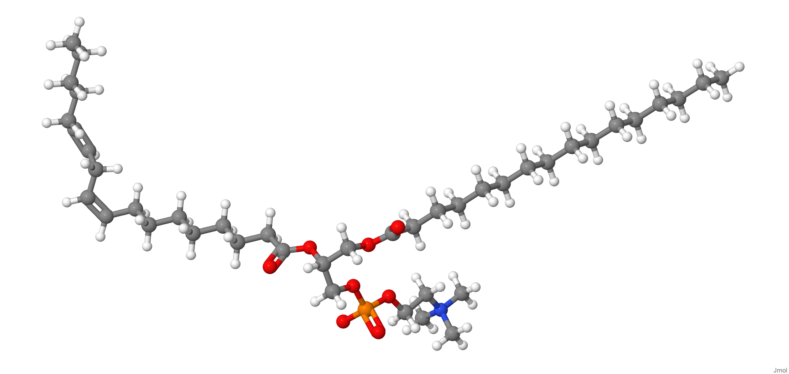

[{width="40%"}](https://chemapps.stolaf.edu/jmol/jmol.php?model=C1=CC(=CC=C1C%5BC@@H%5D(C(=O)O)N)O)

[Wikipedia](https://pt.wikipedia.org/wiki/Tirosina)

[{width="40%"}](https://chemapps.stolaf.edu/jmol/jmol.php?model=C(%5BC@@H%5D1%5BC@H%5D(%5BC@@H%5D(%5BC@H%5D(C(O1)O)O)O)O)O)

[Wikipedia](https://pt.wikipedia.org/wiki/Glicose)

[{width="40%"}](https://chemapps.stolaf.edu/jmol/jmol.php?model=%20CCCCCCCCCCCCCCCC(=O)OC%5BC@H%5D(COP(=O)(%5BO-%5D)OCC%5BN+%5D(C)(C)C)OC(=O)CCCCCCC/C=C\C/C=C\CCCCC)

[Wikipedia](https://pt.wikipedia.org/wiki/Lecitina)

[{width="40%"}](https://chemapps.stolaf.edu/jmol/jmol.php?)

[Wikipedia](https://pt.wikipedia.org/wiki/Insulina)

