# Hidrocarboneto

## Alcano

 
[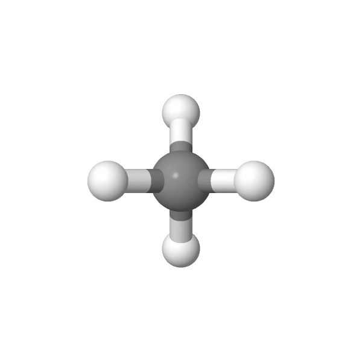{width=40%}](https://chemapps.stolaf.edu/jmol/jmol.php?model=C)

<p style="text-align:right;">
[Wikipedia](https://pt.wikipedia.org/wiki/metano)
</p>

```{r, eval=FALSE}
wireframe only; wireframe 0.2
```

[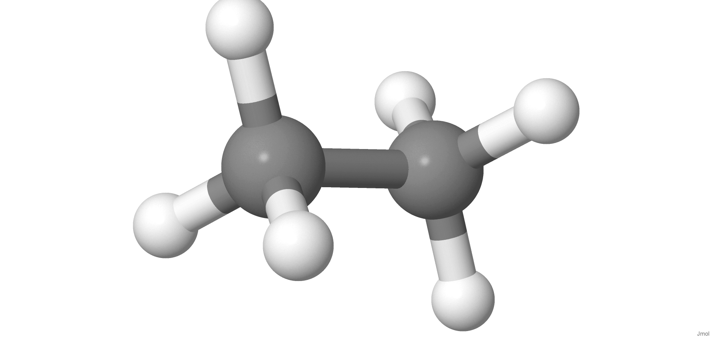{width=40%}](https://chemapps.stolaf.edu/jmol/jmol.php?model=CC) 

```{r, eval=FALSE}
rotate x 10
```


<p style="text-align:right;">
[Wikipedia](https://pt.wikipedia.org/wiki/etano)
</p>

[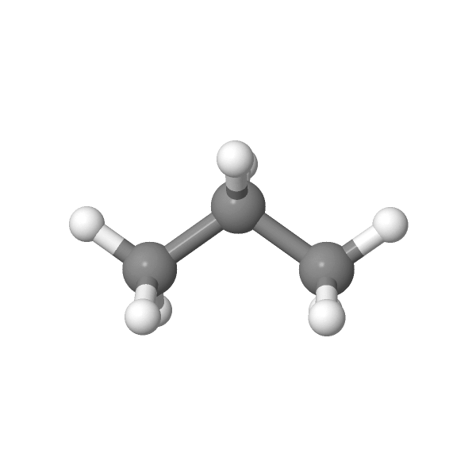{width=40%}](https://chemapps.stolaf.edu/jmol/jmol.php?model=CCC)

```{r, eval=FALSE}
spin on

```


<p style="text-align:right;">
[Wikipedia](https://pt.wikipedia.org/wiki/propano)
</p>

[{width=40%}](https://chemapps.stolaf.edu/jmol/jmol.php?model=CCCC) 

```{r, eval=FALSE}
 isosurface vdw

```


<p style="text-align:right;">
[Wikipedia](https://pt.wikipedia.org/wiki/butano)
</p>

[{width=40%}](https://chemapps.stolaf.edu/jmol/jmol.php?model=CCCCCCCCCCCCCCCC)

```{r, eval=FALSE}
moveto 2.0 {1 1 1 90}

```


<p style="text-align:right;">
[Wikipedia](: https://pt.wikipedia.org/wiki/Alcano)
</p>


## Alceno


[{width=40%}](https://chemapps.stolaf.edu/jmol/jmol.php?model=C=C) 

```{r, eval=FALSE}
select atomno=1,2 
color atoms yellow

```

<p style="text-align:right;">
[Wikipedia](https://pt.wikipedia.org/wiki/etileno)
</p>

[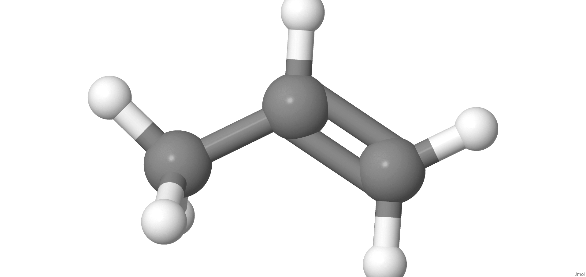{width=40%}](https://chemapps.stolaf.edu/jmol/jmol.php?model=CC=C) 

```{r, eval=FALSE}
bondOrder double
```


<p style="text-align:right;">
[Wikipedia](https://pt.wikipedia.org/wiki/propileno)
</p>


[{width=40%}](https://chemapps.stolaf.edu/jmol/jmol.php?model=CCCC=C) 

```{r, eval=FALSE}
color bonds red

```


<p style="text-align:right;">
[Wikipedia](https://pt.wikibooks.org/wiki/Introdu%C3%A7%C3%A3o_%C3%A0_Qu%C3%ADmica/Hidrocarbonetos)
</p>

[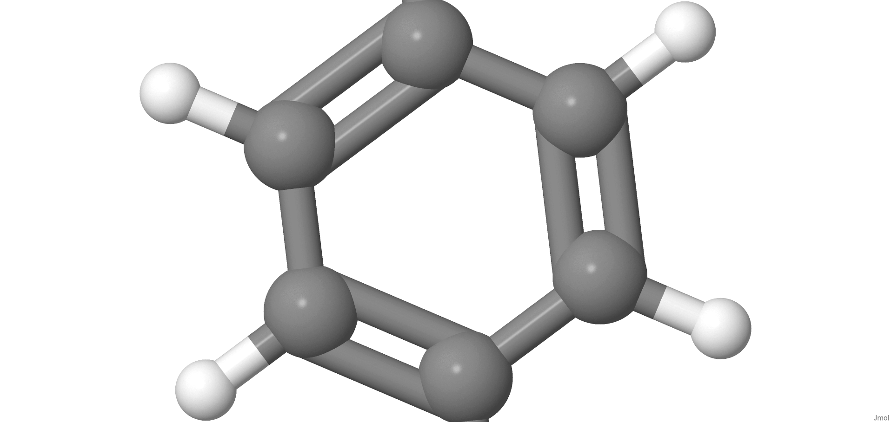{width=40%}](https://chemapps.stolaf.edu/jmol/jmol.php?model=C1=CC=CC=C1) 

```{r, eval=FALSE}
for (var i=0; i<10; i++) {
   rotate y 30
   color atoms random
   delay 0.5
}
```


<p style="text-align:right;">
[Wikipedia](https://pt.wikipedia.org/wiki/benzeno)
</p>


[{width=40%}](https://chemapps.stolaf.edu/jmol/jmol.php?model=CCCCC=C) 

```{r, eval=FALSE}
color bonds blue
```

<p style="text-align:right;">
[Wikipedia](https://pt.wikipedia.org/wiki/hexeno)
</p>
|       Links:
1. [Alcanos e alcenos](https://www.echalk.co.uk/3Dmolecules/alkanes_alkenes/alkanes.htm)

## Alcino 

[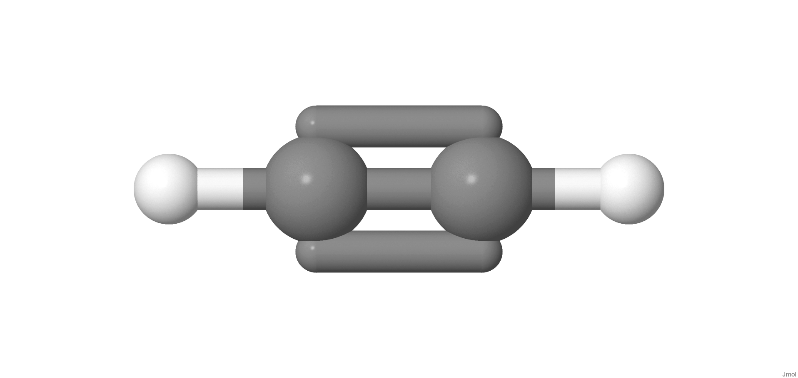{width=40%}](https://chemapps.stolaf.edu/jmol/jmol.php?model= 
acetylene) 

```{r, eval=FALSE}
 color bonds yellow
```


<p style="text-align:right;">
[Wikipedia](https://pt.wikipedia.org/wiki/Acetileno)
</p> 

[{width=40%}](https://chemapps.stolaf.edu/jmol/jmol.php?model=CC#C) 

```{r, eval=FALSE}
select bond(triple);C2, C3
```


<p style="text-align:right;">
[Wikipedia](https://pt.wikipedia.org/wiki/propino)
</p>

[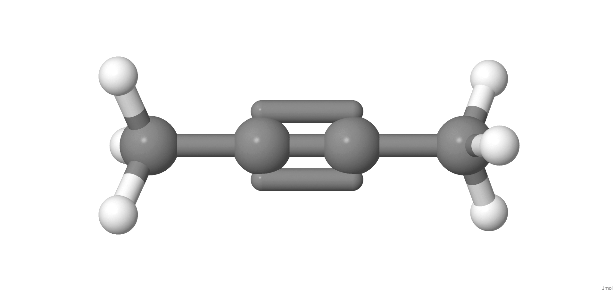{width=40%}](https://chemapps.stolaf.edu/jmol/jmol.php?model=CC#CC) 

```{r, eval=FALSE}
load "SMILES:CCCC#C"
```


<p style="text-align:right;">
[Wikipedia]( https://pt.wikipedia.org/wiki/Etilacetileno)
</p>


# Areno

# Álcool

[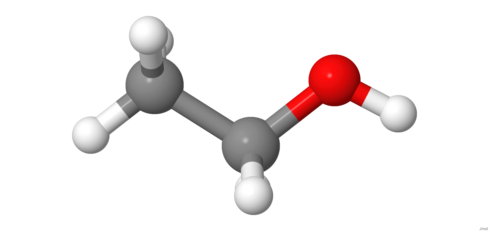{width=40%}](https://chemapps.stolaf.edu/jmol/jmol.php?model=CCO) 

```{r, eval=FALSE}
cylinder 50

```


<p style="text-align:right;">
[Wikipedia](https://pt.wikipedia.org/wiki/etanol)
</p> 


[{width=40%}](https://chemapps.stolaf.edu/jmol/jmol.php?model=C(CO)O) 

```{r, eval=FALSE}
spacefill 20
```


<p style="text-align:right;">
[Wikipedia](https://pt.wikipedia.org/wiki/etilenoglicol)
</p> 

# Fenol 

[{width=40%}](https://chemapps.stolaf.edu/jmol/jmol.php?model=C1=CC=C(C=C1)O) 

```{r, eval=FALSE}
select aromatic
color blue
```


<p style="text-align:right;">
[Wikipedia](https://pt.wikipedia.org/wiki/fenol)
</p> 

[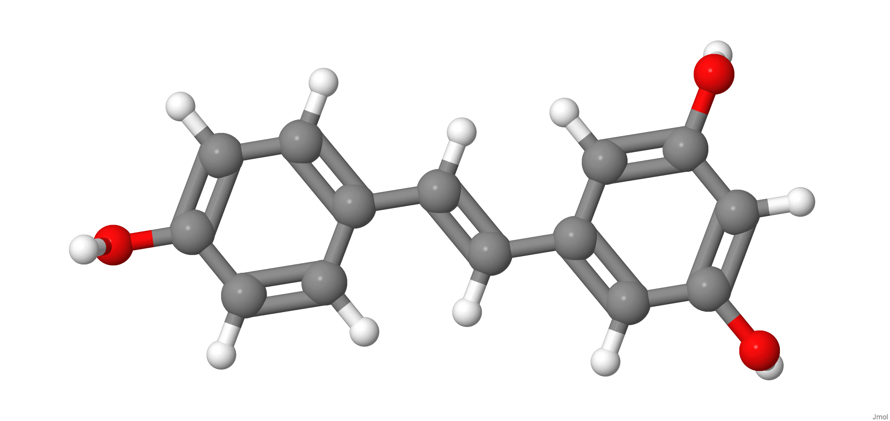{width=40%}](https://chemapps.stolaf.edu/jmol/jmol.php?model=C1=CC(=CC=C1/C=C/C2=CC(=CC(=C2)O)O)O) 

```{r, eval=FALSE}
select aromatic
wireframe 100
```

<p style="text-align:right;">
[Wikipedia](https://pt.wikipedia.org/wiki/resveratrol)
</p> 

# Éter 

[{width=40%}](https://chemapps.stolaf.edu/jmol/jmol.php?model=CCOCC) 

```{r, eval=FALSE}
select O C
wireframe 100
```


<p style="text-align:right;">
[Wikipedia](https://pt.wikipedia.org/wiki/%C3%89ter_et%C3%ADlico)
</p> 


# Aldeído 

[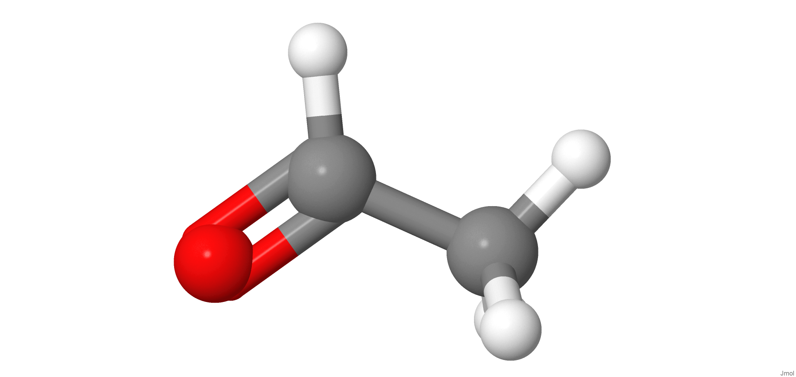{width=40%}](https://chemapps.stolaf.edu/jmol/jmol.php?model=CC=O) 

```{r, eval=FALSE}
select C=O
wireframe 100
```


<p style="text-align:right;">
[Wikipedia](https://pt.wikipedia.org/wiki/acetaldeído)
</p> 

[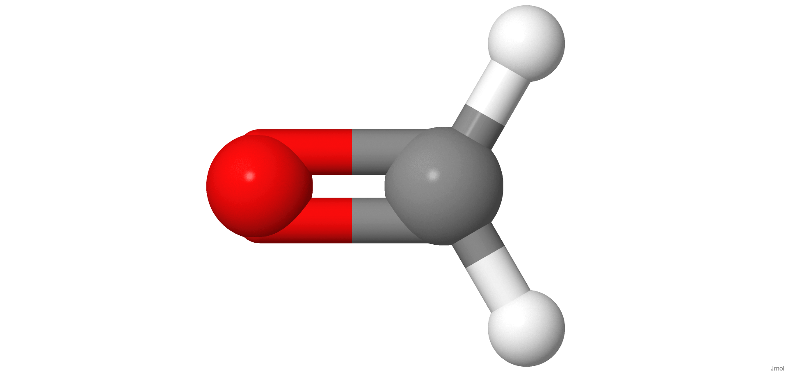{width=40%}](https://chemapps.stolaf.edu/jmol/jmol.php?model=C=O)

```{r, eval=FALSE}
wireframe 50
```


<p style="text-align:right;">
[Wikipedia](https://pt.wikipedia.org/wiki/Metanal)
</p> 

# Cetona 


[{width=40%}](https://chemapps.stolaf.edu/jmol/jmol.php?model=CC(=O)C) 
```{r, eval=FALSE}
isosurface solvent; color isosurface red blue
```


<p style="text-align:right;">
[Wikipedia](https://pt.wikipedia.org/wiki/acetona)
</p> 

[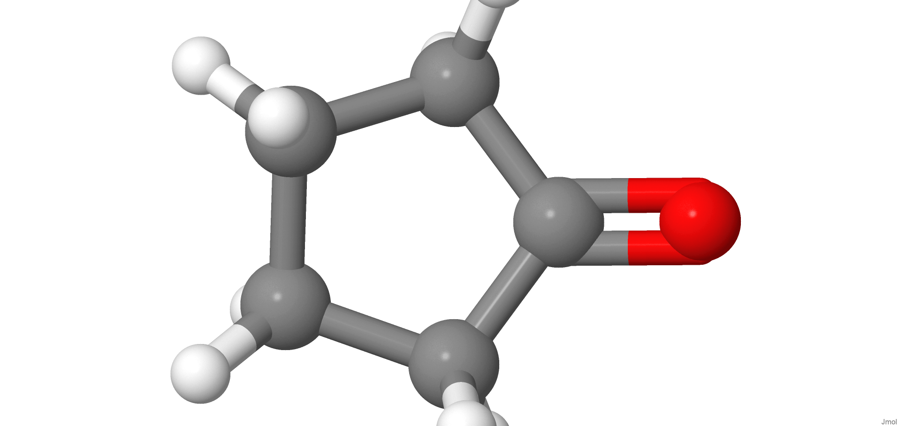{width=40%}](https://chemapps.stolaf.edu/jmol/jmol.php?model= C1CCC(=O)C1) 

```{r, eval=FALSE}
select carbonyl
color yellow
```


<p style="text-align:right;">
[Wikipedia](https://pt.wikipedia.org/wiki/ciclopentanona)
</p> 


# Ácido carboxílico 


[{width=40%}](https://chemapps.stolaf.edu/jmol/jmol.php?model= CC(=O)OC1=CC=CC=C1C(=O)O) 

```{r, eval=FALSE}
dihedral
```


<p style="text-align:right;">
[Wikipedia](https://pt.wikipedia.org/wiki/%C3%81cido_acetilsalic%C3%ADlico)
</p>  

[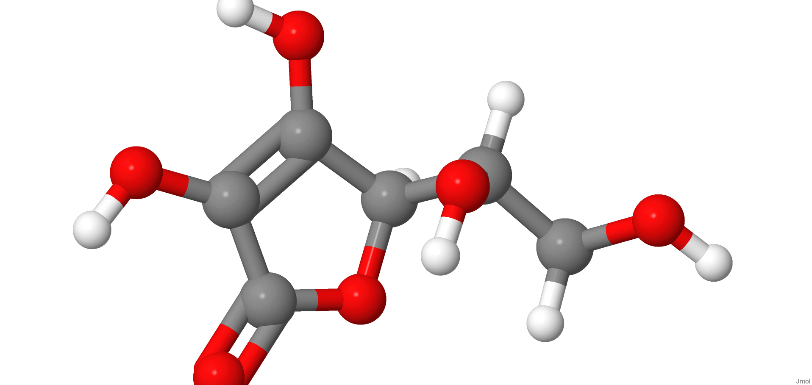{width=40%}](https://chemapps.stolaf.edu/jmol/jmol.php?model=C([C@@H]([C@@H]1C(=C(C(=O)O1)O)O)O)O) 

```{r, eval=FALSE}
show atoms
show bonds
```


<p style="text-align:right;">
[Wikipedia](https://pt.wikipedia.org/wiki/%C3%81cido_asc%C3%B3rbico)
</p>  

