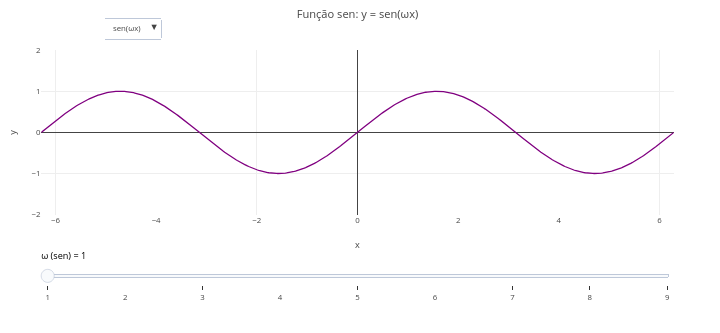
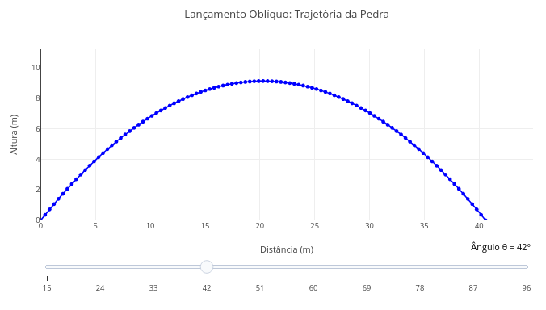

|   Para ilustrar o potencial de uso do *JSPlotly* para o ensino fundamental e médio, seguem alguns exemplos de simulações e cujos gráficos são frequentemente encontrados em livros-texto e conteúdos afins. Para um melhor aproveitamento de cada tema, experimente seguir as sugestões para *manipulação paramétrica* em cada tema. 
\

## Instruções {.unnumbered}


```{r, eval=FALSE}

1. Escolha um tema;
2. Clique no gráfico correspondente;
3. Clique em "Add Plot";
4. Use o mouse para interatividade e/ou edite o código. 

Lembrete: o editor usa desfazer/refazer infinitos no código (Ctrl+Z / Shift+Ctrl+Z) !
```
\

## Matemática

### Contexto - Trigonometria (EM13MAT306, EM13MAT308, EM13MAT307) {.unnumbered}

|   A simulação a seguir objetiva facilitar a visualização para alguns conceitos em trigonometria, *seno, cosseno e tangente*. O código permite usar um *menu suspenso* para cada função trigonométrica, bem como um *slider* para alterar a frequência em radianos. 

### Equação: {.unnumbered}

**1. Função seno:** 

$$
y = \sin(\omega x)
$$

**2. Função cosseno:**

$$
y = \cos(\omega x)
$$

**3. Função tangente:**

$$
y = \tan(\omega x)
$$
\

[](Eq/jsp_trigonom.html){target="_blank"}


### Sugestão: {.unnumbered}

```{r, eval=FALSE}
1. Selecione, alternativamente, a função seno, cosseno, e tangente, utilizando-se o "menu suspenso";
2. Experimente o efeito de se alterar a frequência da função na barra deslizante ("slider");
3. Sobreponha um gráfico de seno e um de cosseno para observar suas diferenças;
4. Repita o mesmo para o gráfico de tangente.
```


## Física

### Contexto - Movimento de corpos (EM13CNT102): {.unnumbered}

|   O código a seguir ilustra a trajetória de um lançamento oblíquo com ângulo ajustável por uma barra deslizante (*slider*), útil para explorar os conceitos de cinemática.

### Equação: {.unnumbered}

**1. Equação geral**

$$
y(x) = x \cdot \tan(\theta) - \frac{g}{2 v_0^2 \cos^2(\theta)} \cdot x^2
$$

*Onde:*

- y(x): altura em função da distância horizontal;
- x: posição horizontal (m);
- $\theta$: ângulo de lançamento em relação à horizontal (radianos ou graus);
- v0: velocidade inicial do projétil (m/s);
- g: aceleração da gravidade (9,8 m/s²$^{2}$)

**2. Tempo total de vôo:**

$$
t_{\text{total}} = \frac{2 v_0 \sin(\theta)}{g}
$$


**3. Posição Horizontal ao longo do tempo**

$$
x(t) = v_0 \cos(\theta) \cdot t
$$


[](Eq/jsp_fis_pedra.html){target="_blank"}

### Sugestão: {.unnumbered}

```{r, eval=FALSE}
1. Veja que há uma barra deslizante para ângulos iniciais na simulação. Arraste a barra para outro ângulo e adicione o gráfico, comparando o efeito dessa modificação.
2. Altere a velocidade inicial no código, e observe o efeito no gráfico.
3. Simule uma "condição lunar" para a trajetória, e cuja gravidade é em torno de 1/6 a da Terra (~1.6 m/s²).
```


## Química

### Contexto: {.unnumbered}

### Equação: {.unnumbered}

### Sugestão: {.unnumbered}


## Biologia

### Contexto: {.unnumbered}

### Equação: {.unnumbered}

### Sugestão: {.unnumbered}


## Geografia

### Contexto: {.unnumbered}

### Equação: {.unnumbered}

### Sugestão: {.unnumbered}


## História

### Contexto: {.unnumbered}

### Equação: {.unnumbered}

### Sugestão: {.unnumbered}
