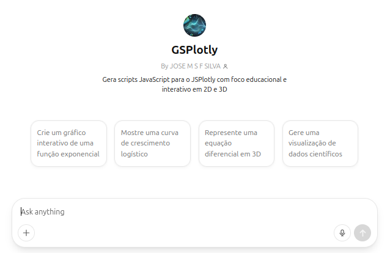

|   Frente à inerente dificuldade para uso de uma linguagem de programação, como *JavaScript*, bem como de bibliotecas correlatas, e outras linguagens modernas para web (HTML - estrutura, CSS - estilo), buscou-se desenvolver um *GPT personalizado* para a criação instantânea de códigos, bem como para sua edição e personalização.

|   A iniciativa denomina-se *GSPlotly*, e visa atuar como um gerador em linguagem natural para o simulador *JSPlotly*. Dessa forma, permite-se duplamente a geração de um código em qualquer tema que assistentes de IA são hoje alimentados, bem como o aprendizado subliminar das próprias linguagens envolvidas.

|   Teste o *GSPlotly* neste [link](https://chatgpt.com/g/g-67e3f882d8b881918bb3c8608b5474a2-gsplotly). Para tal, peça a simulação de um tema qualquer embasado em função matemática para ciências naturais ou outra área do conhecimento, copie o código gerado, e rode-o no *JSPlotly*.

