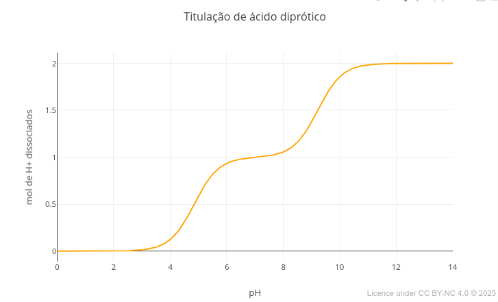
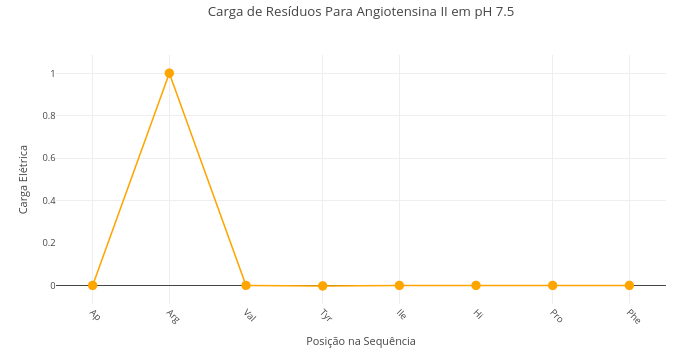
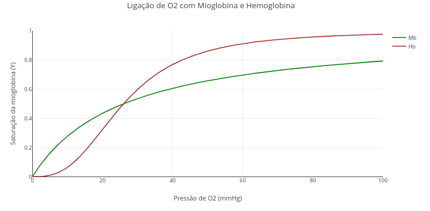
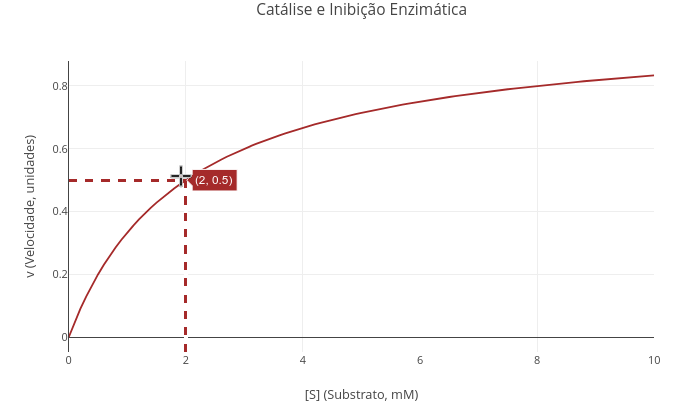

|   Para ilustrar o potencial de uso do *JSPlotly* para Bioquímica e áreas correlatas, seguem alguns exemplos de simulações e cujos gráficos são frequentemente encontrados em livros-texto e conteúdos afins. Para um melhor aproveitamento de cada tema, experimente seguir as sugestões para *manipulação paramétrica* em cada tema. 
\

## Instruções {.unnumbered}


```{r, eval=FALSE}

1. Escolha um tema;
2. Clique no gráfico correspondente;
3. Clique em "Add Plot";
4. Use o mouse para interatividade e/ou edite o código. 

Lembrete: o editor usa desfazer/refazer infinitos no código (Ctrl+Z / Shift+Ctrl+Z) !
```


## Equilíbrio ácido-básico e sistema tampão

#### Contexto: {.unnumbered}

|   O exemplo ilustra a adição de base num sistema contendo um ácido fraco e sua base conjugada. A equação de titulação refere-se a um *ácido triprótico*, o ácido fosfórico do tampão homônimo, mas serviria igualmente para outros tantos, como os presentes no ciclo de Krebs (citrato, isocitrato). 


#### Equação: {.unnumbered}

$$
fa= \frac{1}{1 + 10^{pKa1 - pH}} + \frac{1}{1 + 10^{pKa2 - pH}} + \frac{1}{1 + 10^{pKa3 - pH}}
$$
*Onde*,
fa = fração de ácido (grupos protonáveis)
\

[](Eq/jsp_acbase.html){target="_blank"}
\
<!---div class="jsplotly_sup-fundo"> --->

### Sugestão: {.unnumbered}

```{r, eval =FALSE}
"A. Convertendo a curva de tampão fosfato (triprótico) para tampão bicarbonato (diprótico)"

1. Altere os valores de pKa para o tampão bicarbonato: pKa1 =      6.1, e pKa2 = 10.3;
2. Coloque um valor muito grande para pKa3 (ex:1e20). 
3. Clique em "add plot".

Explicação: pKa é um termo que representa o logaritmo de uma constante de dissociação (-log[Ka]). Com um valor extremo, o denominador torna-se igualmente imenso, anulando o termo que leva pKa3. Em JavaScript e outras linguagens, "e" representa a notação para potência de 10.

"B. Convertendo a curva de tampão bicarbonato para acetato"

1. Basta repetir o procedimento acima, com pKa1 = 4.75, e eliminando-se pKa2.

```
\

## Rede de carga líquida em peptídios

#### Contexto: {.unnumbered}

|   O código refere-se à rede de carga líquida presente numa sequência qualquer de resíduos de aminoácidos. Aqui é ilustrada a *angiotensina II*, importante peptídio para regulação da pressão arterial e equilíbrio eletrolítico, e cuja enzima conversora está associada ao mecanismo de invasibilidade celular por SARS-CoV-2.


#### Equação: {.unnumbered}

|   Para essa simulação não há uma equação direta, já que o algoritmo precisa decidir a carga em função da natureza básica ou ácido do resíduo em determinado valor de pH (observe o *script*). Assim:

$$
q =
\begin{cases}
-\dfrac{1}{1 + 10^{pK_a - pH}} & \text{(grupo ácido)} \\\\
\dfrac{1}{1 + 10^{pH - pK_a}} & \text{(grupo básico)}
\end{cases}
$$
\

*Onde*,
pKa = valor do antilogarítmo de base 10 para a constante de equilíbrio de dissociação do ácido, Ka (ou log[Ka])


[](Eq/jsp_cargaAA.html){target="_blank"}
\
<!---div class="jsplotly_sup-fundo"> --->

### Sugestão: {.unnumbered}

```{r, eval =FALSE}
1. Selecione a sequência peptídica abaixo, e observe a distribuição de cargas:
  
"Ala,Lys,Arg,Leu,Phe,Glu,Cys,Asp,His"

2. Simule a condição de pH do estômago ("const pH = 1.5"), e verifique a alteração de cargas no peptídio. 

3. Selecione um peptídio fisiológico (oxitocina, por ex), observe sua carga no sangue (pH 7.5), e reflita sobre seu potencial de interação eletrostática com componentes celulares.

"Cys,Tyr,Ile,Gln,Asn,Cys,Pro,Leu,Gly"  - oxitocina
```
\


## Interação de oxigênio com mioglobina e hemoglobina

#### Contexto: {.unnumbered}

|   A molécula de oxigênio pode combinar-se ao grupo *heme* de mioglobina e hemoglobina de forma distinta, em função da cooperatividade exibida nesta última frente à sua estrutura quaternária. O modelo que segue exemplica essa interação, por uso da *equação de Hill*. 


#### Equação: {.unnumbered}


$$
Y= \frac{pO_2^{nH}}{p_{50}^{nH} + pO_2^{nH}}
$$
\

*Onde*

Y = grau de saturação de oxigênio na proteína;


pO$_{2}$ = pressão de oxigênio;

p$_{50}$ = pressão de oxigênio a 50% de saturação;

nH = coeficiente de Hill para a interação;
\


[](Eq/jsp_O2.html){target="_blank"}
\
<!---div class="jsplotly_sup-fundo"> --->

### Sugestão: {.unnumbered}

```{r, eval =FALSE}
1. Rode o aplicativo ("add plot"). Veja que o valor de "nH" da constante de Hill é "1", ou seja, sem efeito de cooperatividade.

2. Agora substitua o valor de "nH" pelo coeficiente de Hill para a hemoglobina, 2.8, e rode novamente !
```
\

## Catálise e inibição enzimática


#### Contexto: {.unnumbered}

|   A simulação visa oferecer uma equação geral para estudos de inibição enzimática, que contemple os *modelos competitivo, incompetitivo e competitivo (puro ou misto)*, também permitindo o estudo de catálise enzimática na ausência de inibidor. 

#### Equação: {.unnumbered}


$$
v=\frac{Vm*S}{Km(1+\frac{I}{Kic})+S(1+\frac{I}{Kiu})}
$$
*Onde*

S = teor de substrato para reação;

Vm = velocidade limite da reação (nos livros, velocidade máxima);

Km = constante de Michaelis-Mentem;

Kic = constante de equilíbrio de dissociação de inibidor para modelo competitivo; 

Kiu = constante de equilíbrio de dissociação de inibidor para modelo incompetitivo
\


[](Eq/jsp_kin_inib.html){target="_blank"}
\
<!---div class="jsplotly_sup-fundo"> --->

### Sugestão: {.unnumbered}

```{r, eval =FALSE}
"A. Catálise enzimática na ausência de inibidor."
1. Basta rodar o aplicativo com a equação geral. Veja que os valores para Kic e Kiu estão elevados (1e20). Dessa forma, com "constantes de dissociação" alta, a interação do inibidor com a enzima é irrelevante, retornando o modelo à equação clássica de Michaelis-Mentem.
2. Experimente alterar os valores de Vm e Km, comparando gráficos.
3. Use o recurso de coordenadas geográficas da barra de ícones ("Toggle Spike Lines"), para consolidar o significado matemático de Km, bem como observar o efeito de valores distintos desse sobre a visualização do gráfico.

"B. Modelo de inibição competitiva."
1. Para observar ou comparar o modelo michaeliano com o de inibição competitiva, basta substituir o valor de Kic para um número consistente (ex: Kic= 3).

"C. Modelo de inibição incompetitiva."
1. A mesma sugestão acima serve para o modelo incompetitivo, desta vez substituindo o valor para Kiu.
 
"D. Modelo de inibição não competitiva pura."
1. Neste modelo, a simulação dá-se por valores iguais para Kic e Kiu.

"E. Modelo de inibição não competitiva mista."
1. Para este modelo, basta alocar valores distintos para Kic e Kiu.
```
\

## Estabilidade termodinâmica de ácidos nucleicos

